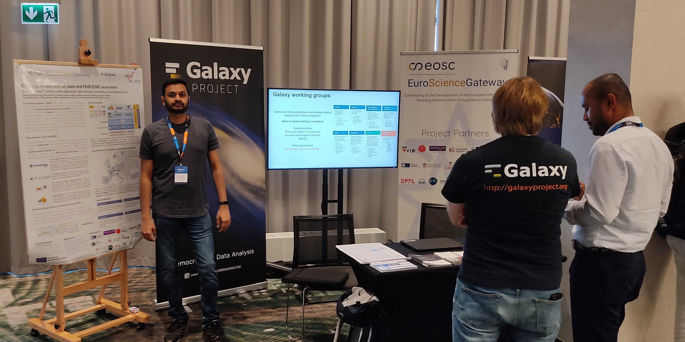
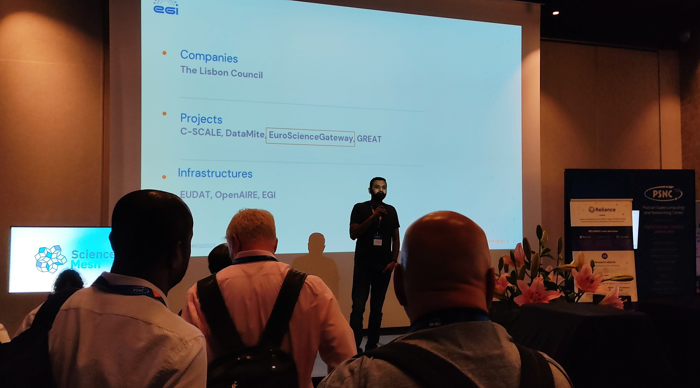
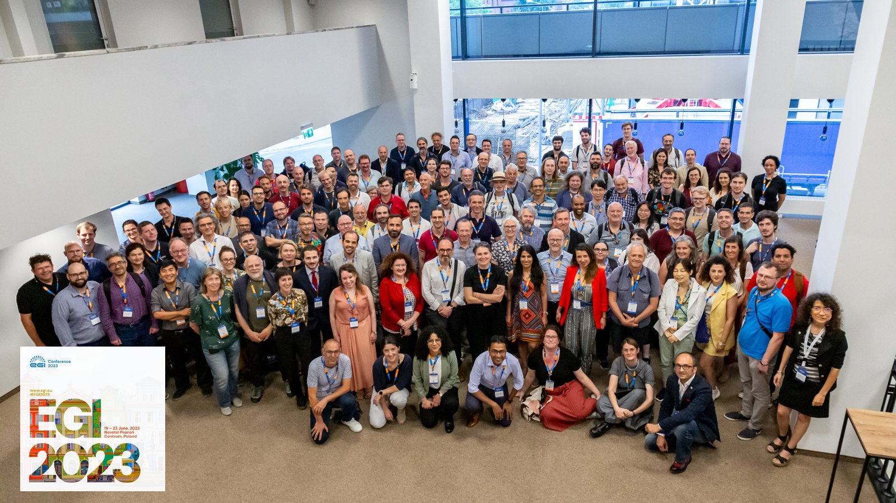

During 19th-23rd of June, Björn Grüning, Sebastian Schaaf, and Sanjay Kumar Srikakulam from the European Galaxy Team travelled to Poznań to join the [EGI2023 conference](https://www.egi.eu/event/egi2023/) and presented the [EuroScienceGateway project](https://galaxyproject.org/projects/esg/) along with collaborators. With Sebastián Luna-Valero and Enol Fernández (European Grid Initiative/NL), Hakan Bayındır (ULAKBIM/TR), Łukasz Dutka (Cyfronet/PL), Abdulrahman Azab and Maiken Pedersen (University of Oslo/NO), work packages 1, 3 and 4 of ESG were represented.

At EGI2023, we first time held a booth on Galaxy and usegalaxy.eu, presenting the European Galaxy Server to a wider audience from various scientific fields. A dedicated conference session with multiple talks introduced Galaxy and presented its opportunities, as well as the ESG project.

# Events

## Day 2 - June 20

On the second day, Sanjay and Sebastian set up the ESG booth. In the evening Sanjay pitched the booth and advertised Galaxy and the ESG project during the **Exhibition opening and 1 minute pitches** session.

## Day 4 - June 22

The members of the ESG project held a dedicated 90 minutes session **EuroScienceGateway: an open infrastructure for data-driven research**, where they gave the following three talks, followed by a Q&A.

| Presenters | Title | Links |
|---|---|---|
| Sebastian, and Sanjay | Introduction to Galaxy | [Slides](https://docs.google.com/presentation/d/e/2PACX-1vQfHWkU_rg2KaNe58Fp341Il_Y0UxMnQvPA1REs90WvfLfksNvQMcKzn2TVBnd8DQ/pub?start=true&loop=true&delayms=3000) |
| Björn | Let's talk about storage Or Empower EOSC Users to Bring Their Own Storage (BYOS) | [Slides](https://docs.google.com/presentation/d/e/2PACX-1vQVTNtkCPMPGE53RGvqmitR__xEI0Rq0gZjwnLkWERNJ7B7_vuaFqOMF7KXDIXA4w/pub?start=true&loop=true&delayms=3000) |
| Abdulrahman, Sebastián, and Hakan | Bring Your Own Compute (BYOC) | [Slides](https://docs.google.com/presentation/d/e/2PACX-1vQg8bu0q3RomaQwQmN50saGHNsiRfzO0rg15fB3Nej9aFLF8X4uuLRDHdSeeb8z4Q/pub?start=true&loop=true&delayms=3000) |

During the session, the members introduced Galaxy,  in particular the Galaxy's EU instance's design, setup and architecture. Highlighted the recent developments, such as object stores and distributed computing. With [PULSAR ](https://pulsar-network.readthedocs.io/en/latest/index.html) being a core component of ESG (and a product of the Galaxy community), the efforts to mature it to TLR-9 and enabling the efficient utilization of resources across Europe were sketched.

The initiative aims to create an open infrastructure for data-driven research, focusing on providing a user-friendly scientific workflow and data integration platform. This endeavor seeks to achieve robustness, scalability, and integration, enabling federated computational infrastructures and democratizing research data analysis.

During the session various aspects of ESG and Galaxy were discussed, including the integration of the OneData platform, exploring [DIRAC ](https://dirac.readthedocs.io/en/latest/index.html) as a new metascheduler, and [ARC ](https://arc-user-guide.readthedocs.io/en/latest/index.html) as a new job-runner.

# Thank You !

The European Galaxy team would like to **thank** the **Galaxy community**, **members of the ESG** for all their contributions that were presented and **EGI** for the fantastic organisation of this meeting.

