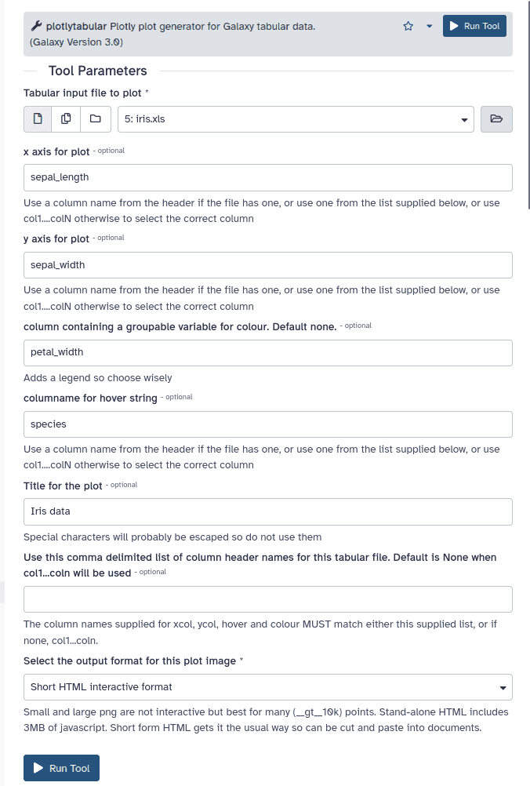

### Sample use case - Iris data scatterplot with mouse-over hover showing species in Galaxy

Galaxy users can now easily turn this:

into this interactive HTML output:

<iframe src="https://lazarus.name/demo/Plotlytabular_Iris_data_on_iris_html.html" width="1024" height="768" resize="both" overflow="auto"  style="border:none;">
</iframe>

(hover the browser pointer over any point to see details including the Species column)

by setting up a Galaxy tool form like this:

The tool form has selected the *Iris data* as the input tabular data from the history.
*Any existing Galaxy tabular data can be used*. The iris data already has column names in the data, such as 'species',
so they are used for the required x, y, and the optional colour and optional hover columns for the plot.

The optional hover column allows detailed information about points of interest
such as outliers or isolated groups, to be displayed when the viewer hovers the mouse pointer
over any point. In this example, the species is provided, but any column can be chosen.

### Input data headers and dimensionality

This Iris test data is relatively tiny with about 150 rows, so the points
are nicely separated, making the hover information easy to use.

Interactive html plots work best for at most, a few thousand well spread points,
so the hover display is easy to control. They reliably freeze up using a recent firefox build if 10k rows, so this tool
now always fails if >5k rows are chosen for html output. Advice to this effect has been
added to the form.

For <5k rows of data, interactive html output is available in stand alone format, where 3MB of javascript is included,
allowing it to be viewed offline. Short form html requires an internet connection to download the
javascript into the browser so cannot be viewed offline.

Only PNG output options will work for large numbers of rows, since the the hover function tends to be less useful
when the plot is very crowded, and large html outputs can make browser windows freeze up.

If the tabular data does not have a header row of column names, the user can supply and use a
comma delimited list, as the "header" parameter on the tool form.
If these are both missing, use col1....colN which are the default, autogenerated names 
Any named column can be used as the x, y, colour or hover columns.

#### Warning

Plotly.express will usually make sensible choices about how to show whatever you throw at it - with the current
notable exception of columns of very small floats in scientific notation. It thinks they must be strings,
or something, so Bad Things Happen unless a transformation, such as -log10(x) is used, as is done for
columns of very tiny evalues, in the specialised Blast version below. Rescaling gives sensible plots and
transformed evalues seem highly collinear with bitscores, in the few samples tested.

### Installation for testing

The [plotly_tabular_plot](https://toolshed.g2.bx.psu.edu/repository/browse_repository?id=a4961ff57ce13935) tool, owned by fubar,
is available for testing, in the main Galaxy Toolshed.
It is very new and so not suitable for production use yet. Please let me know if it works for you at the [github repository](https://github.com/fubar2/plotly_tabular_tool).

