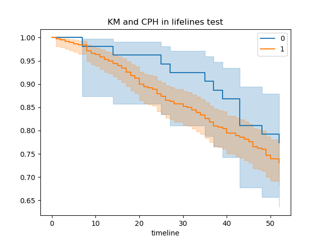
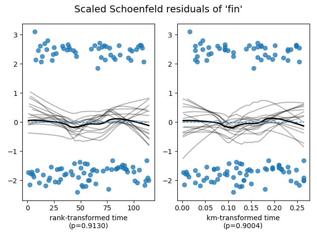
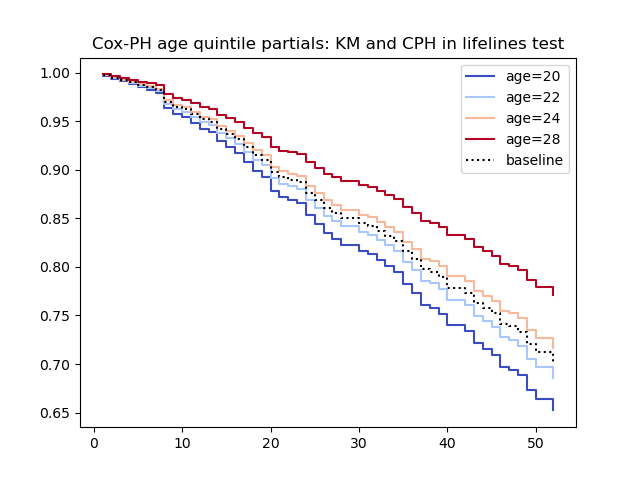
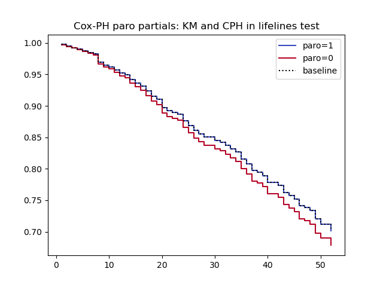

A wrapper for the [lifelines](https://lifelines.readthedocs.io/en/latest/Survival%20Analysis%20intro.html) package is available

1. Runs a Kaplan-Meier analysis and generates a KM plot with 95% confidence intervals.
2. If a grouping variable is provided, produces curves by group.
3. If there are exactly 2 groups, runs a log-rank test of the hypothesis of no difference.
4. If covariates are provided, a Cox's proportional hazards model is run, the proportionality assumptions are tested and partial plots
generated, for each covariate

Any Galaxy tabular data with a column containing time and status in a format suitable for pandas and lifelines can be used as input.
Time might be an integer month since a treatment. Status might be 0 for no failure at observation time, 1 for death or failure.
Other columns can be used as groups for KM, or as covariates for Cox-PH.

If the data has no header row, the default column names are col1,....coln unless a header parameter, containing column names in order
delimited with "," is supplied on the tool form.

Whatever the source of column names, they must match the ones provided as parameters.

### Using the Rossi recidivism data from the lifelines tutorials

With race as a grouping variable, the report shows a logrank test result.

A comma separated list (prio, age, race, mar, fin) of covariate column names was provided,
so a Cox-PH model is run, the assumption of proportionality are tested,and recommendations made
in the text report.

For each covariate, a Schoenfeld diagnostic plot is produced in a history collection.

Partial plots for each covariate are produced. Quintiles are used for covariates with > 10 distinct values.
Non-ordinal categories with > 10 values will produce meaningless quintiles, but ordinal should work.
10 or fewer distinct values are used as is.

A tabular survival table and life table are written to the collection.

### Installation for testing

The [lifelines tool](https://toolshed.g2.bx.psu.edu/view/fubar/lifelines_km_cph_tool/dd5e65893cb8), owned by fubar,
is available for testing, in the main Galaxy Toolshed. It is very new and so not suitable for production use yet.
Please let me know if it works for you at the [github repository](https://github.com/fubar2/lifelines_tool).
