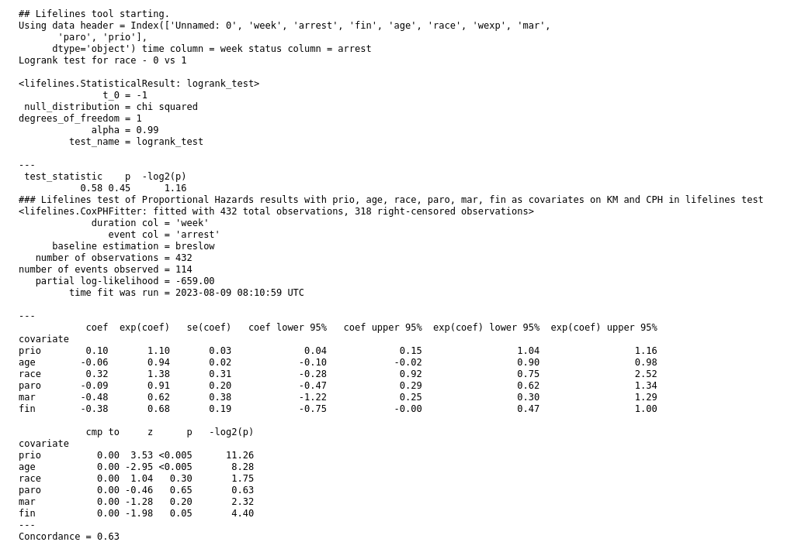

A tool that wraps the [lifelines](https://lifelines.readthedocs.io/en/latest/Survival%20Analysis%20intro.html) package is available

Any Galaxy tabular data with a column containing time and status in a format suitable for pandas and lifelines can be used as input.
Time might be an integer month since a treatment. Status might be 0 for no failure at observation time, 1 for death or failure.
Other columns can be used as groups for KM, or as covariates for Cox-PH.

If the data has no header row, the default column names are col1,....coln unless a header parameter, containing column names in order
delimited with "," is supplied on the tool form.
Whatever the source of column names, they must match the ones provided as parameters.

### Demonstration with the Rossi recidivism data from lifelines tutorials

Runs Kaplan-Meier and generates a plot. Optional grouping variable.

Plots show confidence intervals

If 2 groups, runs a log-rank test for difference.

If a comma separated list (for example: prio, age, race, mar, fin) of covariate column names is provided,
a Cox proportional hazards model is run, the assumption of proportionality is tested, and
recommendations made.

Also included are partial plots for each covariate like these from the Rossi recidivism lifelines sample data
used in the tool test.

Uses pandas read_csv with tabular delimiters so should work with any tabular data with the required columns - time and status for observations.

Issues to https://github.com/fubar2/lifelines_tool please.
Autogenerated so pull requests are possibly meaningless but regeneration of a new version should work.

### Installation for testing

The [lifelines tool](https://toolshed.g2.bx.psu.edu/view/fubar/lifelines_km_cph_tool/dd5e65893cb8), owned by fubar, is available for testing, in the main Galaxy Toolshed.
It is very new and so not suitable for production use yet. Please let me know if it works for you.

### Tool code

The tool code is available for review at the <a href="https://github.com/fubar2/lifelines_tool">github repository</a> where issues should
be raised when there are problems or suggestions. This is machine generated code, so pull requests don't
make much sense. The generator can be rerun with simple changes easily so please suggest
any useful things you'd like to see.

### Tool made with the [Galaxy ToolFactory](https://github.com/fubar2/galaxy_tf_overlay)

Galaxy Training Network tutorials [ are available here](https://training.galaxyproject.org/training-material/topics/dev/tutorials/tool-generators/tutorial.html)

The github repository contains a Galaxy history that was exported after generating the current version of the tool.
If that history is imported into a ToolFactory instance, the generating ToolFactory form can be recreated
using the redo button. Editing the tool id will make a new tool, so edits to parameters can be made and the
new tool generated and tested.

