# 2023 Galaxy Community Conference Meeting Report

### Check out the GCC2023 playlist on YouTube for recordings of this year's sessions and keynote presentations! https://www.youtube.com/playlist?list=PLNFLKDpdM3B9PicSdtM_kKeOPvZoD1wSQ
		
## GCC2023 Meeting Summary
#### Overview

The 2023 Galaxy Community Conference (GCC2023) was held at the Queensland University of Technology in Brisbane, Queensland, Australia, from July 10th–16th. GCC is an annual meeting of the Galaxy community, providing an opportunity to discover the incredible new work done on Galaxy in the past year scientifically and technically, create new collaborations and strengthen existing connections, and forge paths in new directions as a result of meeting together in person. Hosted by Galaxy Australia and Australian BioCommons, GCC2023 consisted of four days of talks, workshops/trainings, posters, and demos; three keynote speakers; and three days of Collaboration Fest (CoFest). In addition to the conference activities, networking and social events were held throughout the week. In total, GCC2023 consisted of 12.8 hours of long and short talks, 37.5 hours of training, 3.3 hours of poster sessions and demo presentations, and 10.6 hours of structured social events and networking.

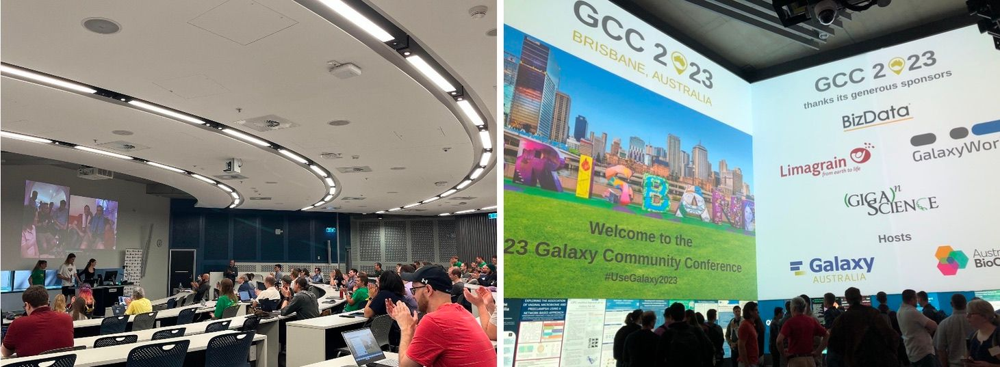

GCC2023 was attended by 91 people in person and had 40 virtual attendees. Attendees attended from 21 different countries: Australia, Belgium, Brazil, Canada, Česko, Denmark, France, Germany, India, Ireland, Malta, Morocco, Netherlands, New Zealand, Norway, Singapore, South Korea, Sri Lanka, Switzerland, United Kingdom, and the United States
of America (Figure 1). Of the total attendees, 22.4% were research assistants or technicians, 17.6% were senior scientists or principal investigators, 9.6% were postgraduates, 7.2% were post-doctorates, 2.4% were undergraduates, and 40% were Other.

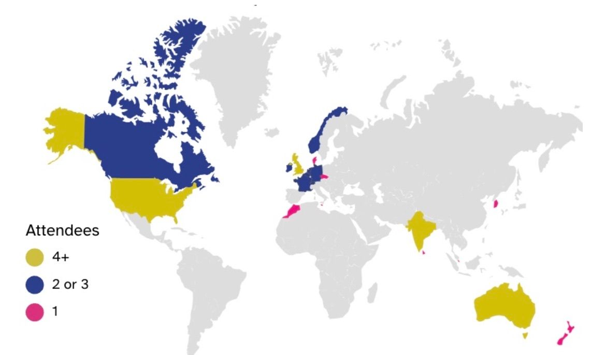
*Figure 1. Map of GCC2023 attendees’ countries of origin.*

## Fellowship Recipients

GCC2023 was grateful to be able to offer fellowships for in-person and virtual attendance using funds from an anonymous donor. As part of the fellowship, recipients were asked to participate in the conference by presenting a talk, poster, or both. 

This year, one in-person fellowship was awarded to Marisa Loach (Twitter: @Marisa_Loach), a 1st year PhD student at the Open University in the United Kingdom. Marisa gave a talk and presented a poster titled “Why Use Galaxy? Preliminary Results from a Scoping Review Comparing the Options for User-Friendly Bioinformatics”. 

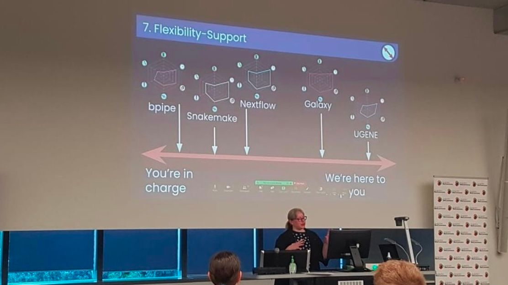

Six virtual fellowships were awarded for GCC2023. Below, each recipient and their role, affiliation, and contribution to the conference are listed.

### Coline Royaux
Twitter: @ColineRoyaux

Graduate student

Sorbonne University, French Natural History Museum, France

Talk titled “Galaxy-E: Ecology oriented Galaxy initiative, a 2022-2023 update!” 

### Vajiha Hussain
Senior undergraduate student

Vignan University, India

Poster titled “Identification for a potential GBNV biomarker in thrips palmi using RNASeq analysis”

### Sudeepti Kulshrestha

Graduate student

Amity University, India

Poster titled “Exploring The Association Of Vaginal Microbiome And Preeclampsia Using A Network-Based Approach”

### Jonas Bucher
Graduate student

Swiss Federal Institute of Technology in Zurich (ETH Zurich), University of Zurich, Switzerland

Poster titled “Methylator - DNA cytosine methylation pipeline”

### Katarzyna Kamieniecka
Twitter: @katemurat

Graduate student

University of Bradford, United Kingdom

Poster titled “FAIR Data Stewardship in Galaxy”

#### Taoufik Bensellak

Graduate student

University of Liverpool, United Kingdom

Poster titled “A Galaxy Instance and Tools for MicroArrays Data Analysis”

## Keynote Speakers

GCC2023 hosted three keynote speakers that presented their thoughts and research results on the topics of wildlife conservation, structural biology, and biosecurity. The presenters showcased how their teams were able to accomplish their work in a more accessible and reproducible manner via the adoption of Galaxy. 

Each of the three keynote speakers presented aspirational and informational talks discussing advancement in their prospective research areas, focusing on open-access end-to-end bioinformatics. Galaxy played a strong role in each of the keynote speakers' recent research advances, and Galaxy developers and the Galaxy community were able to see firsthand the impact Galaxy has on the scientific community. Additionally, each keynote speaker provided inspiration for the future of Galaxy and was given time to speak directly with the developers behind the trajectory of the platform. 

### Carolyn Hogg, PhD (University of Sydney)
Dr. Carolyn Hogg, from the University of Sydney, kicked off GCC2023 as the first keynote speaker. Dr. Hogg has been instrumental in the research being conducted by the Save the Tasmanian Devil Program, in addition to research focusing on other Australian species, such as orange-bellied parrots, koalas, bilbies, and woylies. Her GCC2023 talk, titled “To Infinity and Beyond: Combining genomics and cloud technology to save our species”, highlighted the need for collaborative research between conservationists and genomic scientists. Her vision to create a conservation legacy for Australia by changing the way science, management, and policy are integrated is enhanced through the use of Galaxy. By using an open-sourced platform like Galaxy, Dr. Hogg is able to produce reproducible genomic science to aid in species conservation and management practices in Australia. 

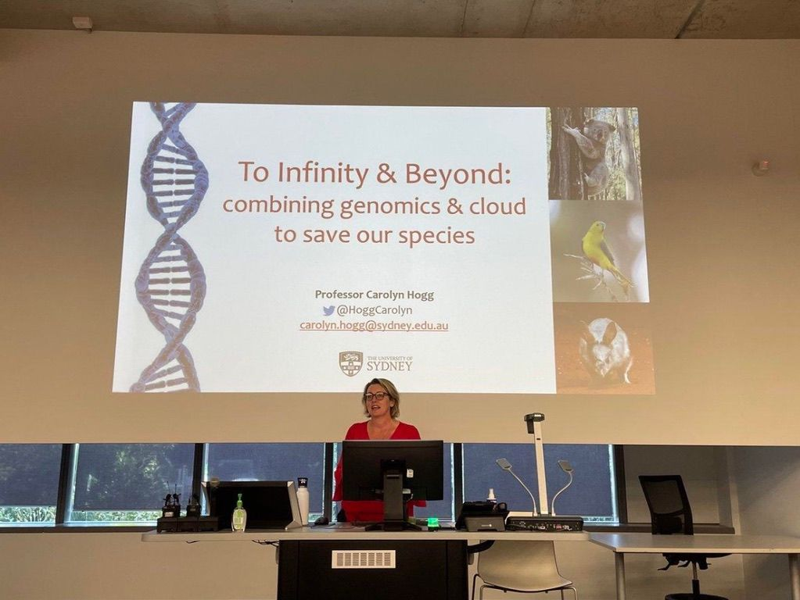

### Kate Michie, PhD (University of New South Wales)
Dr. Kate Michie, from the University of New South Wales, presented her talk titled “Alphafold2 and the Age of Deep Learnings: Recent Advances in Structural Biology” as the second keynote speaker at GCC2023. Dr. Michie has over two decades of experience in protein structural biology and extensively uses Alphafold2, having worked closely with a wide range of researchers to teach them how to use this powerful tool to advance their research. In her keynote presentation, Dr. Michie called attention to the vital need for Galaxy to prepare for the research advances in structural biology that are sure to follow the huge success of Alphafold2. Dr. Michie’s presentation was an influential and impactful addition to GCC2023, as Galaxy strives to remain competitive and stay ahead of the vast research needs of the community.

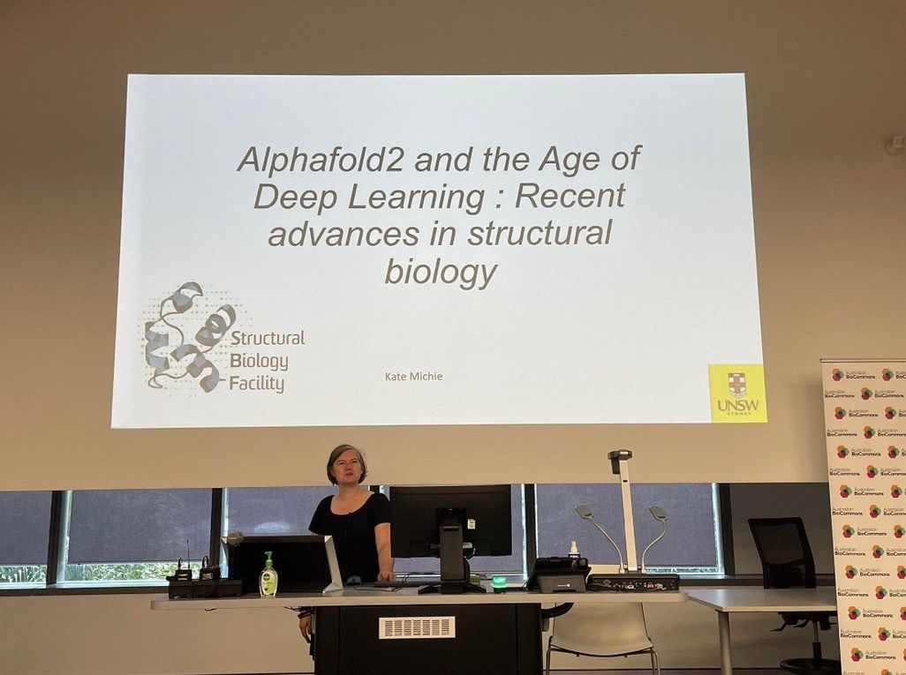

### Roberto Barrero, PhD (Queensland University of Technology)
The final keynote speaker of GCC2023 was Dr. Roberto Barrero from the Queensland University of Technology. Dr. Barrero’s talk, titled “Improving plant industry access to new genetics through faster and more accurate diagnostics of plant viruses and viroids”, focused on using bioinformatics to tackle real-world problems in agriculture, plant biosecurity, and human health. Recently, Dr. Barrero was instrumental in developing a plant diagnostic toolkit that accurately detects a range of viruses and viroids in a single test, awarding him and his team the Biosecurity Impact Award in 2018. The advancements in Dr. Barrero's research are supported by Galaxy through GA-VirReport and High Throughput Sequencing technologies. Access to open-access end-to-end bioinformatics workflows is essential in diagnosing plant viruses and viroids, and Galaxy was thrilled to have this topic forefronted at GCC2023.

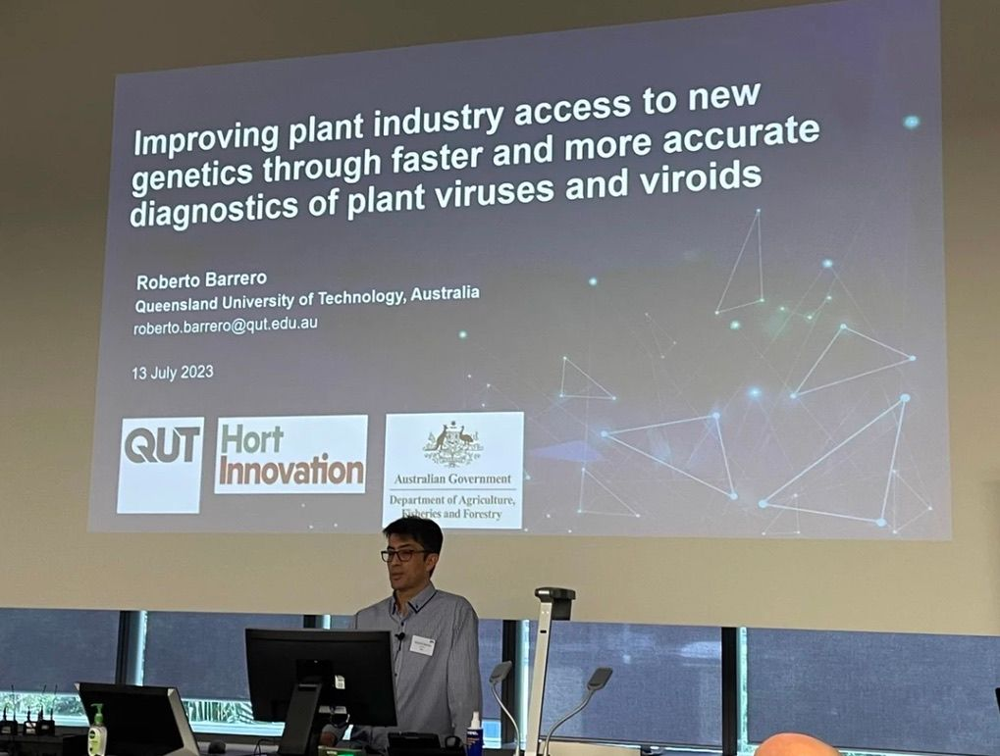

## Training Sessions

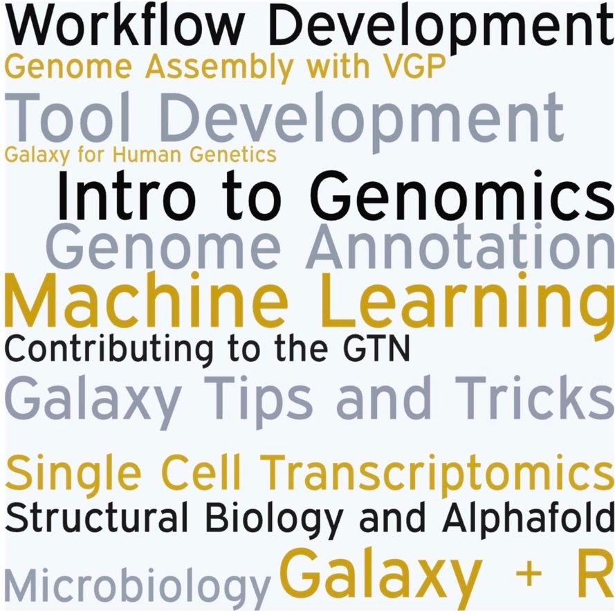

Training is a key priority for the Galaxy Community. Making it easy for researchers to learn to use the platform, how to perform a new analysis, or explore features and tools that can solve real needs researchers face has been instrumental for the growth and sustainability of Galaxy. In that spirit, throughout three days of GCC2023, a total of 15 different training sessions were held for attendees to learn and practice hands-on bioinformatics with experts. Experts included principal investigators, Galaxy developers, project managers, and power users of Galaxy. Training session topics varied, providing relevant and practical learning opportunities to all of GCC2023’s attendees. From microbiology and human genetics to workflow and tool development, GCC2023 training sessions offered opportunities to expand attendees' particular research interests and encounter new topics. 

Each session was nearly three hours long, providing time for trainees to immerse themselves in the material fully, connect with their trainer and fellow trainees, and exchange experiences and methods with people from different backgrounds. 

## Birds of a Feather (BoF)

Birds of a Feather, or BoF, sessions are informal gatherings during GCC that allow participants to discuss topics of interest. BoFs took place at the close of the conference each day, and groups split up into focus groups to network and discuss with experts and fellow attendees. 

During GCC2023, there were nine different opportunities for attendees to participate in BoFs. A variety of topics were presented through this year's BoFs, including the much-anticipated opportunity for power users of Galaxy to converse with developers. Additionally, BoFs gave the opportunity for mini social events, such as board games, pub crawls, and a walking tour of Brisbane, Australia! 

## CoFest

Following the main conference of GCC2023, Collaboration Fest (CoFest) took place for three days. CoFest is a community gathering by Galaxy members who are interested in contributing to Galaxy's tool set, documentation, training materials, code base, and anywhere else that expands the Galaxy ecosystem. The goals of CoFest are to:

1. Expand the contributor community. This CoFest is, first and foremost, about welcoming new contributors and helping you learn the resources and meet the people that will help you contribute.
2. Expand the Galaxy Ecosystem. Not just the code but the whole ecosystem. That includes training, tools, best practice workflows, documentation, test cases, translations, infrastructure, and even code.

CoFest participants coalesced around shared interests and addressed common topics related to those interests. These clusters formed before, at the beginning of, and throughout CoFest, and aimed to be fluid and highly interactive with each other. This year's CoFest was divided into nine broad topics: frontend, backend, community, design, tools, workflows, training, testing, and side projects. Because CoFest is ever-changing and builds throughout the event, topics were broken down further to focus on topics such as interactive tools; upgrading Vue3 and upload features; engaging and retaining community participation in activities, governance, and leadership; ChatGXY; implementing a Galaxy tool health auditing service; and Simon’s Data Club.

## Social Events
GCC2023 aspires to connect members of the Galaxy community and therefore held different opportunities for social events throughout the conference. This year’s GCC2023 social events included a welcome dinner to kick off the conference, a walking tour of Brisbane hosted by a Galaxy member local to the community, a pub crawl with arcade games, a night of board games, a conference dinner, and the highly proclaimed visit to Lone Pine Koala Sanctuary! 

The Lone Pine Koala Sanctuary was, without a doubt, the highlight of this year’s social events! A large group of GCC2023 attendees visited the world’s largest koala sanctuary for an afternoon of animal encounters, wildlife shows, and learning about some of Australia’s most beloved wildlife!

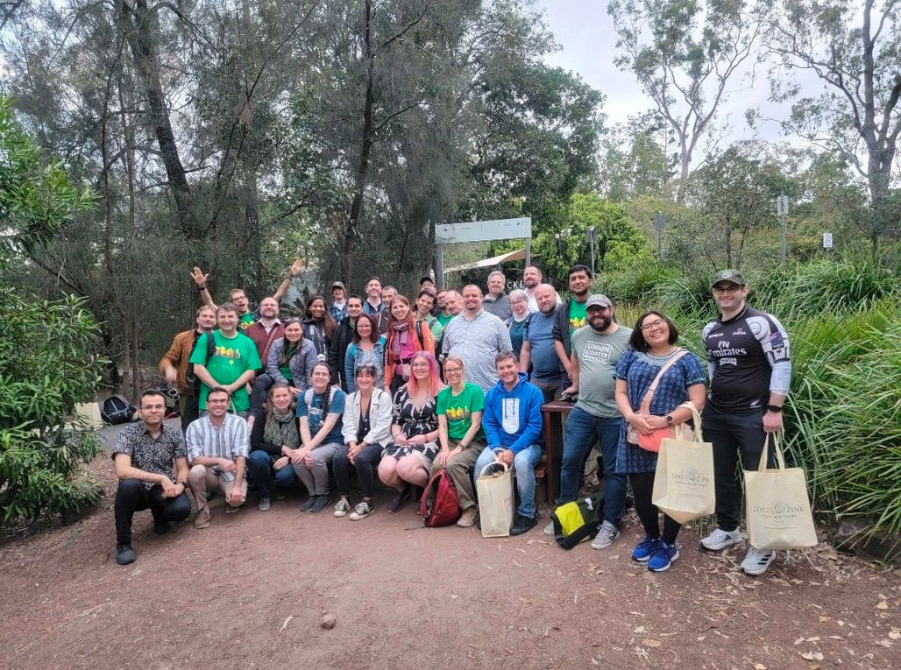

Through these organized social events, members of the Galaxy community were able to connect and form friendships along with their professional relationships. Additionally, many community members took the opportunity to connect with each other through unorganized events, including trips through botanical gardens, tours of zoo hospitals and the rainforest, and day trips.

See *Appendix I* for more photos from this year’s social events and all of the amazing Australian animals encountered!

## Remembering Simon Gladman
### Simon's Data Club
Simon Gladman, who was an original instigator and organizer of GCC2023, would have been so proud to see his partner and kids participating in the conference. Simon was remembered with several tributes, and his legacy as an innovator, role model, supporter, and community connector will continue to be honored by the renaming of the “Intergalactic Data Commission” to “Simon’s Data Club” and by an annual award in his name.

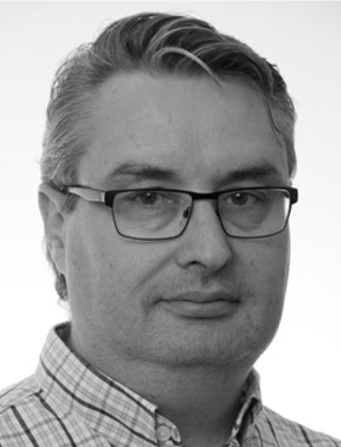

### Simon Gladman Travel Grant
The contributions of the late Simon Gladman to Galaxy will be honored by an annual award in his name. Galaxy Australia’s talented Technical Lead and everybody’s mate, Simon was sorely missed at GCC2023, where he was remembered with several tributes.

Simon was passionate about Galaxy and connecting with people and was very excited to be organizing the first international Galaxy Community Conference (GCC) to be hosted in Australia. He was celebrated at GCC2023 with the announcement of the inaugural Simon Gladman Travel Grant. The grant of AUD $5,000 will be awarded annually to an Australian citizen who is participating in a Galaxy community event. 

If you share Simon’s passion and want to contribute to Galaxy, you’re encouraged to apply for the Simon Gladman travel grant.

## Testimonials
Galaxy Executive Board member Michael Schatz, who is a Bloomberg Distinguished Professor of Computer Science and Biology at Johns Hopkins University, was encouraged to see that:

*“The keynotes really highlighted how Galaxy enables cutting edge science.”*

Galaxy Australia team members from BioCommons, Queensland Cyber Infrastructure Foundation (QCIF), University of Queensland, Melbourne Bioinformatics, and AARNet presented on topics ranging from monitoring tool health to developing the recently released Galaxy Australia Genome Lab. Dr Gareth Price, Project Lead for the Galaxy Australia service, said that:

*“There was a fantastic exchange between our team and international colleagues and wonderful opportunities to engage with the global Galaxy community. GCC was an exhilarating experience, and it was inspiring to be surrounded by like-minded people. The team left full of energy to keep improving Galaxy Australia and strengthen their collaborations with the wider Galaxy community.”*

While we were hosted by the Queensland University of Technology (QUT) at their fabulous facilities at The Cube, the ability to participate remotely was a critical factor in providing a truly international conference. Although he was part of the GCC2023 Organising Committee, Dr. Prash Suravajhala, Principal Scientist, Systems Genomics at Amrita University, could not travel from India but was:

*“Very excited and happy to be a part of GCC2023 virtually. We witnessed scintillating talks and brainstorming sessions, and the virtual attendance was a treat. This was a cherishing moment for me as I guzzled the talks from early morning India time! It has created a great camaraderie.*

## Recognition
A special thank you to the sponsors of GCC2023: 

### Platinum Sponsor: 
BizData (https://www.bizdata.com.au/)

### Silver Sponsors: 
Limagrain (https://www.limagrain.com/en)

GalaxyWorks (https://galaxyworks.io/)

### Bronze Sponsor
GIGA Science (https://academic.oup.com/gigascience?login=false)

And a huge thank you to all the individuals who made GCC2023 a success:

### Organizing & Scientific Committees

Andrew Lonie

Christina Hall

Enis Afgan

Gareth Price

Jenn Vessio

Margita Jadan

Prash Suravajhala

Roberto Barrero Gumiel

Ross Lazarus

Assunta DeSanto

Natalie Whitaker

Simon Gladman

Claudia Melogno de Sandoval 

### Training Coordinators

Assunta DeSanto

Igor Makunin

Mark Crowe

### Online Support

Melissa Burke

Patrick Capon

### Scientific Program Members

Andrew Lonie

Anne Claire Fouilloux

Anna Syme

Anshu Bhardwaj

Bérénice Batut

Bryan Raubenolt

Cameron Hyde

Catherine Bromhead

Clare Sloggett

Cristóbal Gallardo

Dan Blankenberg

Davor Davidović

Enis Afgan

Frederik Coppens

Hans-Rudolf Hotz

Ivan Jakovlić

Jeremy Goecks

Justin Lee

Margita Jadan

Maria Doyle

Matthias Bernt

Natalie Kucher

Nicola Soranzo

Nuwan Goonasekera

Peter van Heusden

Ralf Weber

Ross Lazarus

Soyean Kim

Thomas Harrop

Timothy Griffin

Tyler Collins

Wendi Bacon

Yvan Le Bras

### CoFest Organizers

Cameron Hyde

## *Appendix I*

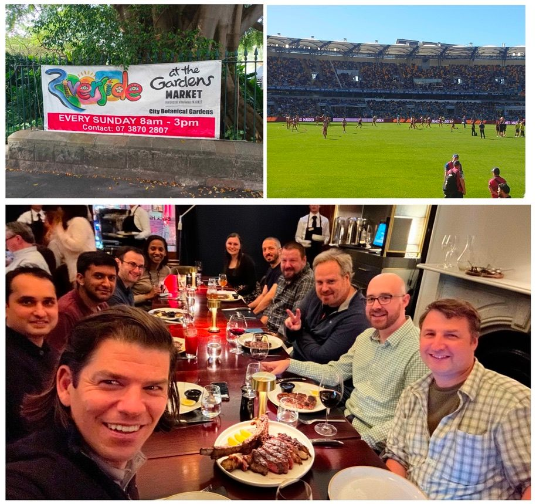

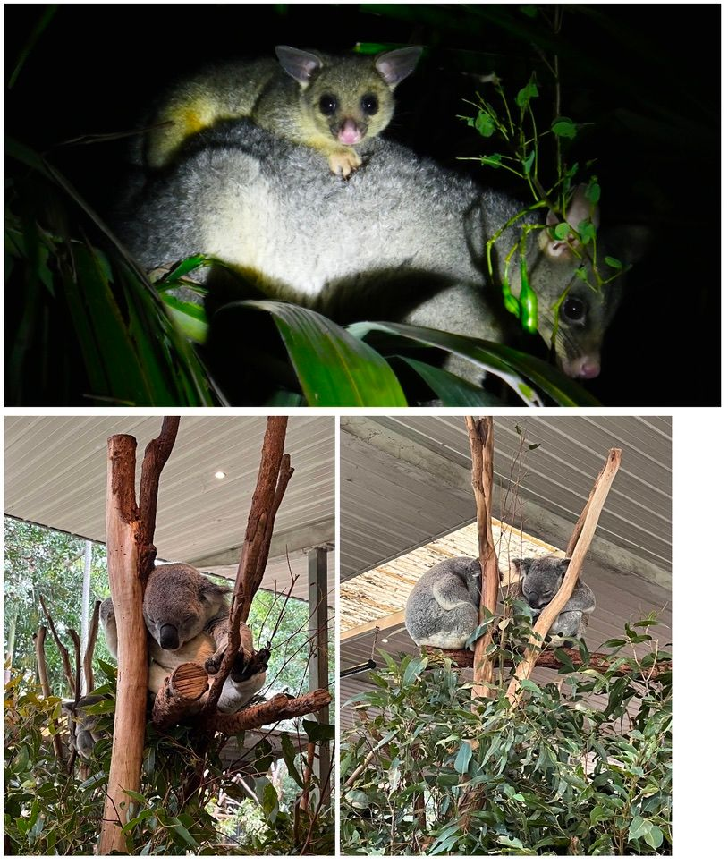

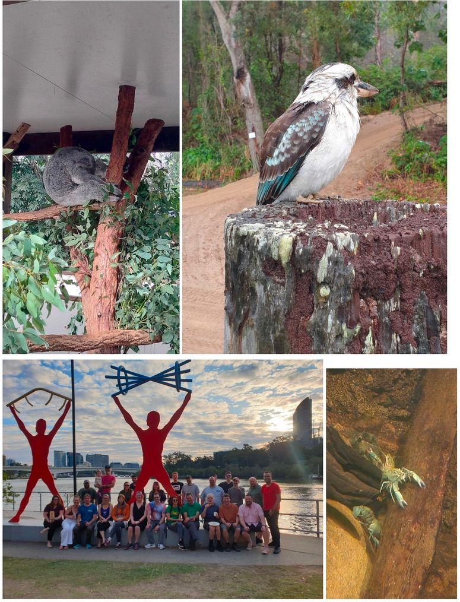

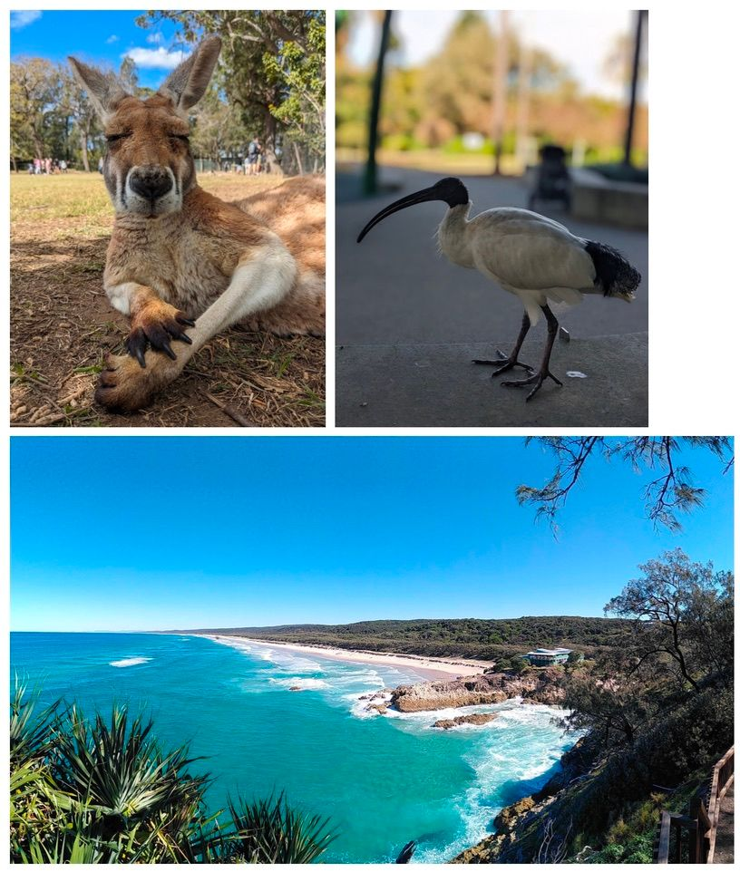

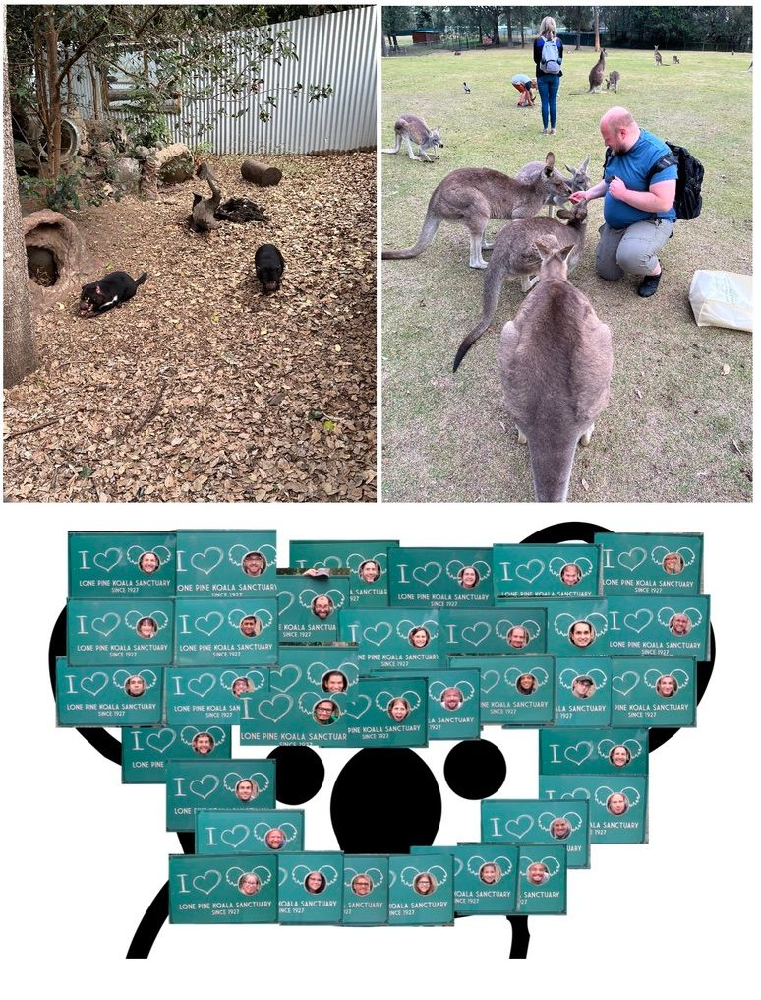

