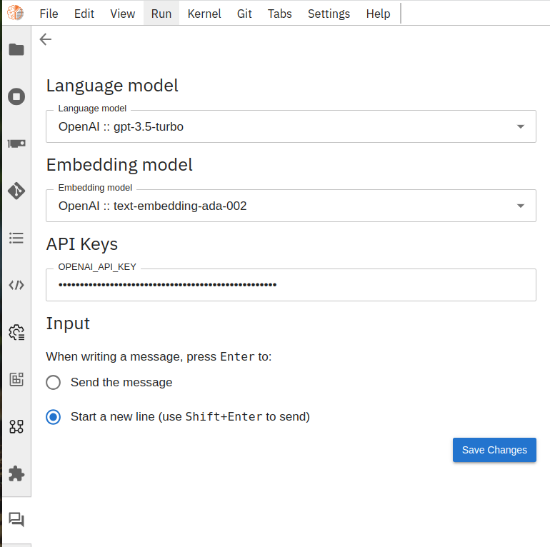
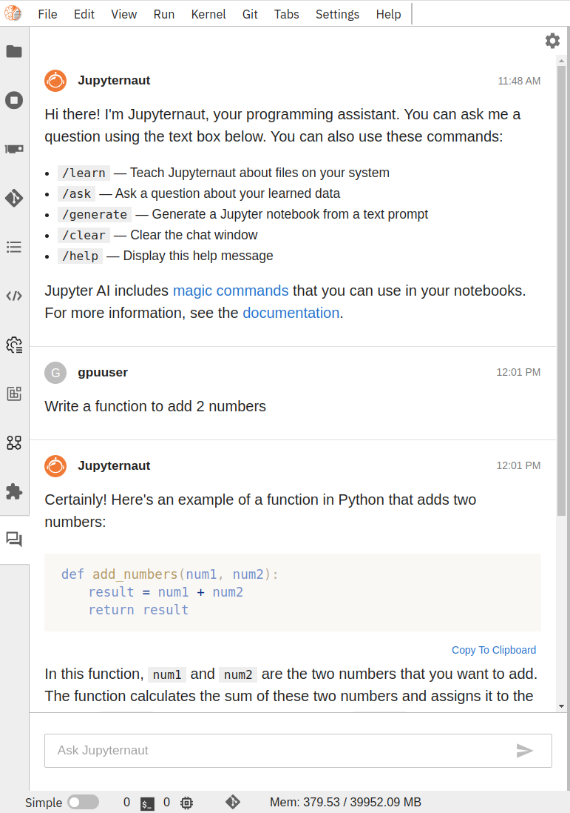
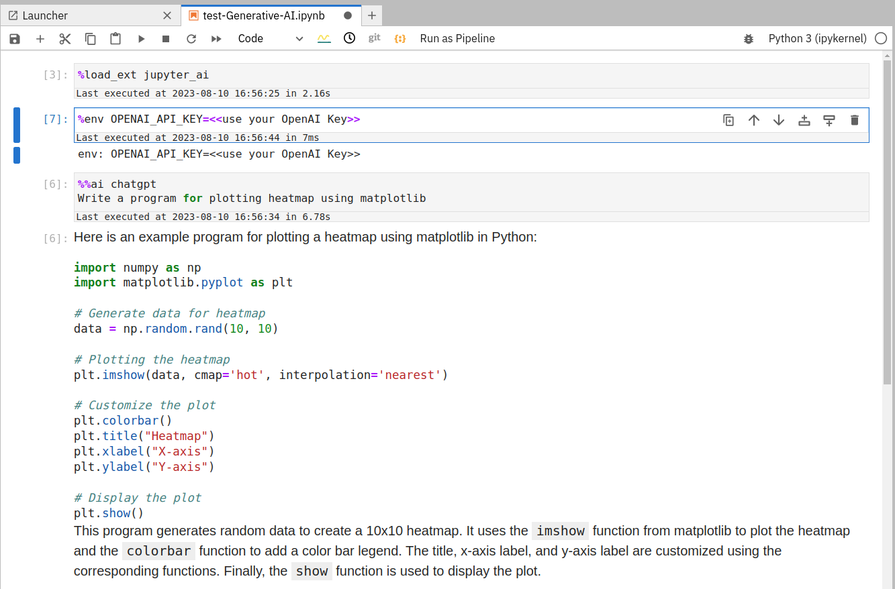

### Generative AI (ChatGPT) as a programming assitant

Many generative AI models by [OpenAI](https://openai.com/) are now accessible via a [UI plugin](https://github.com/jupyterlab/jupyter-ai) in the GPU-enabled JupyterLab interactive tool on Galaxy Europe. These AI models from OpenAI have been trained on an enormous amount of text that provides reasonable answers to queries - from literature to programming. In several ways, models such as ChatGPT can assist programmers in generating a backbone of general-purpose code blocks and methods, finding errors in code or developing explanations of already written code or existing errors, and for many different purposes. 

### Usage

 

By clicking on "chat" icon in the (bottom) left panel of JupyterLab, "Jupyternaut" programming assistant can be configured. It asks to choose a "language model" (an LLM). (Optionally) Further, an "embedding" model can be selected to make the assistant learn about the local file structures - files inside JupyterLab. User must provide their OpenAI access token to get responses to their queries. These tokens are for personal use and are NOT saved inside Galaxy. Refer to the above image. 

The Jupyternaut panel provides a chatbox for writing questions. When a query is submitted, an API call is made to the chosen OpenAI model and responses are shown in the same panel. Refer to the following two images.

Follow-up queries can also be made: 

Another way to use ChatGPT is via a notebook using "magic commands `%%ai`". Refer to the following image.

### Pricing for OpenAI token

The cost of using OpenAI models depends on factors such as the type of model (LLM) used and the number of tokens. The [price chart](https://openai.com/pricing) describes the detailed cost of using different LLMs. Models such as GPT4 are more expensive than GPT-3.5 Turbo. Usage cost also depends on the number of tokens/words used in the query and its response. Refer to the [tokens guide](https://platform.openai.com/docs/guides/gpt/managing-tokens) for more understanding. A straightforward example of how tokens are managed inside models is - the string "ChatGPT is great!" is encoded into six tokens: ["Chat", "G", "PT", " is", " great", "!"]. Using the GPT-3.5 Turbo model for 1000 tokens costs $0.0015.

### How to access on Galaxy Europe:

1. Acquire an OpenAI access token by creating an [OpenAI](https://openai.com/) account. It should be noted that using OpenAI models requires a premium/paid account.
2. Apply for using GPU JupyterLab using http://usegalaxy.eu/gpu-request. Ignore this step if you have access to GPU JupyterLab in Galaxy Europe.
3. Go to GPU JupyterLab tool in Galaxy Europe and choose tool version 0.2. Currently, it has been deployed on this version only. It may be deployed on other interactive tools (ITs) in Galaxy, serving Jupyter notebooks online.
4. Open the JupyterLab and click the "chat" icon at the bottom of the left panel. Choose the model you want to use and provide an OpenAI access token. It gives a chatbox to write questions. Refer to images 1 and 2.
5. Creating a regular notebook is Another way to use these models. Type the following commands in the same order in a notebook:

    a. `%load_ext jupyter_ai`
 
    b. `%env OPENAI_API_KEY=<<use your OpenAI Key>>`
 
    c. `%%ai chatgpt`

    d. `Write a program for plotting heatmap using matplotlib`

6. One example notebook is provided at `/notebooks/test-Generative-AI.ipynb`. Click [Jupyter AI](https://jupyter-ai.readthedocs.io/en/latest/users/index.html) for further examples and details.
