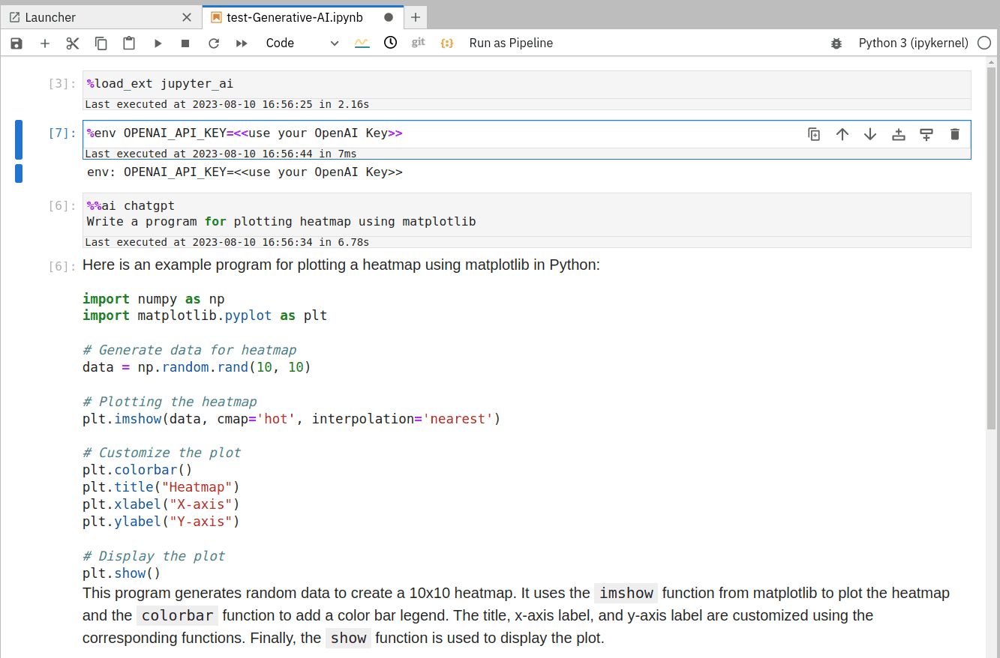

### Gerative AI (ChatGPT) models as a programming assitant

Many generative AI models by [OpenAI](https://openai.com/) have been made accessible via a [UI plugin](https://github.com/jupyterlab/jupyter-ai) in a JupyterLab interactive tool in Galaxy Europe. These AI models from OpenAI have been trained on an enormous amount of text that provides resonable answers to queries - from literature to programming.

### Steps to use:

1. Acquire an OpenAI access token from creating an [OpenAI](https://openai.com/) account. Note: it should be noted that the usage of OpenAI models require a premium/paid account.
2. Apply for using GPU JupyterLab using http://usegalaxy.eu/gpu-request. Ignore this step if you have its access.
3. Go to GPU JupyterLab tool in Galaxy Europe and choose the tool version 0.2 (currently) its available on this version only.
4. Open the JupyterLab and click on the "chat" icon at the bottom of the left panel. Choose the model you would like to use and provide you OpenAI access token. It provides a chatbox to write questions. Refer to image 3.
5. Another way to use these models is by creating a regular notebook. Type the following commands in the same order in a notebook:

- `%load_ext jupyter_ai`
- `%env OPENAI_API_KEY=<<use your OpenAI Key>>`
- `%%ai chatgpt`
- `Write a program for plotting heatmap using matplotlib`

6. One example notebook is provided at `/notebooks/test-Generative-AI.ipynb`. Click [Jupyter AI](https://jupyter-ai.readthedocs.io/en/latest/users/index.html) for further examples and details.

