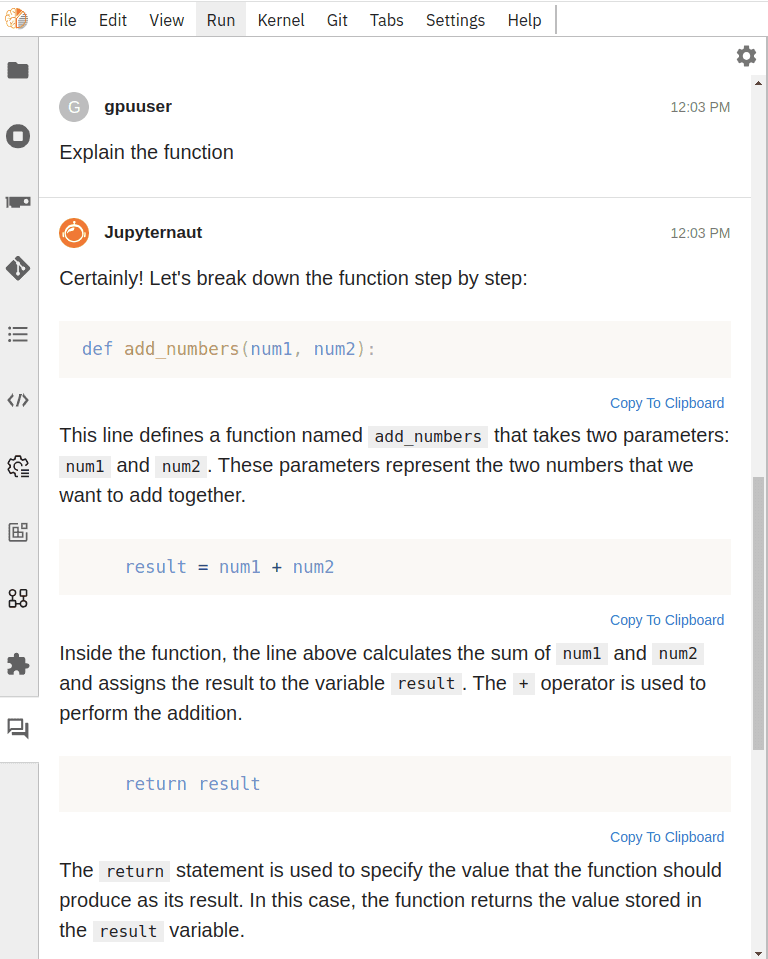

### Generative AI (ChatGPT) as a programming assitant

Many generative AI models by [OpenAI](https://openai.com/) are now accessible via a [UI plugin](https://github.com/jupyterlab/jupyter-ai) in the GPU-enabled JupyterLab interactive tool on Galaxy Europe. These AI models from OpenAI have been trained on an enormous amount of text that provides reasonable answers to queries - from literature to programming. In several ways, models such as ChatGPT can assist programmers in generating a backbone of general-purpose code blocks and methods, finding errors in code or developing explanations of already written code or existing errors, and for many different purposes.

### How to access on Galaxy Europe:

1. If you do not have it already, please apply for using GPU JupyterLab via http://usegalaxy.eu/gpu-request.
2. Acquire an OpenAI access token by creating an [OpenAI](https://openai.com/) account. It should be noted that using OpenAI models requires a premium/paid account from OpenAI.
3. Go to [GPU JupyterLab tool](https://usegalaxy.eu/?tool_id=interactive_tool_ml_jupyter_notebook&version=0.2) in Galaxy Europe.
4. Open the JupyterLab and click the "chat" icon at the bottom of the left panel ("Jupyternaut"). Choose the model you want to use ("language model", an LLM). (Optionally) Further, an "embedding" model can be selected to make the assistant learn about the local file structures - files inside JupyterLab. Users must provide an OpenAI access token to get responses to their queries. These tokens are for personal use and are NOT saved inside Galaxy. Then, a chatbox is shown to write questions. Refer to images 1 and 2.

Follow-up queries can also be made: 

5. Another way to use ChatGPT is from inside a notebook using the "magic command" `%%ai`, see the next image to get an idea. An example is provided at `/notebooks/test-Generative-AI.ipynb` inside the notebook. See the following image for further details.

For more examples and details, see the [Jupyter AI page](https://jupyter-ai.readthedocs.io/en/latest/users/index.html).
