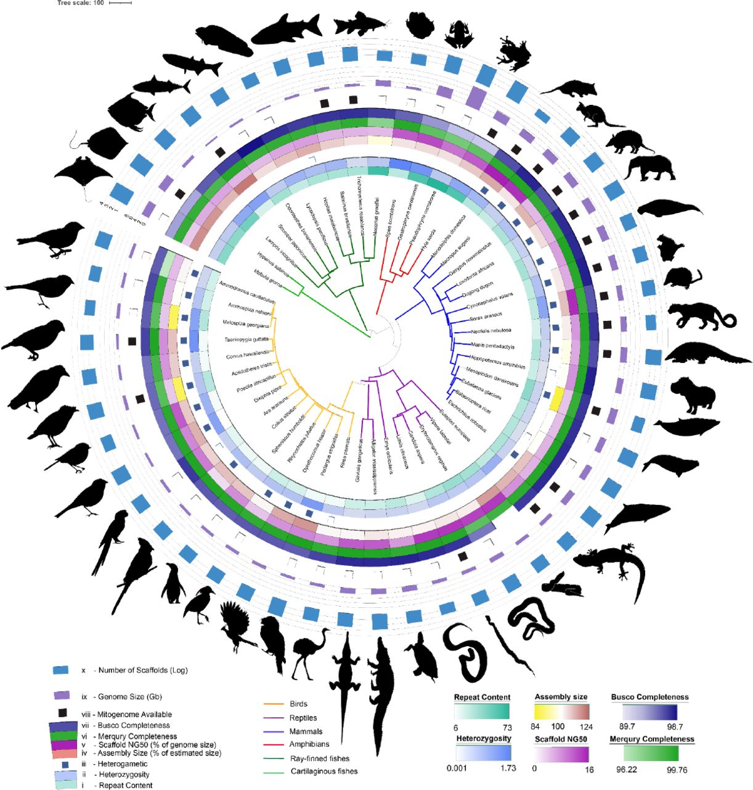

Hello, Galaxy Community!

The Galaxy Project is excited to share a new paper in preprint! 

“Scalable, accessible, and reproducible reference genome assembly and evaluation in Galaxy”, authored by Larivière et al. (2023), presents the latest genome assembly pipeline used by the Vertebrate Genome Project in Galaxy (VGP-Galaxy pipeline 2.1). This new pipeline is freely accessible through Galaxy, which directly contributes to Galaxy’s mission of reproducible, open-source, and FAIR (Findability, Accessibility, Interoperability, and Reuse of digital assets) data analysis!

This new, versatile pipeline combines Hi-C-based haplotype phasing and PacBio HiFi long-reads in a graph model and is standardized with quality control to assess complexities automatically. The pipeline is organized into ten workflows in Galaxy and can be successfully launched in just a few clicks of your mouse! The success of the VGP-Galaxy pipeline 2.1 was demonstrated in this paper through the assembly of reference genomes for 51 vertebrate species.

To access the latest versions of the workflows, please see the Galaxy Project VGP page (https://galaxyproject.org/projects/vgp/); here, you will see the workflows and their use described in detail, along with additional training materials for users interested in learning about genome assembly!

*Read the full paper here! (https://www.biorxiv.org/content/10.1101/2023.06.28.546576v1.full)*

Sincerely,
The Galaxy Project
