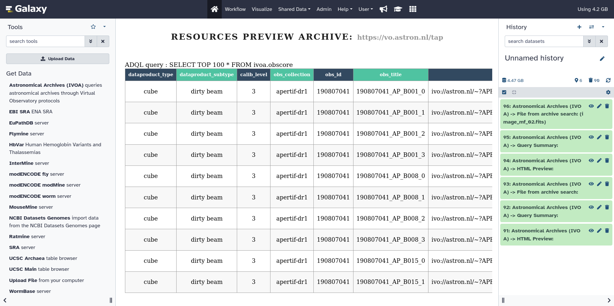

In a continuing effort to bring astronomical workflows to Galaxy, as part of the EuroScienceGateway project [WP5]([https://galaxyproject.org/projects/esg/news/?tag=esg-wp5](https://galaxyproject.org/projects/esg/news/?tag=esg-wp5)), the [EPFL]([https://www.epfl.ch/en/](https://www.epfl.ch/en/))  and [UPC]([https://apc.u-paris.fr/APC_CS/](https://apc.u-paris.fr/APC_CS/))  have made a first attempt at integrating astronomical archives directly into the Galaxy platform through the development of a specific tool aimed at enabling the discovery and download of astronomy related files.

Relying on community developed software and protocols, like the [IVOA virtual observatory service protocols]([https://www.ivoa.net/](https://www.ivoa.net/)) and the [PyVO]([https://pyvo.readthedocs.io/en/latest/#](https://pyvo.readthedocs.io/en/latest/#)) python library, the tool enables the user to:

-   Choose a specific archive from a list of 138 different archives or query multiple archives matching a specific keyword
    
-   Run custom TAP queries or use the IVOA obscore table query builder
    
-   Preview the content of an archive table through an html report integrated into Galay
    
-   Download a csv file containing access urls of every resources matching a given query
    
-   Download matching files directly into Galaxy
    

This tool has been presented for the first time at the 2023 edition of the Swiss SKA Days by Volodymyr Savchenko, the slides of the presentation are available [here]() and a video demonstrating the tool different features can be found [here]()

The tool is available on the Galaxy toolshed at this [url]([https://toolshed.g2.bx.psu.edu/repository?repository_id=5e558af15782f7db&changeset_revision=0ddfc343f9f9](https://toolshed.g2.bx.psu.edu/repository?repository_id=5e558af15782f7db&changeset_revision=0ddfc343f9f9)) and through the built-in toolshed interface inside any Galaxy instance

The possibility to add new features like cone search or the development of a new more interactive tool that would give more freedom to users and make exploring archives easier are also being researched right now
=======
title: 'Connecting Astronomical Data Archives with Galaxy'
date: "2023-09-25"  
tease: "Enabling astronomers to search and download data from IVOA-compliant archives directly within Galaxy"
hide_tease: false
tags: [esg-wp5, esg]
subsites: [all-eu, esg, all]
main_subsite: eu
---

Astronomical observations are diverse and unique, maintaining their scientific value for centuries. This lead the astronomical community to develop traditions and practices of data preservation and interoperability in Astronomical Data Archives. Modern astronomical observatories produce large, nearing exoscale, amounts of data, 
posing new challenges which can be addressed by web-based platforms bringing analysis code to the data. Possibility to discover and analyse data from these archives is crucial for making Galaxy adopted in astronomocal community.

As part of the effort to bring astronomical workflows to Galaxy within EuroScienceGateway project [WP5](https://galaxyproject.org/projects/esg/news/?tag=esg-wp5), teams at [EPFL](https://www.epfl.ch/en/) and [UPC](https://apc.u-paris.fr/APC_CS/) developed [a tool](https://usegalaxy.eu/root?tool_id=astronomical_archives) which relies on Table Access Protocol ([TAP](https://wiki.ivoa.net/twiki/bin/view/IVOA/TableAccess)) developed by  International Virtual Observatory Alliance ([IVOA](https://www.ivoa.net/)) to allow user to:

* Choose a specific archive from a list of 138 different archives or query multiple archives matching a keyword
* Run custom [ADQL](https://www.ivoa.net/documents/ADQL/) TAP queries or use the IVOA table query builder
* Preview discovered resources in an easy-to-explore HTML
* Obtain a CSV file containing resource URLs matching given query    
* Download matching files directly into Galaxy for futher analysis

  

<figcaption>
Selection of <a href="https://science.astron.nl/sdc/astron-data-explorer/data-releases/apertif-dr1/">APERTIF</a> radio telescope observation data found at <a href="https://science.astron.nl/sdc/astron-data-explorer/">ASTRON</a> archive through IVOA TAP protocol with a <a href="https://usegalaxy.eu/root?tool_id=astronomical_archives">Galaxy tool</a>
</figcaption>

    
For a demonstation of the tool features, see [video](https://fair.tube/w/bAYTSeD7gt2XiDTWzTo3rz).
This functionality has been [presented](https://galaxyproject.org/events/2023-09-06/) at the 2023 edition of the Swiss SKA Days. 

The tool is [now available](https://toolshed.g2.bx.psu.edu/repository?repository_id=5e558af15782f7db&changeset_revision=0ddfc343f9f9) on the Galaxy toolshed.

We are exploring possibilities for extending the tool with further features, in particular adding more interactive user interface with a visualization plugin.

We are grateful to [IVOA](https://www.ivoa.net/) and all contributing institutions for developing and maintaining crucial interoperability layer for astronomical community. We are also greateful to [PyVO](https://github.com/astropy/pyvo) developers for their work on the library which is the basis of the presented Galaxy tool.
