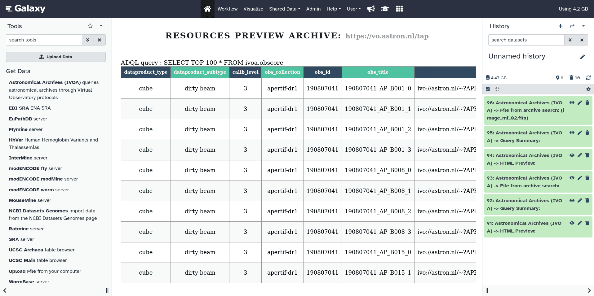

Astronomical observations are diverse and unique, maintaining their scientific value for centuries. This lead the astronomical community to develop traditions and practices of data preservation and interoperability in Astronomical Data Archives. Modern astronomical observatories produce large, nearing exoscale, amounts of data, 
posing new challenges which can be addressed by web-based platforms bringing analysis code to the data. Possibility to discover and analyse data from these archives is crucial for making Galaxy adopted in astronomocal community.

As part of the effort to bring astronomical workflows to Galaxy within EuroScienceGateway project [WP5](https://galaxyproject.org/projects/esg/news/?tag=esg-wp5), teams at [EPFL](https://www.epfl.ch/en/) and [UPC](https://apc.u-paris.fr/APC_CS/) developed [a tool](https://usegalaxy.eu/root?tool_id=astronomical_archives) which relies on Table Access Protocol ([TAP](https://wiki.ivoa.net/twiki/bin/view/IVOA/TableAccess)) developed by  International Virtual Observatory Alliance ([IVOA](https://www.ivoa.net/)) to allow user to:

* Choose a specific archive from a list of 138 different archives or query multiple archives matching a keyword
* Run custom [ADQL](https://www.ivoa.net/documents/ADQL/) TAP queries or use the IVOA table query builder
* Preview discovered resources in an easy-to-explore HTML
* Obtain a CSV file containing resource URLs matching given query    
* Download matching files directly into Galaxy for futher analysis

  

<figcaption>
Selection of <a href="https://science.astron.nl/sdc/astron-data-explorer/data-releases/apertif-dr1/">APERTIF</a> radio telescope observation data found at <a href="https://science.astron.nl/sdc/astron-data-explorer/">ASTRON</a> archive through IVOA TAP protocol with a <a href="https://usegalaxy.eu/root?tool_id=astronomical_archives">Galaxy tool</a>
</figcaption>

    
For a demonstation of the tool features, see [video](https://fair.tube/w/bAYTSeD7gt2XiDTWzTo3rz).
This functionality has been [presented](https://galaxyproject.org/events/2023-09-06/) at the 2023 edition of the Swiss SKA Days. 

The tool is [now available](https://toolshed.g2.bx.psu.edu/repository?repository_id=5e558af15782f7db&changeset_revision=0ddfc343f9f9) on the Galaxy toolshed.

We are exploring possibilities for extending the tool with further features, in particular adding more interactive user interface with a visualization plugin.

We are grateful to [IVOA](https://www.ivoa.net/) and all contributing institutions for developing and maintaining crucial interoperability layer for astronomical community. We are also greateful to [PyVO](https://github.com/astropy/pyvo) developers for their work on the library which is the basis of the presented Galaxy tool.

