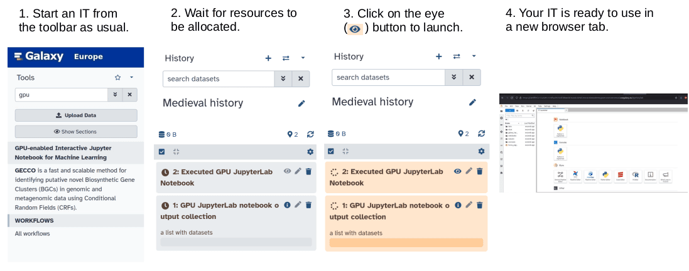

September marks the end of the summer semester here in southwestern Germany. Exquisite time to enjoy the nature before it is too late, but also a good time to finish up leftover tasks, contemplate on our progress and make plans for the future. At the top of this list is this way overdue blog post regarding our work on Galaxy interactive tools, which allow users to visually communicate with software during its execution on Galaxy.

## What are Interactive Tools (IT) on Galaxy?

For a non-interactive tool execution, the user defines all inputs before the job execution and has access to the results after the job finishes. During the execution phase of the job, the user does not and cannot interact with the system. For majority of the scientific software, this model is actually fully sufficient. Because they are commandline-only, the computation follows a pre-written recipe in the script and a user input during the computation is not needed at all.

    

<cb>Non-IT execution model</cb>

<cb>IT execution model</cb>

However, sometimes this model is too restrictive, say when the user wants to explore the data manually. The project might be too new and you do not have a well-defined algorithmic approach available yet; you want to try a few ideas out in rapid succession, visualise them in a few ways and see what works, what fails and how the data look. In theory, one could write a tool for each such variation, but it is too cumbersome for creative work.

This is where Galaxy Interactive Tools (IT) come into play. As before, the user can still define some inputs and pass them to the interactive environment and will have access to the results after execution via history. However, the user will also be able to communicate with the tool during its execution by clicking, selecting, typing, and filtering via a GUI. In essence, this replicates the experience of a remote desktop (or VM) user. They provide a reproducible and resumable computing system, which can leverage the existing computing and storage infrastructure of the Galaxy instance.

### Galaxy ITs enhances the efficiency and reproducibility within dynamic research landscapes.
ITs empower users with interactive coding environments, enabling real-time manipulation of code, visualizations, and data analysis and fostering iterative exploration. As a case study, consider a user developing a new machine learning model for the first time, a task involving a execution of a few scripts executed on some (test) datasets, that are modified on the go. The proposed model needs to be debugged and then optimised with different training parameters. With the integrated Virtual Research Environments (VREs) such as Jupyterlab or Rstudio, Galaxy simplifies such exploratory research project ideas. 

### Users only need a browser to access.
A local deployment of such resources could potentially present technical and security concerns, and might even prohibit common usage scenarios due to institutional policies or hardware with restrictive configurations. The users would also likely need to purchase and/or configure a suitable graphics processor to be able to fully test their code and the model, which costs researchers time and funds. As such, ITs lower the barriers to entry.

### No need for data transfer
One common way of harnessing data for modelling or visualisation is by processing big raw data sets via Galaxy workflows, and the results will already be in the user history. Transfer of training data would also require the user to export this data to a local computing resource, which might trigger high network traffic due to its sheer size or might even be off-limits by local data privacy regulations. ITs alleviate all of these issues as the users would immediately gain access to a pre-configured system with access to their data stored within Galaxy histories or shared libraries.

### Launching an IT is very simple

### Adding workflows a "human touch"
Just like any other tool, Galaxy ITs can be integrated into a "traditional" workflow, with the possibility to switch back to non-interactive tools at any time, thereby adding a "human touch" to the workflow for the steps that require a manual inspection or intervention. Incorporating ITs into a Galaxy workflow will pause the execution of the downstream steps till the user completes the interactive tasks. Processing will continue asynchronously once the interactive step is complete, potentially making use of the results interactively generated by the user as inputs at various downstream steps.

## Updates from [usegalaxy.eu](https://usegalaxy.eu)

Within the four-year time window between September 2019 and August 2023, our public instance, [live.usegalaxy.eu](https://live.usegalaxy.eu), already served 21801 IT jobs executions. A coarse look into the job statistics suggests that the typical availability of the system was not very different than that of a user-owned local system. Thanks to the availability of computing resources dedicated to IT executions in our cloud, users usually did not need to wait much after realising their need and spinning up an IT instance: half of the requests began within 21s, whereas 83.2% were ready for research use within 100s. To ensure the fair distribution of limited resources, we implement user- and system-wide quotas on the number of simultaneous IT instances, which suspend (or postpone) the provision of additional instances if too many were requested at once.

We think that ITs provide an opportunity to integrate much more interactive scientific use-cases and visualizations and will increasingly gain popularity in the community. While the popularity of the ITs gradually increased over the past few years, we believe we still have ample room to welcome a higher foot traffic.

### New ITs
In the recent past, we added new ITs to [usegalaxy.eu](https://usegalaxy.eu), reaching now a total of 46 ITs available. But adding your own favourite tool is not very different than a typical non-IT integration experience, either. ITs exploit the containerisation technology: adding new ITs require access to a container running the tool. It then suffices to declare the tool as an interactive tool in its wrapper, and define a port, through which the tool should be accessed from within the container (see our [quick guide](https://github.com/usegalaxy-eu/operations/blob/main/interactive_tools.md) or a comprehensive [admin tutorial](https://training.galaxyproject.org/training-material/topics/admin/tutorials/interactive-tools/tutorial.html)).

