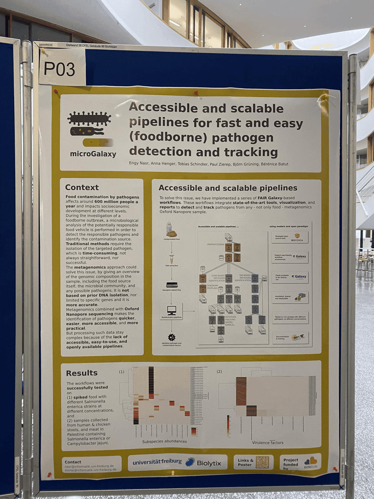
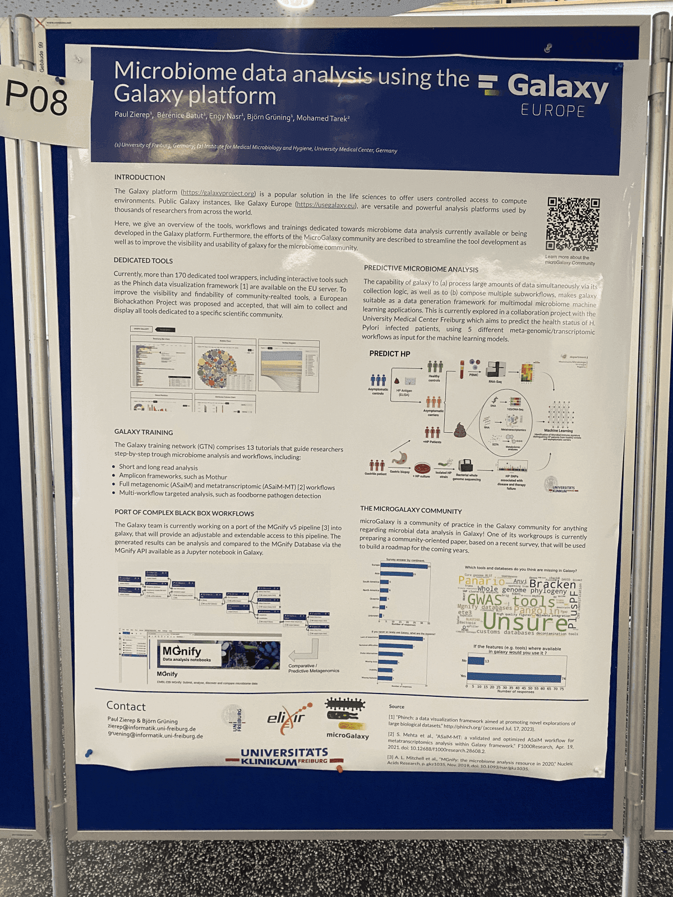
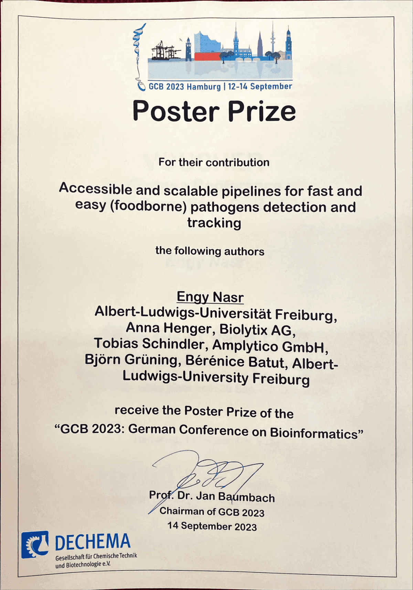

From the 11th to the 14th of Semptember, Engy Nasr (I) and Paul Zierep from the Freiburg Galaxy team travelled to Hamburg to join and present our posters about 'Accessible and scalable Galaxy pipelines for fast and easy (foodborne) Pathogen detection and tracking' and 'Microbiome data analysis using the Galaxy platform' at the [**German Conference on Bioinformatics (GCB) 2023**](https://gcb2023.de/).

<twitter tweet="1702283085729996879"></twitter> 

The German Conference on Bioinformatics (GCB) is an annual, international conference devoted to all areas of bioinformatics and meant as a platform for the whole bioinformatics community. Recent meetings attracted a multinational audience of approx. 250 participants each year.

This year’s talks focused on Multiomics analysis with Machine learning for the serve of the public health.

On the first day; there were multiple worshops, 7 of them were in the morning and 5 of them were in the afternoon, participants had the chance to choose one of them to attend.

On the second day; we had two keynote and two talk sessions. At the end of the second talk session, we had the poster session, were 140 posters were presented. The poster prepared by Bérénice Batut and presented by me, was about the project **Foodborne Pathogen Dectection using direct Nanopore** and how is it important to implement it within Galaxy. I have presented my work and showed the Pathogen Detection workflow created in Galaxy along with its [**training material**](https://training.galaxyproject.org/training-material/topics/metagenomics/tutorials/pathogen-detection-from-nanopore-foodborne-data/tutorial.html) and results.

Paul has also presented his poster about **Microbiome data analysis using the Galaxy platform** with an example of our current project pAllori, where we create Galaxy workflows to perform multi mircobiome data analysis applying machine learning algorthims to identify patients with Helicobacter pylori.

During the poster sessions, we also had the chance to meet Dr. Anne Hartebrodt and learn about Time shifting computation to reduce the carbon emissions of software. This technique is particular interesting for the galaxy project, in order to improve our environmental footprint. Thanks to the contact we made during GCB, Anne will preset her work during the European galaxy days [EGD](https://galaxyproject.org/events/2023-10-egd/egd/).

On the third and last day; we had more keynotes and very interesting other talks sessions, as shown in the [programme](https://gcb2023.de/Programme/_/Programm_GCB_2023%20-%2007.09.2023.pdf). Before closing the conference they annonced the winning poster, and we made it again with the Foodborne project, we won the best poster award, where I got a free conference fee for GCB 2024 in Bielefeld.

<twitter tweet="1702282717381996985"></twitter>

Overall, I have really enjoyed attending the conference. I met a lot of scientist working on similar projects where we had a chance to exchange our knowledge. I would like to thank **DECHEMA** for choosing our poster to win the award and having me attenging the conference. Wish to see all the people I met next year in GCB 2024.
