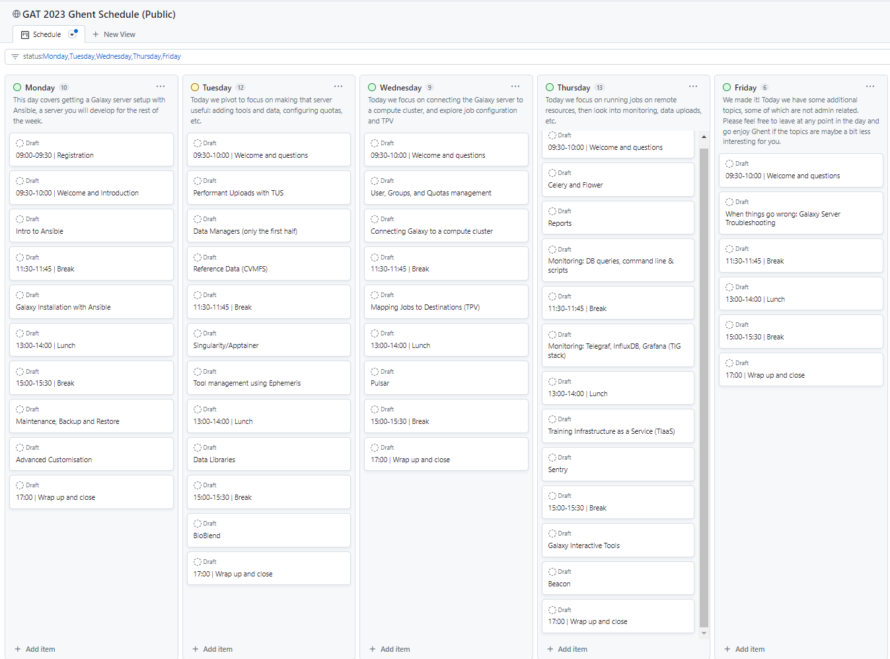

Galaxy Europe conducted the [Galaxy Admin Training (GAT) 2023](https://galaxyproject.org/events/2023-admin-training/) in Ghent Belgium this year from April 17th till 21st ([schedule](https://github.com/orgs/galaxyproject/projects/28/views/1?filterQuery=status%3AMonday%2CTuesday%2CWednesday%2CThursday%2CFriday+)) and invited experts and senior admins with several years of experience in maintaining Galaxy to share the ins and outs of setting up an own production quality Galaxy server and various other services. The training was attended by 16 participants from different countries and backgrounds.

The training covered the basic and advanced topics needed to know to setup and maintain a production, high-performance and multi-user Galaxy instance. During the one week intensive hands-on training session participants were introduced to Ansible, a configuration management system which is used to automate the installation and configuration of Galaxy and its dependencies. The training also covered the installation of various other services such as tusd, CVMFS, containers, tool management, reference datasets, meta-schedulers such as Total Perspective Vortex (TPV), job schedulers, pulsar, celery among others.

During the training, various elements, strategies, debugging techniques and best practices were discussed and shared. The training was a great success and the participants were very happy with the training and the knowledge they gained. Especially with the training material, which is available online and can be used as a reference for future use. The training material is available at [https://training.galaxyproject.org/training-material/topics/admin/](https://training.galaxyproject.org/training-material/topics/admin/).

# Schedule

# Funding

We would like to thank the [EOSC-LIFE](https://www.eosc-life.eu/), [EOSC EuroScienceGateway](https://galaxyproject.org/projects/esg/), and [ELIXIR](https://elixir-europe.org/) for their support and funding for this training. EOSC-Life has received funding from the European Union’s Horizon 2020 programme under grant agreement number 824087. EuroScienceGateway has received funding from Horizon Europe programme of the EU with the number 101057388.

# Acknowledgements

We would like to thank all the instructors and participants for their time and effort in making this training a success. Also, we would like to extend our gratitude to our partners at VIB, Frederik Coppens (ELIXIR Belgium), and Kim De Ruyck (ELIXIR Belgium) for their support and help in organising this training.
