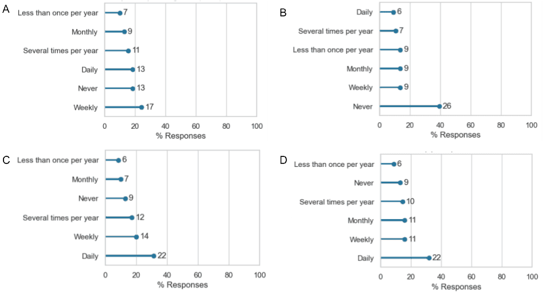
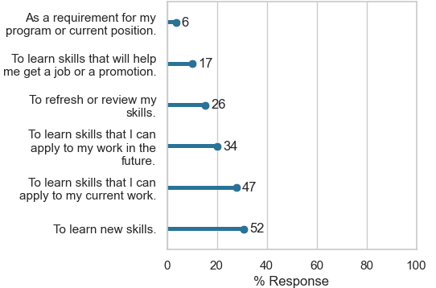

The [BioNT](http://biont-training.eu/) consortium is dedicated to **providing a comprehensive training program** and **fostering a community for digital skills** relevant to the **biotechnology industry and biomedical sector**. With a curriculum tailored for both beginners and advanced professionals, BioNT aims to equip individuals with the necessary expertise in handling, processing, and visualising biological data, as well as utilising computational biology tools. Leveraging the consortium's strong background in digital literacy training and extensive network of collaborations, BioNT is poised to **professionalise life sciences data management, processing, and analysis skills**.

BioNT delivered its **first training workshop**, a Bioinformatics Introduction workshop from 4th to 8th of September, 2023. It was fully online and free of costs.

Within this practical introduction to bioinformatics, key concepts of **sequencing data analysis** were explained and a **broader overview on bioinformatics data analysis** was given. The focus was on **RNA-sequencing**. Indeed, RNA-sequencing revolutionised genomics and health care research, by being a high-throughput and comparatively low-cost method. Together with the development of computational tools to enable their analysis, it has fundamentally improved our understanding of RNA biology.

The **Galaxy** platform was selected as the training infrastructure to support this workshop. Galaxy is a worldwide open source project. The [European Galaxy server](https://usegalaxy.eu/) is the biggest instance in Europe with more than 70,000 users. It offers free access to databases and more than 3,200 bioinformatics[ tools](https://galaxyproject.eu/tools) which can be used through a graphical user interface.

Within this workshop, the **30+** participants learnt how to **use Galaxy** and how to **perform a full RNA-seq data analysis**. In bioinformatics, RNA-seq data is one of the most commonly performed data analyses. However, there are many different kinds of data and potential ways to analyse them. Therefore, the last workshop day provided an **overview of the wide range of bioinformatics databases and data formats**.

# Organisation of the workshop

The workshop "A practical introduction to bioinformatics and RNA-seq using Galaxy" ran for **5 day**s, from 4th to 8th of September 8, 2023. It was **fully online** and **free of costs**. Each day, a **4-hour session** was delivered from 9:00 to 13:00 CEST.

## Webpage and registrations

The [CECAM](https://www.cecam.org/) event management platform, provided by the EPFL, was used to create a dedicated webpage (accessible at [https://www.cecam.org/workshop-details/1260](https://www.cecam.org/workshop-details/1260)) for the workshop, which included the workshop description, learning objectives, requirements, program, and any further information relevant to potential participants. 

For registration, the CECAM platform was used to manage the applicant's information and communication. In parallel, the EMBL servers were used to collect pre- and post-workshop information through pseudo-anonymised surveys. The survey data was linked to the applicant's data only via a unique identifier, provided in the CECAM registration process, as well as in the EMBL-based survey. This ensures that **only the workshop organisers access the applicants' personal data while still collecting information relevant to the workshop separately**. To register, applicants had to: 
1. register on the CECAM platform,
2. complete and submit the pre-workshop survey,
3. complete the application on the CECAM platform using the unique identifier generated at the end of the pre-workshop survey. 

## Infrastructure for the workshop

The workshop was delivered in a **Zoom webinar format**, with **participants' visibility disabled to preserve their privacy**. Participants were able to see and learn from the trainers. However, **direct interactions (e.g. chat or voice) were not possible** within Zoom during the sessions. All direct interaction took place in **written form via a collaborative document**, where anonymous participation was ensured. To serve the collaborative documents, a HedgeDoc collaborative space was set up by BIOBYTE, and is hosted on their server.

A **Main** collaborative document, setup by the instructors and organisers, was shared with the participants before the session. Each section of the workshop had dedicated _Hands-on_ boxes to report on the task status, ask questions, or raise issues. **Helpers engaged and helped participants by answering the questions and issues directly in this document**. This Main document was filled in live during the workshop. Separate boxes to answer questions were used to improve participant engagement and as an indirect learning assessment.

To help with the organisation, four HedgeDoc documents were used:
1. a **[Template](https://biont.biobyte.de/AZptJADHQBusn0t6tpBL5w)** with all instructions and boxes for hands-on, questions, etc;
2. the **[Main](https://biont.biobyte.de/JvXq44sER_qfh-1J_XIwbg)** document with the information for the participants during the workshop, filled with boxes related to the section covered by the instructor to help with the navigation and cleaned during each break to avoid an overcrowded document;
3. a **[History](https://biont.biobyte.de/s/fDH1UF18o#)** document with everything that needed to be kept and shared with participants after the workshop
4. a [document](https://biont.biobyte.de/IqUZPrizR82BdwUHRzA0aA#) for Helpers & Instructors was created providing the workshop setup, interactions and explaining tasks of the helpers and instructors.

Galaxy, an open source platform for accessible, reproducible, and transparent computational research, via the **European Galaxy server**, was used during the workshop because it enables participants to access 3,000+ tools, high-performance compute resources, through a standard web browser, without requiring informatics expertise. To support this workshop, a dedicated job queue and resources was provided via the **Training Infrastructure as a Service** (TIaaS - [https://usegalaxy.eu/tiaas/](https://usegalaxy.eu/tiaas/)). This service also provided instructors with a dashboard, enabling them to monitor the progress of the participants.

The training material used during this workshop, i.e. slides and tutorials, are all **stored and publicly available on the [Galaxy Training Network website](https://training.galaxyproject.org)**. For the first four days, existing tutorials and slides were used. For the last day, dedicated tutorials and slides were developed **specifically** for this workshop and contributed to the Galaxy Training Network.

| Day | Topic | Material |
|---|-----|--------|
| 1 | Galaxy Introduction | [Slides](https://training.galaxyproject.org/training-material/topics/introduction/tutorials/introduction/slides.html) + [Tutorial](https://training.galaxyproject.org/training-material/topics/introduction/tutorials/galaxy-intro-peaks2genes/tutorial.html) |
| 2 | Quality Control | [Slides](https://training.galaxyproject.org/training-material/topics/sequence-analysis/tutorials/quality-control/slides.html#1) + [Tutorial](https://training.galaxyproject.org/training-material/topics/sequence-analysis/tutorials/quality-control/tutorial.html) |
| 2 | Mapping | [Slides](https://training.galaxyproject.org/training-material/topics/sequence-analysis/tutorials/mapping/slides.html#1) + [Tutorial](https://training.galaxyproject.org/training-material/topics/sequence-analysis/tutorials/mapping/tutorial.html) |
| 3 | Introduction to Transcriptomics | [Slides](https://training.galaxyproject.org/training-material/topics/transcriptomics/tutorials/introduction/slides.html#1) |
| 3 + 4 | Reference-based RNA-seq | [Tutorial](https://training.galaxyproject.org/training-material/topics/transcriptomics/tutorials/ref-based/tutorial.html) |
| 5 | Learning about one gene across biological resources and formats | [Slides](https://training.galaxyproject.org/training-material/topics/data-science/tutorials/online-resources-gene/slides.html#1) + [Tutorial](https://training.galaxyproject.org/training-material/topics/data-science/tutorials/online-resources-gene/tutorial.html) |
| 5 | One protein along the UniProt page | [Tutorial](https://training.galaxyproject.org/training-material/topics/data-science/tutorials/online-resources-protein/tutorial.html) |

## Certificates

Certificates were provided to those participants who explicitly required them after checking for their participation using two criteria: 
1. they joined at least one session on Zoom or notified that they could not attend live and 
2. they provided links to their Galaxy histories corresponding to the taught tutorials.

# Outcomes of the workshop

## Applications and pre-workshop survey

**73** applicants completed the pre-workshop survey and **60** submitted their application form via the CECAM platform. The pre-workshop survey consisted of 13 questions covering skills, demographics, and miscellaneous topics. The majority of questions were not mandatory for the successful completion and submission of the survey.

### General information

The 73 applicants, **almost at a balanced gender representation** with 43.84% female and 46.58% male, were from and were working in **35 countries**: 16 countries in Europe, 10 in Asia, 5 in Africa, 3 in South America, and 1 in North America. 38.36% described themselves as White, 27.4% as Asian, 9.59% as Black or African American, 8.22% Hispanic or Latino(a).

Most applicants (63%) were **academic employees** as graduate students (31%) or research staff (27%), from the Genetics, Genomics, or Bioinformatics field. 

Related to the original target audience of this workshop, 6 applicants were **industry employees** and 21 were **job seekers** (with 12 in Academia and 3 in Industry). Regarding the connections with SMEs, 13 mentioned working in an SME, 12 collaborating with SME(s) and 22 aiming at working in an SME. 

63% of the applicants planned to use Windows for the workshop, 20% macOS and 12% Linux. Finally, two applicants had **visual accessibility requirements**. These two participants were contacted in advance to enquire about their accessibility requirements. The organisers afterwards provided the full learning materials and an offer for further assistance, if needed.

### Background information

The aim of this workshop was to give an introduction to bioinformatics and RNA-seq using Galaxy. When asked about their knowledge and use of Galaxy, the answers are quite diverse, from "never" to "daily".

There was an **interest in learning how to analyse sequencing data**, given the frequency with which they analyse data: 68% analyse sequencing data at least several times per year (A), but the vast majority never builds bioinformatics workflows (B). They use programming languages and/or command line tools for that (C-D).

Most applicants (85%) agree with the **importance of having access to the original, raw data** to be able to repeat an analysis (data not shown). The majority agree that using a programming language can make their analyses easier to reproduce, but 37% of applicants were satisfied with their current data management and analysis workflow.

### Expectations

The expectations of the applicants regarding the workshop were quite diverse. They were mostly **interested in learning**: How to perform basic analyses, in particular RNA-seq; how to build pipelines and workflows; how to use Galaxy and cloud based bioinformatics infrastructure without complex coding; new tools; how to process (massive) biological data. 

    

## Participation

**All applicants** that submitted their complete application were selected to participate in the workshop, but not all of them joined for the complete workshop.

After the workshop, **18** participants requested a certificate. The certificate was provided to those 16 participants that completed the post-workshop survey and submitted their Galaxy history.

## Daily feedback

At the end of each day, participants were asked for feedback on the following three points:

* Please share one thing that was good about today
* Please share one thing that that could be improved about today
* Do you have any other comments?

The daily feedback is summarised in the following Table:

<table>
  <tr>
   <td><strong>Day</strong></td>
   <td><strong>Topic</strong></td>
   <td><strong>Good about today</strong></td>
   <td><strong>To improve</strong></td>
   <td><strong>Any other comments?</strong></td>
  </tr>
  <tr>
   <td>1</td>
   <td>Galaxy Introduction</td>
   <td>Nice tutorial, easy to follow and perform steps on Galaxy
        
Nice speed to follow all the steps
        
Clear explanations of performed steps
        
Real-time interactions :-)
        
Good idea to use HedgeDoc
   </td>
   <td>Some steps require more time than for the instructor
        
Sometimes, it is not clear why a specific tool or step is needed
        
Maybe some information on how to choose the tool like would there be alternatives or is there only the one we used
   </td>
   <td>
   </td>
  </tr>
  <tr>
   <td>2</td>
   <td>Quality Control 
        
Mapping
   </td>
   <td>The speed of the class was perfect
        
The repetitions after loading the data or each analysis were helpful
        
We covered a lot of material and the explanations were good
        
Everything was excellent
        
The class was interactive and very understandable
        
The class was very practical.
        
The class was well packed with hands on skills
   </td>
   <td>Reduce the info or increase time because it was a little bit overwhelming with the amount of information
        
Maybe it would it be better to modify the tutorial guides, or rather not to follow them completely, for us to cover all the agenda for the meeting
   </td>
   <td>Thank you and continue with the great workshops!
        
Thank you for this world class workshop. I got new information today.
        
Thank you for this workshop! Let’s keep going! You are doing a great job!
        
You are doing a great job! Thank you so much :)
        
Good job
   </td>
  </tr>
  <tr>
   <td>3</td>
   <td>Introduction to Transcriptomics 
        
Reference-based RNA-seq (Part I)
   </td>
   <td>Great job! Thank you both!
        
Really great how the complex content was explained
        
See the troubles with running the jobs and how to fix mistakes
   </td>
   <td>Share a history that people can keep on working in case someone gets stuck because it doesn’t run or after a long waiting time failed
        
Fetch the needed datasets from the data libraries (if they are available) before the workshop if possible.
        
Install IGV locally the previous day to have it ready
        
Extend the RNA seq analysis day because of the demanding calculations on Galaxy
   </td>
   <td></td>
  </tr>
  <tr>
   <td>4</td>
   <td>Reference-based RNA-seq (Part II)</td>
   <td>The speed of the class, it was really easy to follow, and the graph explanation. 
        
Clear explanations of steps and selected options, as well as of obtained results
        
New Galaxy tools and protocols
        
Big help with answering also general questions
   </td>
   <td>A little bit longer</td>
   <td>Great job, great explanation! Thank you!
        
Excellent work to explain as much as it was possible and repeatedly for us
   </td>
  </tr>
  <tr>
   <td>5</td>
   <td>Learning about one gene across biological resources and formats
        
One protein along the UniProt page
   </td>
   <td>Great job! 
        
The pace was good
        
The atmosphere - relaxed and excellent for work
        
Really detailed explanations, really interesting and informative
        
Bice informative introduction to the accessibility of gene and protein related information
        
Overview of different data formats and also other biodata platforms (refresher including new features)
   </td>
   <td>Perhaps more illustrative images aside the plain text/data in the initial presentation (from the platforms etc), how they are related</td>
   <td>Thanks for the whole workshop, great job.
        
Thanks a lot for all your time and patience! It was really great and helpful!
        
Thanks!! 
        
That was a really informative workshop. Thank you for such an informative workshop. I learnt a lot. Thank you all.
        
Thank you for the workshop
        
Thank you for this workshop! Y'all did great! We learnt a lot because of your efforts &lt;3
   </td>
  </tr>
</table>

## Postworkshop survey

At the end of the workshop, participants were asked to fill a post-workshop survey consisting of 20 questions. In total, **28** participants completed this survey.

Regarding the workshop environment, the answers were overall positive. Participants felt **comfortable learning** in this workshop environment and **interacting** with the instructors (A-B). They felt that the **instructors were enthusiastic** about the workshop and **knowledgeable** about the material being taught (C-D). Participants could get **clear answers to their questions** from the instructors (E) and **felt they could immediately apply what they learned at the workshop** (F).

Only one accessibility issue was reported: Unstable internet connection on Wednesday that affected their ability to participate in this workshop. 

Participants also shared **examples of how an instructor or helper affected their learning experience**. One participant liked that the instructors motivated participants to self-explore the additional available training material, as well as to finish parts of the tutorial by themselves after the course. Participants felt that it gives them a boost of inspiration and motivation to continue learning on their own, specially with the excellently prepared tutorials. Participants appreciated that instructors and helpers answered detailed questions about all the aspects of tutorials, but were also able to answer general questions that helped them improve their work even more. They appreciated the help when experiencing problems by sharing their history with helpers. Finally, it was appreciated that instructors made mistakes on their own and showed afterwards how to solve the problem.

Participants were also asked about strengths and ways to improve the workshop. All answers are summarised in the following Table:

<table>
  <tr>
   <td><strong>Major strengths of this workshop</strong></td>
   <td><strong>Ways the workshop could be improved</strong></td>
  </tr>
  <tr>
   <td>
    <ul>
        <li>Speed and way of explanations was great</li>
        <li>Easy to follow also if you have not used Galaxy before</li>
        <li>Good overview of the important steps of RNA-seq analysis.</li>
        <li>Nice interaction via the HedgeDoc document</li>
        <li>Links to additional information and/or other tutorials are provided within the hands-on sections</li>
        <li>That questions were answered "in the background" by additional helpers</li>
    </ul>
   </td>
   <td>More time for some parts of the tutorials so we would be able to finish it all</td>
  </tr>
  <tr>
   <td>Highly interesting and needed topic; hand-ons with step-by-step clear tutorials and highly empathic and patient instructors; highly interactive and fun and relaxed atmosphere</td>
   <td>Increase a bit the time for RNA seq hand-ons (wednesday and thursday), info about downloading needed free software day(s) in advance, sharing the instructor's history from Galaxy in case the server is highly loaded with other computations</td>
  </tr>
  <tr>
   <td>Step by step explanations of the tutorials, access to the instructors, anonymity that made it even more easier to ask questions</td>
   <td>Some of the parts could last a little bit longer so we could cover some more details</td>
  </tr>
  <tr>
   <td>Good introduction. Needs second stage</td>
   <td>More time, and more exercises with examples</td>
  </tr>
  <tr>
   <td>
    <ul>
        <li>Relevance</li>
        <li>Easy to use tools</li>
        <li>Step-by-step guide</li>
    </ul>
   </td>
   <td>I think the last session about formats and databases will be nice to include at the workshop's beginning</td>
  </tr>
  <tr>
   <td>
    <ol>
        <li>The materials are informative and can be independently used by the learner</li>
        <li>The instructors have the expertise about the topics</li>
        <li>The instructors are interacting well with the learners despite only using a HedgeDoc</li>
        <li>The workshop is well-paced given it runs for a whole week</li>
    </ol>
   </td>
   <td>
    <ol>
        <li>The contents of the workshop can be modified to cover all the objectives for the day. Some topics can be skipped while the important or tricky ones can be given emphasis</li>
        <li>Certificate is suggested to be provided at the end of the workshop. This will serve as proof that the participants gained the skills/knowledge offered by the workshop. It will also serve as some sort of reward for them. However, if certificates will be given, there must be established conditions on who are qualified to receive them</li>
    </ol>
   </td>
  </tr>
  <tr>
   <td>Nicely explained tutorial and set by step hands-on</td>
   <td>More time for RNA sequence analysis part</td>
  </tr>
  <tr>
   <td>
    <ul>
        <li>Good insight in sequencing analysis pipeline</li>
        <li>Overall good explanations</li>
    </ul>
   </td>
   <td>
    <ul>
        <li>Maybe explain more in detail why a specific tool is used</li>
        <li>Calculate more time for the workshop</li>
    </ul>
   </td>
  </tr>
  <tr>
   <td>
    <ul>
        <li>Hands on engagements</li>
        <li>Knowledgeable facilitators</li>
    </ul>
   </td>
   <td>Make it 10 days</td>
  </tr>
  <tr>
   <td>
    <ul>
        <li>HedgeDoc is a quite useful platform that enables interaction with instructors while the personal privacy of the participants is still protected</li>
        <li>Hands-on</li>
        <li>Good introduction</li>
        <li>Good practice materials</li>
    </ul>
   </td>
   <td>Since the steps are sequential, if there is an interruption in between i.e. due to technical reasons (in my case my internet connection was not stable for 2 hours during RNA-seq analysis Part-1) it is hard to follow the next steps during the hands-on part. My recommendation is to share the history link with the participants so that everyone can follow you even if there is an interruption.
        
Maybe, it would also be nice to share recordings and complete HedgeDoc file or some other related documents at the end of the corresponding day
   </td>
  </tr>
  <tr>
   <td>Hand-on sessions, good explanation of used tools and why we set some parameters, interaction with instructors</td>
   <td></td>
  </tr>
  <tr>
   <td>
    <ul>
        <li>Accessible</li>
        <li>Understandable</li>
        <li>Keeping participants anonymous is a good idea</li>
    </ul>
   </td>
   <td></td>
  </tr>
  <tr>
   <td>
    <ul>
        <li>Teaching skills evoked</li>
        <li>Display of a variety of different tools</li>
        <li>User-friendly but also technical working digital environment</li>
    </ul>
   </td>
   <td></td>
  </tr>
  <tr>
   <td>It has a lot of practice in the workshop, not only theoretical sessions. It helps me to understand better how the program works.</td>
   <td>I think the workshop it's fine and I don't know how to improve more it</td>
  </tr>
  <tr>
   <td>Excellent hands-on and detailed answers to questions</td>
   <td>Making use of current literatures</td>
  </tr>
  <tr>
   <td>
    <ul>
        <li>The organisation</li>
        <li>Availability of materials</li>
        <li>Clear Explanations</li>
    </ul>
   </td>
   <td></td>
  </tr>
  <tr>
   <td>Material was well explained but online videos from previous courses were available.</td>
   <td>Sometimes the allocated time for one session was too short and the last tasks were just rushed through</td>
  </tr>
  <tr>
   <td>Workshop was really user friendly which means that anyone who is not aware about Galaxy can do and learn something from the workshop. Also, the environment was great. Everyone gets their answers for questions</td>
   <td>I think time management could be fixed because some days' workshops took much more time than explained before</td>
  </tr>
</table>

The feedback on the post-workshop survey was **positive** and participants were **likely to recommend this workshop to a friend or colleague**.

# Conclusion

The first BioNT workshop, a Bioinformatics Introduction workshop, was **successfully** held from 4th to 8th of September, 2023. 

As it was the first workshop in this format, the infrastructure for communication, registration, collecting surveys, and teaching had to be developed and implemented. **Everything has been documented and will be reused for the second workshop that will be run in November 2023.**

60 persons applied for this workshop and were accepted, 41 participated and 28 filled the post-workshop survey. The feedback was positive. Some of the proposed improvements, like sharing the history document and the video directly after each workshop day, could be implemented for the second workshop. But overall, we can conclude that the workshop successfully achieved its goals.
