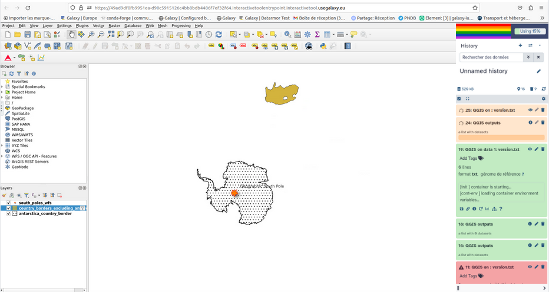

## QGIS ? What does it do ?

[QGIS](https://www.qgis.org/en/site/about/index.html) is a professional Geographic Information System (GIS) application that is built on top of and proud to be itself Free and Open Source Software (FOSS).

### Features
QGIS provides a continously growing number of capabilities provided by core functions and plugins. You can visualize, manage, edit, analyse spatial files, and compose printable maps.  

In the Geographical Information System landscape, there is existing standards to help users deal with remote data. Most common webservices are Web Map Services (WMS) and Web Feature Services (WFS). If WMS allows users only to access and display maps stored remotely, WFS is giving access to the features of data so you can modify it and create your own data and maps.

## How to access on Galaxy Europe:

To use QGIS, you need to use the tool [dedicated form](https://usegalaxy.eu/root?tool_id=interactive_tool_qgis), you can specify input datasets from your history you want to use in QGIS, or not ;), then press the execute button to launch a QGIS instance. When the graphical user interface of QGIS is ready to be used, a URL will be displayed at the top of the Galaxy center panel. 

## Coming up soon !

A tutorial of how to quickly and easily use QGIS on Galaxy will come soon, notably showing how to query remote spatial files through WFS webservice (search for this title "QGIS Web Feature Services"). With this training you will arrive at the end with a nice map that should look like the following.

We are still working on QGIS integration as a Galaxy tool and more and more trainings should be coming up on specific case studies. For instance, on how to use plugins in QGIS and on how to map a geographical land degradation index. This specific study takes place within the cooperation of the Fair-Ease and EuroScienceGateway projects (to know more on the projects see the [blog](https://galaxyproject.org/news/2023-05-21-fair-ease-euro-science-gateway/) .

For more examples and details, see the [QGIS page](https://qgis.org/en/site/index.html).

