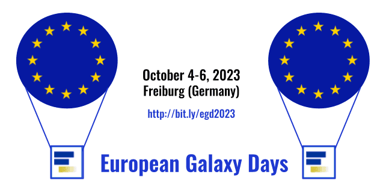

About a week ago the [2023 edition of the European Galaxy Days (EGD 2023)](/events/2023-10-egd) was held in Freiburg, Germany! We had three beautiful days, with a lot of talks, and discussions between sessions at coffee or lunch, or in the evenings in various bars and restaurants in the city.
 
While for many of us, this year's [GCC in Australia](/events/gcc2023/) was too far away, we enjoyed offering some time and space for our community to gather together in the middle of Europe. Close to 80 participants joined, and like for the [EGD 2022](/events/2022-10-egd/), effectively we had a triple event this year, too. We co-located the event with the ELIXIR Galaxy Community F2F meeting and the [EuroScienceGateway](/projects/esg/) (ESG) General Assembly meeting.

### ELIXIR Galaxy Community F2F Meeting

The [ELIXIR Galaxy Community](https://elixir-europe.org/communities/galaxy) had its [face-to-face meeting](https://elixir-europe.org/events/elixir-galaxy-community-meeting-0), after at the beginning of the year the strong wish arose to meet in person again. So, what would have been a better place for a F2F than the EGD, having the opportunity to meet also non-ELIXIR people, enjoy more talks, and present achievements to the larger public? 

Consequently, we had a dedicated ELIXIR session on day 1, [introducing the community](https://galaxyproject.org/events/2023-10-egd/egd/ELIXIR-presentation_2023_10_Galaxy-Community-F2F_EGD_presentation.pdf), but also providing a broad overview on community-derived topics: [Fair Data Management training](https://docs.google.com/presentation/d/1SWO73pjufZI44KjkHg_EUzjMhcgOAeHy/edit#slide=id.g287f34dccc2_0_1098), [mass spectrometry](https://docs.google.com/presentation/d/1FNj_qEPQ2bDHMqNp-qjj1iEnqeArEIm4/edit#slide=id.p1), [connecting OMERO to Galaxy for image analysis](https://galaxyproject.org/events/2023-10-egd/egd/Lucille_Delisle_galaxy_omero.pdf) and [genome annotations on really large scale](https://docs.google.com/presentation/d/1BwZ7W_tg2kbVwIKRsN4abOAtuQJCGIcOkr1tGrO5sKQ). A visual highlight was the presentation officially closing our community's participation in the [ELIXIR staff exchange program](https://elixir-europe.org/internal-projects/staff-exchange-programme), which enabled 14 members to visit the [GCC 2023 in Brisbane, and beyond](https://elixir-europe.org/news/australia_visit_2023) integrate deeper with Australian colleagues and organizations.

We want to highlight ELIXIR's role in enabling us to [again](/events/2022-10-egd/#supporters) carry out the EGD. We thank both the ELIXIR-Hub and ELIXIR-DE for their generous funding of the overall event
and the travel funding of a few of our community members.

### [EuroScienceGateway](/projects/esg/) (ESG) General Assembly

The sub-meeting in parallel with the CoFest marked the project's turnover from year 1 to year 2 and entered the finalization phase for our first report. Thus, we had a wrap-up of our achievements. For sure, planning the project's second year was the central task, matching the proposal with recent developments and particular expectations of the partners as well as the (European) research landscape. 

Highlights of ESG's first year in a nutshell: 
 * usegalaxy.eu's user base is growing fast, having passed 77k recently
 * ESG is facilitating **deeper integrations within EOSC**, e.g. via the [Macro-Roadmap](https://eosc.eu/roadmap), agreements with [FAIR-EASE](https://eosc.eu/news/stronger-together-fair-ease-and-eurosciencegateway-join-forces) (plus a [workshop](/news/2023-05-21-fair-ease-euro-science-gateway/)) and [OpenAIRE](/news/2023-05-05-eosc-esg-openaire/)
 * [Exporting **RO-Crate and BCO** from Galaxy](https://galaxyproject.org/news/2023-02-23-structured-data-exports-ro-bco/) and [**publishing** from Galaxy via Invenio to Zenodo](https://github.com/galaxyproject/galaxy/pull/16381) ([WP2: Stimulate FAIR and reusable research](https://galaxyproject.org/news/2023-01-12-eurosciencegateway-wp2/))
 * Update and extension of the **Pulsar network**; [new repository available](https://github.com/usegalaxy-eu/pulsar-deployment) and [development of a GA4GH TES-compliant API](https://github.com/CESNET/tesp-api) ([WP3: Distributed heterogeneous compute](https://galaxyproject.org/news/2023-01-19-eurosciencegateway-wp3/))
 * Developments on **Bring Your Own Compute/Storage** ([BYOC](https://drive.google.com/file/d/1I3FCJ8vmo6jESNqMcfGZHRcVxtk169Tm/view)/[BYOS](https://drive.google.com/file/d/1IUBbuowoCYsOAuaKzBtEtwayzY4oooQF/view)) achieved; principle adoption of [ARC as job runner](https://docs.google.com/presentation/d/1xb70Z4dZfXEJrvbXFhLQceA1g2UZnEWG) and efforts on [meta-scheduling](https://docs.google.com/presentation/d/1-5ch2UpOXH9qBouR6cbqBYbsgzSNMysk/edit#slide=id.p1)([WP4: Building blocks for a sustainable operating model](https://galaxyproject.org/news/2022-12-08-esg-wp4/))
 * Lively **communities** and tools/workflows from [astronomy](https://galaxyproject.org/events/2023-10-egd/egd/Volodymyr_Savchenko-EGD-2023-astro.pdf), material sciences ([Muon Galaxy](https://galaxyproject.org/events/2023-10-egd/egd/Leandro-EGD-Muongalaxy-2023.pdf), [Catalysis workflows](https://galaxyproject.org/events/2023-10-egd/egd/Leandro-Applications-to-Catalysis-Workflows.pdf)), climate and biodiversity research ([WP5: Community engagement, adoption and onboarding](https://galaxyproject.org/news/2022-11-24-esg-wp5/))
 
Several results and work in progress were presented in the dedicated ["ESG meets EGD" session on day 2](/events/2023-10-egd/egd/), as well as during the general assembly itself - [find all materials there](/events/2023-10-egd/esg/). Also check out our [ESG news page](/projects/esg/news/).

### Numbers & some highlights

* 3 full days
* 77 registrations overall, by far onsite
* 41 ELIXIR members from 11 nodes
* 28 ESG members from 15 partners
* 25 public talks, 4 BOFs, 1 full-day CodeFest
* Countless chats, connections, smiles

An explicitly incomplete, unordered list of memorable impressions, and items worth to (re-)read yourself:

* A delighted audience being served with a beautiful preview on [**'Workflow Comments'**](https://docs.google.com/presentation/d/1O20J7ifwagyW5X6VeK5hshqgfiehuNr39eTr2JA8u7U)
* Having digitally met a large round of the **US team**
* **Bird-of-a-Feather meetings (BoFs)** for Small-scale Admins and the microGalaxy community
* Another [BoF on how to reduce the **environmental impact** of Galaxy workflows](https://docs.google.com/document/d/1krw121K1vHkxnHKcm4qKQfBNXjagQm_j_6C1mdhjB2Q) (matching well a talk on [time-shifted computing](https://docs.google.com/presentation/d/1Ui1Ozp51Er1rWm_wJTY_FejfYNKBAWPm))
* Visitors from [FAIR-EASE](https://galaxyproject.org/events/2023-10-egd/egd/EGD2023_jdetoc_galaxy_for_fairease.pdf) and [AquaINFRA](https://docs.google.com/presentation/d/1wXE5aRQ2MdQ-LW0WtE37Ih_u4ZDywVLG) (presenting **two more EOSC projects**)
* A promising integration with [**Bioconductor**](https://docs.google.com/presentation/d/12qSOm8hEaz57q2apNxyuv7qXI8OS7UDA4PzNMS48MYU)
* A _very_ lively (and ongoing) discussion on **Matrix vs. Slack**
* [Various topics](https://docs.google.com/document/d/1fumqwpdGWsA6yEvQfHbFmdDhjta1iZPXlv-dw8xG42g) on the **CoFest**

## The Community

Having wrapped up a lot of content and numbers, we would like to thank everyone involved during the meeting, and the overall community. Thanks a ton for all your energy to democratize data analysis.

## Survey

We believe there is always space for improvement, and we like to hear your voice. Thus, please support us with filling out the survey that has been sent to the participants - it just takes a minute or two.

## Goodbye!

See you at the next EGD or any other event - stay tuned!

# Supporters

This event was generously supported by [ELIXIR](https://elixir-europe.org/), [ELIXIR-DE](https://www.denbi.de/elixir-de) and the European Commission’s HORIZON-INFRA-2021-EOSC-01 Grant, Agreement no. 101057388.

  
  

  
  

