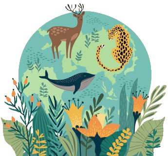
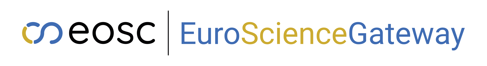
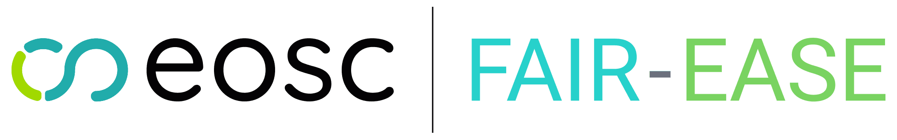

## Earth System ?? What's that ?

Earth system models (ESM) seek to simulate all relevant aspects of the Earth system.
ESMs are composed by a set of equations describing atmospheric and oceanic circulation and thermodynamics, but also the biological and chemical processes that feedback on to the physics of climate, all solved for a number of locations in space that form a three-dimensional grid over the surface of the Earth and underneath the surface of the oceans.

### [Fair-Ease](https://fairease.eu/) : an EOSC project

An approach to observation and modelling of the Earth System, Environment and Biodiversity.
The project focuses onto 2 main aspects:
- Interdisciplinary Data Discovery and Access Service : for discovery and access to environmental and multidisciplinary & aggregated data
- Earth Analytical Lab and Data Lake : an easy way to visualise, analyse and process environmental data on-demand.

## Five domains creating a model of an Earth System on Galaxy

- Coastal Water Dynamics : focuses on the coastal marine environment near river estuaries, where important processes take place.
- Earth Critical Zone : monitors land and soil degradation.
- Volcano Space Observatory : monitors global volcanic activity, allowing the focus on any major volcanic eruption worldwide.
- Ocean Bio-Geochemical Observations: addresses questions regarding the health of marine ecosystems (e.g. ocean acidification, ...) and needs for ocean resource management.
- Marine Omics : analyses of spatial- and time-comparable marine microbial metagenomics data sets for the exploration of biodiversity and its correlations with environmental quality.

### Tools, tools and more tools

Thanks to the help and partnership of Galaxy Europe and [EuroScienceGateway](https://eurosciencegateway.eu) project we were able to implement 6 interactive tools on usegalaxy.eu. They are now also available on [earth-system.usegalaxy.eu](https://earth-system.usegalaxy.eu/)! These tools are :
- [QGIS](https://earth-system.usegalaxy.eu/root?tool_id=interactive_tool_qgis)
- [HDFviewer](https://earth-system.usegalaxy.eu/root?tool_id=interactive_tool_hdfviewer)
- Ocean Data viewer [ODV](https://earth-system.usegalaxy.eu/root?tool_id=interactive_tool_odv)
- [DIVAnd](https://earth-system.usegalaxy.eu/root?tool_id=interactive_tool_divand)
- [Source](https://earth-system.usegalaxy.eu/root?tool_id=interactive_tool_source)
- [Scoop Argo](https://earth-system.usegalaxy.eu/root?tool_id=interactive_tool_scoop3_argo)

Go run them on [earth-system.usegalaxy.eu](https://earth-system.usegalaxy.eu/) and try these tools!
Don't hesitate to give us some feedback and help if you think they should be improved. As said before they are quite new and need to be tested and vetted by the community.

One goal of Fair-Ease is to have at least one workflow of tools to access, process, and visualise data for each domain cited above. Hopefully even more than that! 
If you are interested in earth-system and environmental sciences and have tools that you think could fit right into [earth-system.usegalaxy.eu](https://earth-system.usegalaxy.eu/), please contact us so we can try to work together! The more the merrier! 

This work takes place within the cooperation of the FAIR-Ease and EuroScienceGateway projects (to know more on the projects see the [blog](https://galaxyproject.org/news/2023-05-21-fair-ease-euro-science-gateway/)).

Another cooperation was just started with [Aquainfra project](https://aquainfra.eu/) which will hopefully produce some nice usecases on the water side of the Earth System. 
