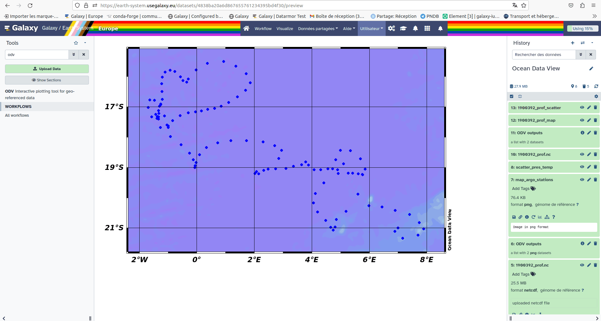

## ODV ? What does it do ?

Ocean Data View (ODV) is a software package for the interactive exploration, analysis and visualization of oceanographic and other geo-referenced profile, time-series, trajectory or sequence data.

Use ODV to produce: 

- property/property plots of selected stations,
- scatter plots for sets of stations,
- color sections along arbitrary cruise tracks,
- color distributions on general isosurfaces,
- temporal evolution plots of tracer fields,
- differences of tracer fields between repeats,
- geostrophic velocity sections,
- animations (3MB)
- interrupted maps.

### Features

ODV can display original data points or gridded fields based on the original data. ODV has two fast weighted-averaging gridding algorithms as well as the advanced DIVA gridding software built-in. Gridded fields can be color-shaded and/or contoured. ODV supports five different map projections and can be used to produce high quality cruise maps. ODV graphics output may be exported to PostScript, gif, png, or jpg files. The resolution of exported graphics files is specified by the user and not limited by the pixel resolution of the screen.

## How to access on Galaxy Europe:

To use ODV, you need to use the tool [dedicated form](https://earth-system.usegalaxy.eu/root?tool_id=interactive_tool_odv), you can specify input datasets from your history you want to use in ODV. Then, press the execute button to launch a ODV instance. When the graphical user interface of ODV is ready to be used, a URL will be displayed at the top of the Galaxy center panel. 

## Coming up soon !

A dedicated tutorial of how to visualise data an create profiles curves with ODV is comming up on Galaxy. If you are interested in knowing more keep an eye open for the tutorial named "Ocean Data View (ODV)". With this training you will arrive at the end with a nice map that should look like the following.

We are still working on ODV and more and more trainings should be coming up on specific case studies. Some workflows should soon be implemented using ODV and [DIVAnd](https://earth-system.usegalaxy.eu/root?tool_id=interactive_tool_divand) among others to create a complete analysis of Coastal Water Dynamics. This specific study takes place within the cooperation of the Fair-Ease and EuroScienceGateway projects (to know more on the projects see the [blog](https://galaxyproject.org/news/2023-05-21-fair-ease-euro-science-gateway/) .

For more examples and details, see the [ODV page](https://odv.awi.de/).

