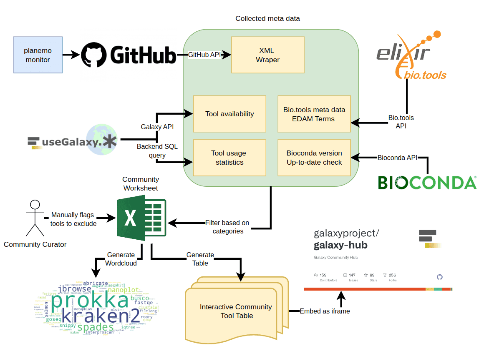
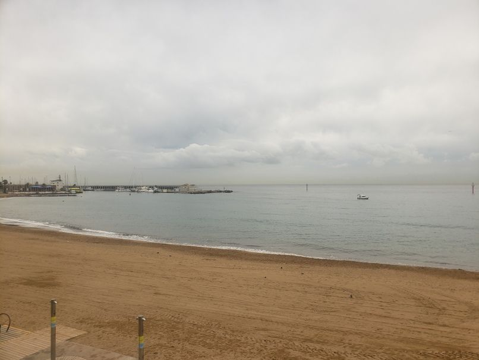
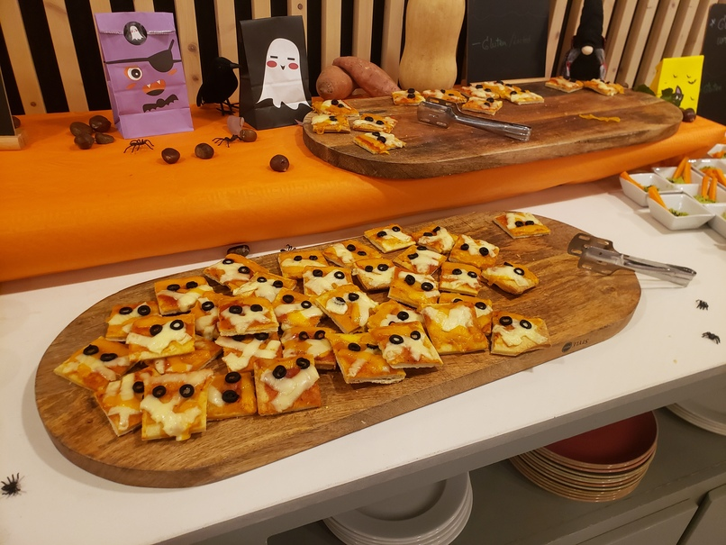
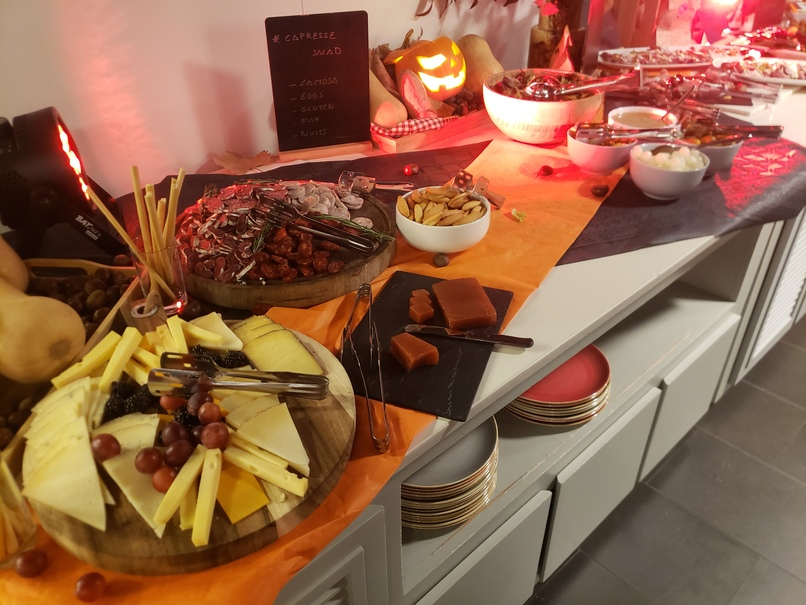
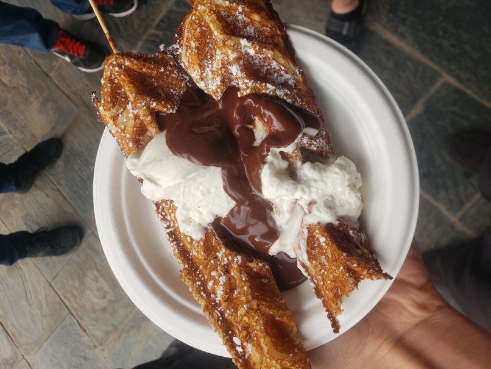

ELIXIR organized last week (October 30th - November 03th, 2023) the [BioHackathon](https://biohackathon-europe.org/index.html) in Barcelona. Paul and Björn went there in Person and represented the Galaxy Freiburg team. The event was a total blast: 5 days in a remote area to work, code, have fun, eat and discuss with the 150 other participants from all Europe (even Australia)!

# Community interaction

Björn discussed and contributed on many projects: 
- [Project 16: Enhancing the image analysis community in Galaxy](https://github.com/elixir-europe/biohackathon-projects-2023/tree/main/16) 
    - While we're at it, we also added a interactive table for the [Image analysis community](https://galaxyproject.github.io/galaxy_tool_extractor/imaging/) as described below.
- [Project 6: BioModelsML: Building a FAIR and reproducible collection of machine learning models in life science and medicine for easy reuse](https://github.com/elixir-europe/biohackathon-projects-2023/tree/main/6)
- [TODO]()
- Table tennis double team champion.

# Project 25: Increasing the findability, visibility, and impact of Galaxy tools for specialised scientific Communities

Paul was the co-lead for [Project 25: Increasing the findability, visibility, and impact of Galaxy tools for specialised scientific Communities](https://github.com/elixir-europe/biohackathon-projects-2023/tree/main/25) together with Nicola Soranzo and Johan Gustafsson. Bérénice participated online and was a great support. Matúš Kalaš helped with the connection to bio.tools and EDAM. 

## Project Workflow

The project could successfully implement a pipeline that collects galaxy tool wrappers, adds metadata from various sources, and filters the tools for a specific Galaxy community.

The generated tool list is then transformed into an interactive table, that can be embedded in e.g. hub pages and subdomains or here:

<iframe
  id="inlineFrameExample"
  title="Microbial related tools"
  width="100%"
  height="600"
  frameBorder="0"
  src="https://galaxyproject.github.io/galaxy_tool_extractor/microgalaxy/">
</iframe>

## Crowd-sourced tool annotation

Furthermore, a crowd-sourced effort was made to improve the bio.tools annotation of the microGalaxy tool selection.
Thanks to a dedicated and motivated group and the help of many people, especially the Australian outpost guided by Johan Gustafsson, the annotation effort was a great success with more then 50 tools annotated.
We're currently writing a paper to summarize the results of this project. More information can be found in the [GitHub Project Repository](https://github.com/galaxyproject/galaxy_tool_extractor). A demo of the interactive table is hosted via the [Github Pages](https://galaxyproject.github.io/galaxy_tool_extractor/) for all the tools and for the  [microGalaxy community](https://galaxyproject.github.io/galaxy_tool_extractor/microgalaxy/). 

# Fun time

And we had an overall great time joining the sport events, escape game and amazing food ! 

