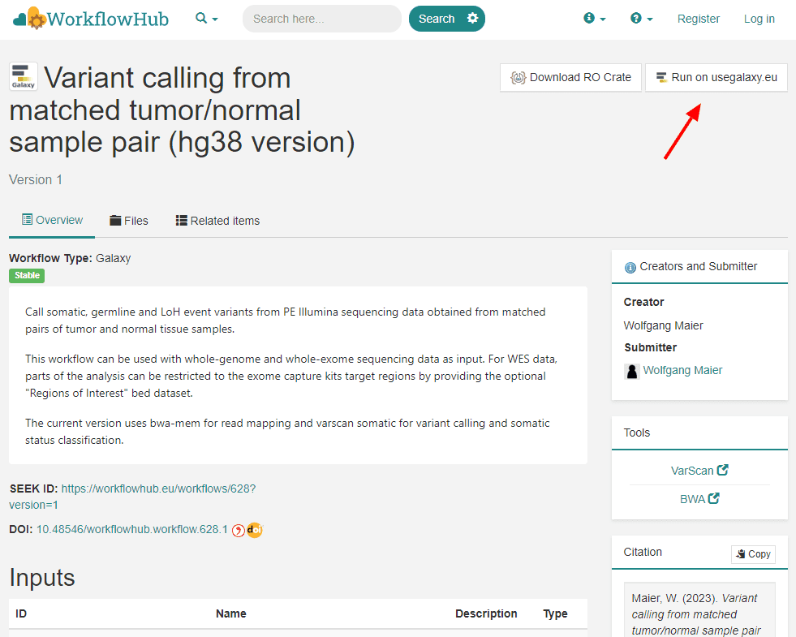

Ever tried [WorkflowHub](https://workflowhub.eu)? The platform aims to support researchers in discovering and re-using workflows from various platforms. Following the FAIR principles, the registry lists workflows and their metadata in an accessible and interoperable way, agnostic to particular workflow management systems. All contents (workflow descriptions, but also test data and examples) are kept in their native forms in workflow-centric, multi-component Research Objects using the RO-Crate specification. WorkflowHub extensively uses open standards, e.g. GA4GH's TRS API and Bioschemas, fostering compatibility with a number of other services, e.g. Galaxy.

From the user's perspective WorkflowHub goes beyond publishing, conveniently browsing, downloading and citing workflows; having identified a useful workflow, it can be simply sent by a click on the "Run in Galaxy" button, for immediate application on data or serving as template for further development.

Technically, the exchange of RO-Crates between both platforms is realized via the GA4GH TRS API, which is also used for the opposite way to pull workflows into Galaxy, as described in a number of GTN tutorials (e.g. [here](https://training.galaxyproject.org/training-material/topics/variant-analysis/tutorials/sars-cov-2-variant-discovery/tutorial.html#hands-on-import-the-workflow-for-your-data-into-galaxy) for SARS-CoV2 variant discovery). Back in March 2021 we initially published a [blog post](https://galaxyproject.org/news/2021-03-25-wfh-video/) about the "Run on Galaxy" button, including a short demo video. Both Galaxy and WorkflowHub have developed since then, and the content of WorkflowHub is constantly increasing, covering a number of topics. For Galaxy, many published workflows go through a review process by the Intergalactic Workflow Commission (IWC), assuring a certain level of quality.

So, why not get inspired by existing workflows, potentially saving some time and effort? While the screenshot above has been taken from the ['Variant calling from matched tumor/normal sample pair (hg38 version)'](https://workflowhub.eu/workflows/628) entry on WorkflowHub, by today there are 194 publically available Galaxy workflows on the Hub. The registry can be browsed by tags, invoked tools (e.g. [MultiQC](https://workflowhub.eu/workflows?filter%5Btool%5D=multiqc), [BWA](https://workflowhub.eu/workflows?filter%5Btool%5D=bwa)), topics (e.g. [biodiversity](https://workflowhub.eu/workflows?filter%5Battributes.topic_annotation_values%5D=Biodiversity), [genetic variation](https://workflowhub.eu/workflows?filter%5Battributes.topic_annotation_values%5D=Genetic+variation)), operations (e.g. [variant filtering](https://workflowhub.eu/workflows?filter%5Battributes.operation_annotation_values%5D=Variant+filtering)), or authors, teams, spaces and several more filters. Even collections have been bundled, e.g. ['scRNAseq processing in galaxy'](https://workflowhub.eu/workflows?filter%5Bcollection%5D=9). Simply make your choice.
