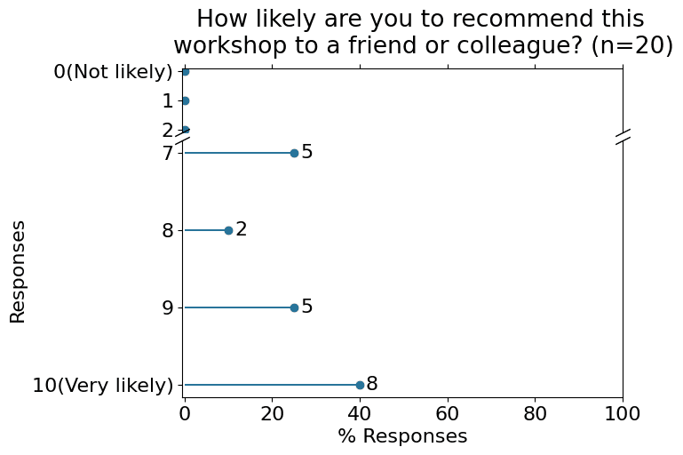

The [BioNT](http://biont-training.eu/) consortium is dedicated to **providing a comprehensive training program** and **fostering a community for digital skills** relevant to the **biotechnology industry and biomedical sector**. With a curriculum tailored for both beginners and advanced professionals, BioNT aims to equip individuals with the necessary expertise in handling, processing, and visualising biological data, as well as utilising computational biology tools. Leveraging the consortium's strong background in digital literacy training and extensive network of collaborations, BioNT is poised to **professionalise life sciences data management, processing, and analysis skills**.

BioNT delivered its **second training workshop**, a Python Introduction workshop from 21th to 24th of November, 2023. It was fully online and free of costs.

Within this practical introduction to Python 3, key concepts of programming languages were explained and put into practice. In addition, practical libraries for data analysis and methods for visualising the results were demonstrated. The material was complemented by a brief introduction to GitLab and an exploration of Jupyter Book, along with guidance on hosting a website using GitLab. The well-rounded program provided participants with skills to perform basic programming tasks, especially in the context of data analysis. It also enabled them to publicly present their work and results via a website. This way, they learned how to share their work with potential collaboration partners.
Python is considered to be an excellent programming language to start a successful programming journey. Using The [Carpentries](https://carpentries.org/index.html) online learning materials proved to be beneficial as they are the result of a community-driven development process and have been improved and validated through extensive workshop evaluation.

# Organisation of the workshop

The workshop "From Hero to Zero with Python" ran for **4 day**s, from 21th to 24th of November, 2023. It was **fully online** and **free of costs**. Each day, a **3-hour session** was delivered from 18:00 to 21:00 CET. 

## Webpage and registrations

The [CECAM](https://www.cecam.org/) event management platform, provided by the EPFL, was used to create a dedicated webpage (accessible at [https://www.cecam.org/workshop-details/1265](https://www.cecam.org/workshop-details/1265)) for the workshop, which included the workshop description, learning objectives, requirements, program, and any further information relevant to potential participants. As this was the second workshop delivered in BioNT’s basic curriculum, the standard operating procedure (SOP) developed during the first workshop (a protocol document describing the steps and timeline to organise a BioNT workshop) was followed and further improved.

For registration, the CECAM platform was used to manage the applicant's information and communication. In parallel, the EMBL servers were used to collect pre- and post-workshop information through pseudo-anonymised surveys. The survey data was linked to the applicant's data only via a unique identifier, provided in the CECAM registration process, as well as in the EMBL-based survey. This ensures that **only the workshop organisers access the applicants' personal data while still collecting information relevant to the workshop separately**. 

## Infrastructure for the workshop

The workshop was delivered in a **Zoom webinar format**, with **participants' visibility disabled to preserve their privacy**. Participants were able to see and learn from the trainers. However, **direct interactions (e.g. chat or voice) were not possible** within Zoom during the sessions. All direct interaction took place in **written form via a collaborative document**, where anonymous participation was ensured. To serve the collaborative documents, a HedgeDoc collaborative space was set up by BIOBYTE, and is hosted on their server.

A **Main** collaborative document, setup by the instructors and organisers, was shared with the participants before the session. Each section of the workshop had dedicated _Hands-on_ boxes to report on the task status, ask questions, or raise issues. **Helpers engaged and helped participants by answering the questions and issues directly in this document**. This Main document was filled in live during the workshop. Separate boxes to answer questions were used to improve participant engagement and as an indirect learning assessment.

To help with the organisation, four HedgeDoc documents were used:
1. a **[Template](https://biont.biobyte.de/s/9y0X2Lao2#)** with all instructions and boxes for hands-on, questions, etc;
2. the **[Main](https://biont.biobyte.de/fsB71mmfSGm_fY5t2gG-OA#)** document with the information for the participants during the workshop, filled with boxes related to the section covered by the instructor to help with the navigation and cleaned during each break to avoid an overcrowded document;
3. a **[History](https://biont.biobyte.de/s/TfzaOoBp0#)** document with everything that needed to be kept and shared with participants after the workshop
4. a **[Helpers document](https://biont.biobyte.de/fsB71mmfSGm_fY5t2gG-OA#)** for Helpers & Instructors was created providing the workshop setup, interactions and explaining tasks of the helpers and instructors.

To ensure that participants do not run into technical difficulties and can follow the workshop smoothly a two screen setup was recommended, a test run of the to installed software was provided and open desc session, where participants could get personal help to clarify potential installation issues where provided. 

The training material used during this workshop were slides and tutorials sourced from The Carpentries, a nonprofit organisation that teaches software engineering and data science skills in order to conduct efficient, open, and reproducible research. Existing tutorials and exercises were used for the first three days of the workshop. However, for the final day, a customised tutorial was created exclusively for this workshop and will be shared with The Carpentries to support their distribution and widen their reach. The customised tutorial was designed on two specific use cases of SMEs and job seekers, as it teaches how to build a website and host it for free with basic programming skills. This could be useful for people with the need to share a data analysis report with colleagues and beyond, or for people that want to host their CV or group/business website online.

| Day | Topic | Material |
|---|-----|--------|
| 1 | Programming environment setup |  [Tutorial](https://swcarpentry.github.io/python-novice-gapminder/index.html) |
| 2 | Tabular data manipulation and visualisation |  [Tutorial](https://swcarpentry.github.io/python-novice-gapminder/index.html) |
| 3 | Advanced programming |  [Tutorial](https://swcarpentry.github.io/python-novice-gapminder/index.html) |
| 4 | Build a website using Jupyter Book  | [Tutorial](https://workshop-building-websites-with-gitlab-biont-eu-2e49af9c9c94c62.gitlab.io/) |

## Certificates

Certificates were provided to those participants who explicitly required them after checking for their participation using three criteria: 
1. they joined at least one session on Zoom or notified that they could not attend live and 
2. they provided the Jupyter notebooks of day 2 and day 3 that they created during the workshop
3. they completed the post-workshop survey

# Outcomes of the workshop

## Applications and pre-workshop survey

**60** applicants completed the pre-workshop survey and **50** submitted their application form via the CECAM platform. Since, one person was admitted after the application deadline and did not fill in the pre-workshop survey only 49 participants are included in the following analysis. The pre-workshop survey consisted of 10 questions covering skills, demographics, and miscellaneous topics. The majority of questions were not mandatory for the successful completion and submission of the survey.

### General information

The 49 applicants, **almost at a balanced gender representation** with 55% male and 43% female (2% preferred not to say), were from and were working in **28 countries**, and described themselves as 38% White, 32% Asian, 13% Black or African American, 11% Hispanic or Latino(a), 2% Slavic and 4% preferred not to say.

Most applicants worked or studied in the fields of **Biomedical or Health Sciences** and were academic employees (56%) in the category of graduate students (31%) or research staff (18%). Additionally, 6 applicants were industry employees and **17 were job seekers** (with 7 in Academia, 5 in Industry and 5 either in academia or in industry). Regarding the connections with SMEs, 9 mentioned to be working in an SME, 6 collaborating with SME(s) and 13 aiming to work in an SME. 

Out of 49 applicants, 50% planned to use Windows for the workshop, 35% macOS, 14% Linux, and 2% were unsure about the operating system they would use. Finally, two applicants had visual accessibility requirements. These two applicants were contacted in advance to understand and implement their accessibility requirements, e.g. extensive self-learning materials were provided to them in advance to decrease the total sources of information that they needed to monitor in parallel during the workshop. The same materials were provided by the organisers to all learners during the workshop

### Background information

This workshop aimed to provide an introduction to the programming language Python. When asked about how often they use this programming language, 29% answered "Several times per year," 25% answered "Never," and 13% answered "Less than once per year". This confirmed the advertising of this workshop reached the desired audience: Beginners with limited or no prior experience in programming.

Most applicants (95%) agreed with the importance of having access to the original, raw data to be able to repeat an analysis. The majority agreed that **using a programming language can make their analyses easier to reproduce**, and 35% of applicants were not satisfied with their current data management and analysis workflow.

### Expectations

The applicants' expectations for the workshop were overall uniform. Most were keen on acquiring new skills, with some specifically interested in learning those applicable to their current positions. Notably, 19 participants expressed their intention to leverage the acquired skills either to secure a promotion within their current job or to pursue new employment opportunities.

    

## Participation

**All applicants** that submitted their complete application were selected to participate in the workshop, but not all of them joined for the complete workshop.

After the workshop, **17** participants requested a certificate. The certificate was provided to those 17 participants that attended the Zoom live session at least once, completed the post-workshop survey and submitted their saved Jupyter notebook.

## Daily feedback

At the end of each day, participants were asked for feedback on the following three points:

* Please share one thing that was good about today
* Please share one thing that that could be improved about today
* Do you have any other comments?

The daily feedback is summarised in the following Table:

<table>
  <tr>
   <td><strong>Day</strong></td>
   <td><strong>Topic</strong></td>
   <td><strong>Good about today</strong></td>
   <td><strong>To improve</strong></td>
   <td><strong>Any other comments?</strong></td>
  </tr>
  <tr>
   <td>1</td>
   <td>Programming environment setup</td>
   <td>Having access to the resources where I can go over the exercises again (sw carpentries, know my way around there now.. )
        
Being shown different ways to arrive at the same desired outcome.
        
I think it was a good start :) thanks for your efforts 
        
Good explanations and access to tutorials and possibility to practise
        
Being able to go to the tutorial under the guidance of the speaker and the staff helping in the Hedge document
        
It's good that we have the exercises and the materials
   </td>
   <td>Well, we've been there, the mixing of 4-5 tabs/apps/docs was difficult
        
Mentioning before, that it would be better to use two screens for the workshop
        
Add examples section, in this document, where we can put our examples directly
        
A bit slower start with launching the jupyterlab (especially using the command line as the data files need to be in the exactly same path as the instructors, I got lost a bit as I had it in the downloads)
        
It would be nice to learn how to run it through terminal
        
Communication/links to documents was hard to navigate in the beginning. But I've got the hang of it now. It would be so much easier if this was previously communicated and the links provided the day before the workshop
        
It was really fast in the beginning so really difficult to follow, and also definitely need at least 2 screens
   </td>
   <td>
         
I would love to have a quick intro to the help site as I wrote above.. i know that these sites are essential
         
Good explanations, speed was a t the beginning too fast, but time for the exercises was good enough
         
Are we going to have at some point, applications for python in real life problems?
         
Will there a be a video available of today's and the rest of the days explanations for the participants
   </td>
  </tr>
  <tr>
   <td>2</td>
   <td>Tabular data manipulation and visualisation</td>
   <td>I learned new things. It was very interesting
        
Awesome! I can follow it completely although I am a newbie
        
Actually working with data helped me thoroughly understand what I was doing and what the commands were doing
        
Very helpful
        
Very interesting session. Learned a lot
        
I was able to follow along, except for the plotting, will have to try recapping that with the software carpentry document myself
        
Good explanations of all that we did!
        
The coding part today was easier to follow , a lot of information that covers all the basics
        
I was able to apply my knowledge from yesterday and could do a few things already on my own :) nice to see progress
   </td>
   <td>Increase your screen when you share. It is so difficult to read
        
orientation at the beginning with files, where to type, what is happening.. we had to get used to a new teacher (meaning: this requires a little time to get used to their way of explaining where we are...)
        
Maybe could have talked about other plotting tools/libraries
        
The need to always switch between screen is partially annoying
        
I think it would be good to show, the same thing could be made with another library. Today is good example when talking about plot
        
A little bit more explanation about the code instead of going more further with difficulty
        
Especially in the beginning it was really difficult to follow, maybe some important steps would be better to be repeated so everyone can follow. If you stop somewhere it's really difficult to continue after that
        
more breaks/more often
   </td>
   <td>I have some problems seeing the difference between "()" and "[]" with my screen.
        
Suggestion: taking few 1 minute breaks at the beginning for others to catch up
   </td>
  </tr>
  <tr>
   <td>3</td>
   <td>Advanced programming</td>
   <td>Great tho i have joined start and we were able to orient
        
The pace was amazing. I loved the session today and it was easy to follow. Also the number of breaks was great
        
Having two breaks
        
It was always clear where we were in the hedge doc (again, we are getting used to it)
        
I look forward to tomorrow
        
Clear and nice explanations. Thank you a lot
   </td>
   <td>All good (I am also getting used to python, which makes day 3 easier than day 1 and 2
        
Add some examples from the bio/biomed topic (perhaps from your past real projects, but probably simplified for us
        
The def function/return part was a bit faster for me
   </td>
   <td></td>
  </tr>
  <tr>
   <td>4</td>
   <td>Build a website using Jupyter Book</td>
   <td>I have never used a jupyter-book. I think it is great. Really the teacher talk very clearly 
        
I very much liked the whole course, the tireless help on the hedge doc .. everyone of my questions was answered and all my issues solved!! THank you to the entire team
        
Today, i loved learning yet more tools and workflows.... on day 1 I almost cried being confused about them all, today I happily installed yet another jupyter-something-something
        
To see where to go next with learning coding in python
        
Very interesting session. Thank you a lot!
        
Thank you!I learned a lot again
        
Really thanks, great team
   </td>
   <td>Probably I would have hoped to see more python applied to bioinformatic, but of course, it is an introductory course. I am very grateful
        
I also agree on our hunger for bioinformatics related tasks
   </td>
   <td>I believe that being able to say something in zoom, and NOT being anonymous, would have been great. Day 1 and Day2 we had troubles with Hedgedoc , so when you don't have the right link you can never even write a request for help there.
   </td>
  </tr>
</table>

## Postworkshop survey

At the end of the workshop, participants were asked to complete the post-workshop survey consisting of 20 questions, 19 of them optional. In total, **21** participants completed this survey.
Regarding the workshop environment and the possibility of interacting with the trainer and helpers, the answers were overall positive. A significant number of participants perceived the instructors as enthusiastic about the workshop and knowledgeable about the material being taught. With the exception of one participant, all others could get clear answers to their questions from the instructors. One-third of the participants expressed **confidence** in their ability to immediately **apply what they learned** at the workshop.

No accessibility issue was reported. However, one participant mentioned that on the last day, they were left behind since a question took longer to be answered by the helpers. Despite this, the interaction of the helper/trainer team with the shared document was perceived as very positive. 

Participants mostly viewed the interaction with the HedgeDoc document and the questions answered on the fly by the helpers as positive and helpful for their learning experience. Not only the assistance of the helpers but also the support from the instructors in addressing individual issues and the repetition of exercises were positively received. The possibility to access the overall discussion within the shared document, during and after the workshop, seemed to have improved the participant’s learning experience, as indicated by their feedback.

Participants were also asked about strengths and ways to improve the workshop. All answers are summarised in the following Table:

<table>
  <tr>
   <td><strong>Major strengths of this workshop</strong></td>
   <td><strong>Ways the workshop could be improved</strong></td>
  </tr>
  <tr>
   <td>An easy way to interact with the teachers and the ease with which questions were answered.
   </td>
   <td>I don't have a large biology background but I appreciated that I was able to join. I think I'd have been a little happier to know whether I'd taken a spot that belonged to an individual that fit your target more.'
   </td>
  </tr>
  <tr>
   <td>Day 2 and day 3
   </td>
   <td>Last day was a bit complex to follow.
   </td>
  </tr>
  <tr>
   <td>Very basic and elaborate explanations. all questions were answered and the communication was very good 
   </td>
   <td>Sometimes a bit chaotic. Very important is the recommendations to maybe have two screens to be able to follow both the zoom and the programming IDE
   </td>
  </tr>
  <tr>
   <td>Hedgedoc</td>
   <td>Maybe to shorten the time.</td>
  </tr>
  <tr>
   <td>Provides a good overview on the topic and can be a valuable starting point to get into programming
   </td>
   <td>I  understand that the workshop is a collaborative effort, however, in my opinion it would be better to only have 1, max. 2, instructors throughout the course. 
   It is a bit overwhelming to manage that many windows simultaneously while looking at the shared screen, checking the links in the chat etc. Maybe it would be good to warn people beforehand to try and set up e.g. a tablet/additional laptop to screen the zoom lecture while working on the coding exercises on a laptop.
   Using the jupyter notebook to type in +/- to express something is quite annoying, maybe the reactions in the zoom lecture would be a better option. 
   I don't really get the reason why the code of conduct had to be recited multiple times and why the level of anonymity needs to be so high for a programming course. somehow gave me a weird feeling', like the participants were seen as a bunch of uncivilised barbarians not able to behave properly. Since there were so many instructors involved, maybe it would have been nice to have some sort of breakout room for the self-study exercises where everybody can decide for themselves if they want to make themselves visible/switch on camera/talk/be silent etc.
   </td>
  </tr>
  <tr>
   <td>I really liked the "HedgeDoc" thing :)</td>
   <td>Explain in a more detailed way how libraries work in python.</td>
  </tr>
  <tr>
   <td>Jupyter-book</td>
   <td>Some instructors need to be clearer and slower, especially when explaining topics that may be completely new for some. Pandas should have been explored a bit more.
</td>
  </tr>
  <tr>
   <td>The possibility to work in parallel with the instructors and solve problems in real time</td>
   <td></td>
  </tr>
  <tr>
   <td>The workshop was slow-paced and interactive which made following it easy.</td>
   <td>I believe that instead of the last day session on Gitlab, a session on file manipulation (some of it was introduced for csv, though) such as PDB and a general introduction on ways to validate the scripts would have been beneficial.</td>
  </tr>
  <tr>
   <td>Easy to follow tutorials
        
Start from basicsCovered stuff that's mostly applied like conditional statements and loops
  </td>
   <td>Increasing workshop days
   </td>
  </tr>
  <tr>
   <td>Basic understanding of python. Basic understanding of tools like git. Motivation to learn something new 
</td>
   <td>More screens are definitely needed. Sometimes got a little bit hectic until everyone is on the same side 
</td>
  </tr>
  <tr>
   <td>Your team was great in the workshop.</td>
   <td>Maybe practical time.</td>
  </tr>
  <tr>
   <td>Knowledgeable instructors. Good time keeping.
</td>
   <td>Pace of some instructors could be slowed down</td>
  </tr>
  <tr>
   <td>It covered a wide range of topics and the basics were very well explained.</td>
   <td>The last day was a bit chaotic. Also, I would have liked to use other libraries as NumPy.</td>
  </tr>
  <tr>
   <td>Having the software carpentry website to follow along with was great because while getting questions answered, it was really easy to get behind on the flow of the course. Also, the instructors were very knowledgeable about the topics.</td>
   <td>It may be beneficial to have the workshop last longer,' all of the days for the most part we were behind. The workshop may need to be lengthened by maybe an hour to give adequate time to cover each topic and answer questions so there isn't a rush.</td>
  </tr>
  <tr>
   <td>The number of hours. That we were exposed to different tutors which was very nice
</td>
   <td>If it was following day 3 that would have been awesome. As on day 3 we had a clear agenda explanation at the beginning of the workshop, we had frequent short breaks which was perfect and the tutor was easy to follow.</td>
  </tr>
</table>

The feedback on the post-workshop survey was **positive** and participants were **likely to recommend this workshop to a friend or colleague**.

# Conclusion

The second BioNT workshop, an introduction to the programming language Python titled “From Hero to Zero with Python”, was successfully held on November 21st-24th of 2023, online and cost-free for participants. 
The setup for the second workshop benefited from the experience gathered during the first BioNT workshop. The organisation of registration, survey data collection and analysis, and certificate requirements were improved compared to the first one. However, the setup for the second workshop posed some challenges, as successful participation in the training required: (a) the installation of certain packages before the course, and (b) the use of a dual-screen setup was recommended. Due to setup issues, some participants faced challenges at the beginning of the workshop. Nevertheless, addressing them and adjusting the workshop’s pace improved their experience over the course of the remaining days. The evening time slot was perceived as not the best option for the concentration of participants.
The consortium will take the improvements and the individual challenges of the second workshop into consideration to further enhance the training provided by BioNT, especially regarding the upcoming third workshop scheduled for February 2024. Overall, the BioNT consortium concludes that the workshop successfully achieved its goals.

