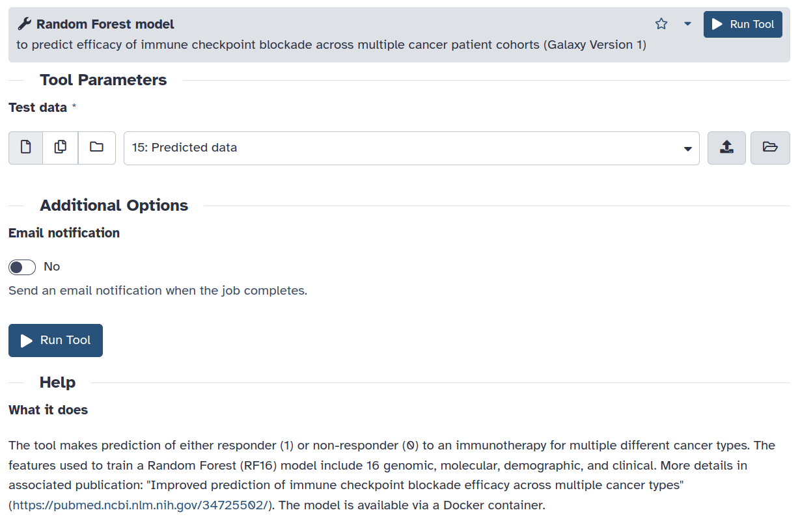

## Introduction
In the fast changing landscape of artificial intelligence, researchers around the globe are training models on myriad datasets including images, biological sequences, text, and gene expression patterns. 
Many such models are powerful and general-purpose that can be utilised for making predictions. But, the tools that offer such a feature are scarce and often require researchers to arrange for a powerful compute infrastructure to execute prediction scripts which may lead to under-utilization of such models. To bridge this gap, a [tool](https://usegalaxy.eu/root?tool_id=biomodels_biomd0000001066) has been integrated into Galaxy that serves a [pre-trained model](https://www.ebi.ac.uk/biomodels/BIOMD0000001066), a Random Forest (RF) model, to Galaxy users to predict efficacy of immune checkpoint blockade across multiple cancer patient cohorts on test data.

## BioModels
[BioModels](https://www.ebi.ac.uk/biomodels/) serves as a collection of mathematical models depicting biological and biomedical systems. Within its repository, a wide array of physiologically and pharmaceutically significant mechanistic models, derived from existing literature, are presented in standard formats.

## Discussion
A [Docker container](https://github.com/anuprulez/biomodelsml-docker/blob/master/rf_immune_checkpoints_blockage/Dockerfile) has been developed serving the RF model. The [Galaxy tool](https://github.com/bgruening/galaxytools/blob/master/tools/biomodelsML/biomodels_BIOMD0000001066.xml) runs inside this container to make predictions on the test data supplied by the user via the tool user interface. To extend this work, several tools can be developed each serving an AI model created by training on different datasets such as single-cell gene expression patterns, medical images, and biological sequences via Docker container promoting applied AI research using publicly available models and Galaxy infrastructure.

## How to use the tool

Please follow these steps for application:

1. Open the [tool](https://usegalaxy.eu/root?tool_id=biomodels_biomd0000001066) on Galaxy Europe.
2. Supply the test data as a tabular file. An example test data can be downloaded [here](https://github.com/bgruening/galaxytools/files/13281244/test_data.csv)
3. Run the tool to generate predictions.

## More details

- [Tool](https://usegalaxy.eu/root?tool_id=biomodels_biomd0000001066) in Galaxy Europe.
- Random Forest model from [BioModels](https://www.ebi.ac.uk/biomodels/BIOMD0000001066).
- [Docker container](https://hub.docker.com/repository/docker/anupkumar/biomd0000001066/general) on Docker hub.
- [GitHub](https://github.com/bgruening/galaxytools/pull/1355) pull request.
