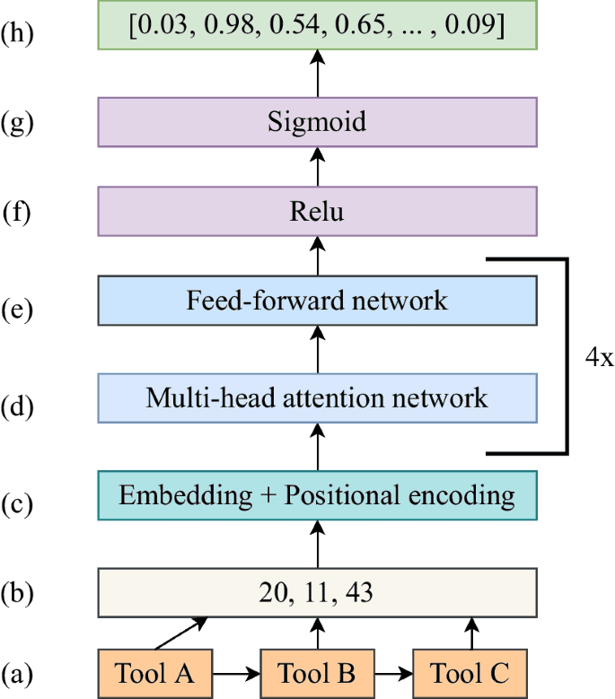
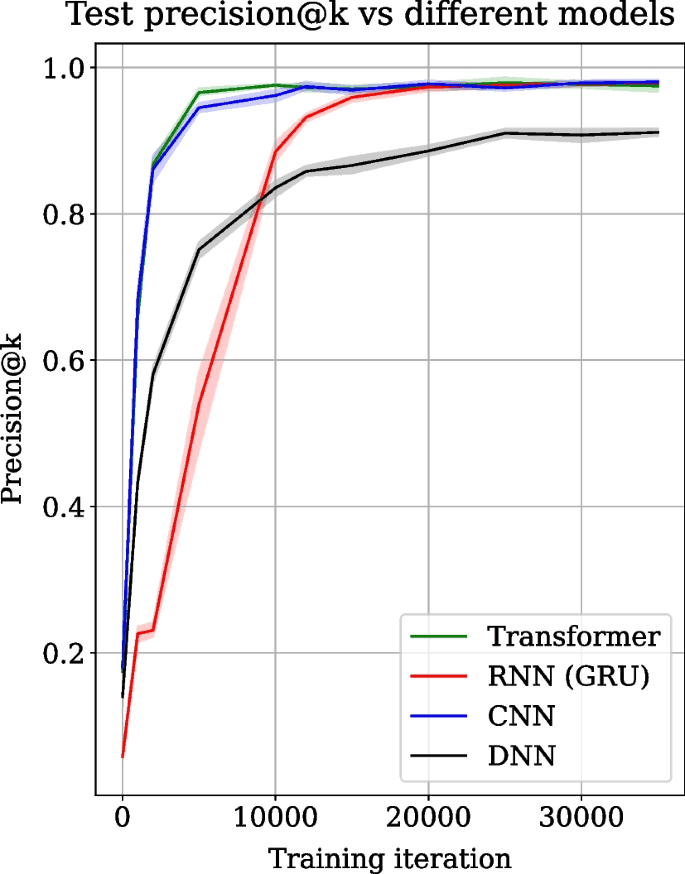
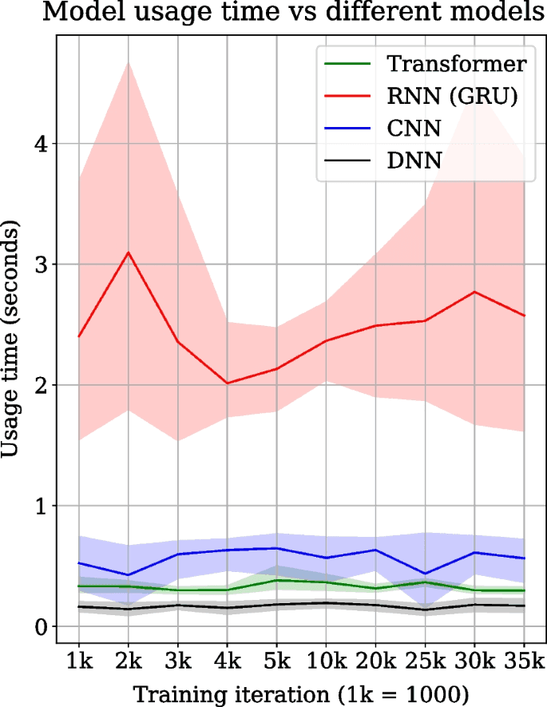

**New *BMC Bioinformatics* Paper on "Transformer-based tool recommendation system in Galaxy"**

**Abstract:**

Background: 
Galaxy is a web-based open-source platform for scientific analyses. Researchers use thousands of high-quality tools and workflows for their respective analyses in Galaxy. Tool recommender system predicts a collection of tools that can be used to extend an analysis. In this work, a tool recommender system is developed by training a transformer on workflows available on Galaxy Europe and its performance is compared to other neural networks such as recurrent, convolutional and dense neural networks.

Results:
The transformer neural network achieves two times faster convergence, has significantly lower model usage (model reconstruction and prediction) time and shows a better generalisation that goes beyond training workflows than the older tool recommender system created using RNN in Galaxy. In addition, the transformer also outperforms CNN and DNN on several key indicators. It achieves a faster convergence time, lower model usage time, and higher quality tool recommendations than CNN. Compared to DNN, it converges faster to a higher precision@k metric (approximately 0.98 by transformer compared to approximately 0.9 by DNN) and shows higher quality tool recommendations.

Conclusion:
Our work shows a novel usage of transformers to recommend tools for extending scientific workflows. A more robust tool recommendation model, created using a transformer, having significantly lower usage time than RNN and CNN, higher precision@k than DNN, and higher quality tool recommendations than all three neural networks, will benefit researchers in creating scientifically significant workflows and exploratory data analysis in Galaxy. Additionally, the ability to train faster than all three neural networks imparts more scalability for training on larger datasets consisting of millions of tool sequences. Open-source [scripts](https://github.com/anuprulez/galaxy_tool_recommendation_transformers) to create the recommendation model are available under MIT licence.

## Implementation

### Data statistics
Approximately 60,000 workflows have been collected from Galaxy Europe, which are published and contain no errors. These workflows are further pre-processed to extract approximately 7,98,000 linear tool sequences, of which 3,53,000 are unique.

### Transformer

Several studies have effectively employed transformers to model sequential data, achieving state-of-the-art results. Bidirectional Encoder Representations from Transformers (BERT) has been extensively utilized for language modeling and has demonstrated outstanding performance across eleven natural language tasks. DNABERT introduces a novel model inspired by the BERT architecture, trained on DNA sequences. It proves valuable in various downstream tasks, including predicting regulatory elements, promoters, splice sites, and transcription factor binding sites with high accuracy. ProteinBERT refines the BERT architecture for modeling protein sequences, delivering excellent results in tasks such as predicting protein functions and gene ontology (GO) annotations. The transformer utilizes the attention mechanism to learn representations of sequential data in natural languages, DNA, and protein sequences. Through self-attention (refer to the "Self-attention" paragraph), each token in a sequence is assigned a weight indicating its correlation with all other tokens. Tokens with higher weight magnitudes are deemed more important in tasks like sequence classification. These weights, represented by real numbers, collectively contribute to prediction computations. The transformer architecture comprises key components, notably the encoder and decoder. For sequential data with input and output sequences, the encoder learns the representation of input sequences, while the decoder jointly trains on the input representation and the output sequences. In our work, we exclusively utilize the encoder to construct the recommendation model, suggesting tools for both individual tools and tool sequences. The transformer architecture employed in creating the Galaxy tool recommendation system is detailed in the Architecture section [1,2,3,4].

The encoder portion of the transformer is composed of multiple layers, illustrated in Fig. 1. The first includes embedding and positional encoding layers (Fig. 1c), working together to encode tools, each represented by a unique integer (Fig. 1b) in a workflow (Fig. 1a). These layers utilize embedding layers to represent tools as real-valued vectors, preserving their relative positions in workflows. The encoded sequences are then processed through a composite block comprising multi-head attention and feed-forward layers (Fig. 1d–e). The 4x in Fig. 1d–e signifies four attention networks operating concurrently. Attention weights from each head are concatenated. The multi-head attention layer is 128-dimensional, and the feed-forward neural network consists of two dense layers, each with 128 dimensions. Together, they compute sequence representations based on self-attention weights, giving higher attention weights to tools related in sequences, capturing long-range dependencies and enhancing model interpretability. Subsequently, these representations undergo processing in a dense layer with 128 dimensions and ReLU activation (Fig. 1f). The predicted output, computed by a separate dense output layer, is a vector of sigmoid scores (Fig. 1h), utilized to recommend the top N tools. A higher sigmoid score indicates a higher probability of correct tool recommendations. The transformer architecture comprises 9,22,291 trainable parameters. To assess the transformer's performance in tool recommendations, we compare its architecture to three different neural network architectures—RNN, CNN, and DNN—across key indicators such as convergence time, model usage time, and tool recommendation quality.

## Results

### Transformer convergence time

Transformer, RNN, CNN and DNN architectures are trained on the same dataset, and their precision@k score collected over 35,000 training iterations on the test data are compared in Fig. 2. Precision@k is used as the prediction metric and is popular for evaluating recommender systems. The precision@k scores are averaged over 5 experiment runs. The shaded regions show the standard deviation over experiment runs. The train and test datasets are randomly created in each run but have the same size. Figure 2 shows the mean precision@k score in green for the transformer, red for RNN, blue for CNN and black for DNN. Figure 2 shows that the transformer converges two times faster than RNN. The transformer converges to the mean precision@k score of approximately 0.98 at iteration 10,000. In contrast, RNN achieves similar mean precision@k only at iteration 20,000. DNN also shows slower convergence and a lower precision@k score (0.9). On the other hand, CNN converges to a similar precision@k value achieved by the transformer but is slightly slower in convergence and stabilises around 12,000 iterations.

Transformer, RNN, CNN and DNN architectures are compared for their respective model reconstruction and prediction time measured at specific intervals over 35,000 training iterations, as shown in Fig. 3. The transformer’s model usage time (= model reconstruction and prediction) is approximately 0.4 s for a sequence of tools. At the same time, for RNN, it is over 2 s which is approximately four to five times slower than the transformer. CNN is also faster than RNN in model usage time but is slower than the transformer. However, DNN is the fastest, recording the lowest model usage time out of all models. The model usage time is averaged over all the sequences of tools in the test dataset. The line plots show the mean usage time, and shaded regions show the standard deviation over 5 experiment runs 

The self-attention weights for a tool sequence, read from left to right on the horizontal axis or top to bottom on the vertical axis, from the tool suite ChemicalToolBox (CTB) in Galaxy Europe are shown. It is seen that tools from the CTB suite (containing “ctb” prefix) attend to each other as they have higher correlation weights, but they don’t attend to the “show beginning1” tool, which is only a text formatting tool and not from the CTB suite

The self-attention weights for a tool sequence, read from left to right on the horizontal axis or top to bottom on the vertical axis and used for performing differential expression analysis, are shown. It is seen that tools such as trimmomatic, hisat2, featurecounts and deseq2 are more correlated to each other compared to the text formatting tools such as “join1” or “filter1”.

## User interface integrations
After refining the recommendations made by the trained transformer model in the post-processing step, the refined list of predicted tools is shown in Galaxy as two user interface (UI) elements - one after running a tool that shows recommended tools as branches of a tree and the second in the Galaxy workflow editor inside a tool’s box. The right arrow on the top right corner inside a tool’s box shows a list of recommended tools. UI elements used in Galaxy for showing tool recommendations are shown in figures 6 and 7.

### Workflow editor

### After tool execution

## Useful links

- [Paper](https://doi.org/10.1186/s12859-023-05573-w)
- [PDF](https://link.springer.com/content/pdf/10.1186/s12859-023-05573-w.pdf) on Docker hub
- [GitHub scripts](https://github.com/anuprulez/galaxy_tool_recommendation_transformers)

## References

[1] Devlin J, Chang M-W, Lee K, Toutanova K. BERT: pre-training of deep bidirectional transformers for language understanding. CoRR arXiv:1810.04805 (2018).

[2] Vaswani A, Shazeer N, Parmar N, Uszkoreit J, Jones L, Gomez AN, Kaiser L, Polosukhin I. Attention is all you need. CoRR arXiv:1706.03762 (2017).

[3] Ji Y, Zhou Z, Liu H, Davuluri RV. DNABERT: pre-trained bidirectional encoder representations from transformers model for DNA-language in genome. Bioinformatics. 2021;37(15):2112–20. https://doi.org/10.1093/bioinformatics/btab083. (ISSN 1367-4803).

[4] Brandes N, Ofer D, Peleg Y, Rappoport N, Linial M. ProteinBERT: a universal deep-learning model of protein sequence and function. Bioinformatics. 2022;38(8):2102–10. https://doi.org/10.1093/bioinformatics/btac02. (ISSN 1367-4803).
