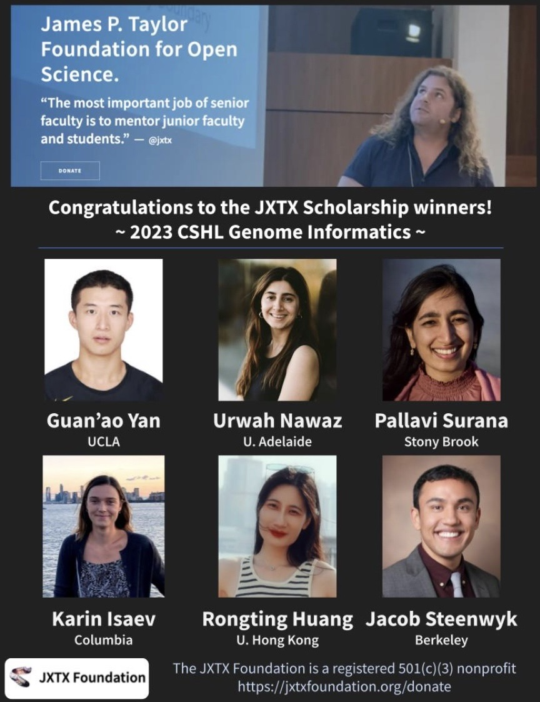

Hello, Galaxy Community!

Firstly, the Galaxy team would like to extend our warmest wishes to you and all your loved ones this holiday season! With the New Year rapidly approaching, we wanted to thank you all for being a part of the Galaxy Community in 2023; we couldn’t do it without you, and we are excited for what is to come!

As a part of the final newsletter for 2023, we are including an end-of-year wrap-up to highlight some of Galaxy's successes and updates over the past year. We also are including a preview of what is to come in 2024, and we hope you are as excited as we are! 

## Galaxy 2023 End-of-year Wrap-up: Another Year Around the Galaxy 

To celebrate Galaxy’s 18th year, we have put together an infographic highlighting the top Galaxy events, features, and scientific drivers of 2023!

To view the infographic, [please view this PDF](https://drive.google.com/file/d/1QhMWQ3JHJNtoUB169adcfb_788uo9hqT/view?usp=sharing). 

## Galaxy 2023 Success Stories

We are excited to share just a few of the Galaxy's scientific success stories in 2023. This year, we are thrilled to have been a part of over 1,400 papers, which brings our total to over 16,000! Check out our “Citations per year” graph from [Google Scholar](https://scholar.google.com/citations?hl=en&user=3tSiRGoAAAAJ). The success of our users helps drive Galaxy to adapt and improve its features, and we cannot wait to see the continued success of our users over the next year!

See below for a brief highlight on each story, and view the full paper for each article to learn more! While there are many more success stories from 2023, each of these articles was chosen by our users and developers who wished to highlight specific features or advances in Galaxy.

### A Galaxy of informatics resources for MS-based proteomics (Mehta et al., 2023)

As mass spectrometry (MS) technology progresses, there is a growing demand for bioinformatics tools that can effectively analyze complex MS-based proteomic data. The Galaxy bioinformatics ecosystem is designed to meet these analysis needs by providing a diverse range of open-source tools tailored for MS-based proteomics applications. This ecosystem operates on a flexible, scalable, and easily accessible computing platform. Galaxy's distinctive feature, provenance tracking, enables users to save and share comprehensive analysis histories and workflows. This capability extends to various MS-based proteomics techniques, including shotgun proteomics, data-independent acquisition MS-based quantitation, multi-omics, MS imaging, as well as results visualization and interpretation. Researchers have successfully employed existing workflows within the Galaxy ecosystem in diverse fields such as COVID-19 pandemic research, proteogenomics, metaproteomics, MS imaging, and clinical studies involving MS-based proteomics with patient-derived samples. Additionally, Galaxy provides access to training resources, fostering awareness and facilitating the widespread adoption of these tools within the research community.

[Read the full paper!](https://www.tandfonline.com/doi/abs/10.1080/14789450.2023.2265062)

### Sequential and directional insulation by conserved CTCF sites underlies the Hox timer in stembryos (Rekaik et al., 2023)

In this study, the researchers aim to understand better the mechanism governing the Hox gene timer, in which the activation of Hox genes occurs in a temporal sequence based on their positions within gene clusters. To address this, stembryos derived from mouse embryonic stem cells were obtained, and various next-generation sequencing (NGS) analyses and figure-generation techniques were applied. These techniques included RNA-seq, single-cell RNA-seq, ChIP and ChIP-M, CHi-C, and HiChIP. Galaxy was utilized for all NGS analyses, excluding single-cell RNA-seq. The findings indicated that the precision and pace of the Hox gene timer are regulated by the presence of evolutionarily conserved and regularly spaced intergenic CTCF sites.

[Read the full paper!](https://www.nature.com/articles/s41588-023-01426-7)

### Galaxy Training: A powerful framework for teaching! (Hiltemann et al., 2023)

Bioinformatics has assumed a pivotal role in the realm of research studies across the natural sciences due to the continuous generation of scientific datasets resulting from numerous technological advancements. Despite the significant influx of knowledge and scientific progress facilitated by the proliferation of datasets, there exists a substantial gap in basic computational skills and data analysis. To bridge this skill gap and empower researchers, the Galaxy Training Network introduced the Galaxy Training Platform. This platform, a community-driven framework accessible to all, compiles FAIR (Findable, Accessible, Interoperable, and Reusable) training materials tailored for data analyses within the Galaxy environment. Since its launch, the Galaxy Training Platform has surpassed expectations, emerging as a reliable repository featuring hundreds of tutorials from numerous contributors worldwide. Initially rooted in the natural sciences, the platform has expanded its scope to encompass diverse subjects such as climatology, cheminformatics, and machine learning. Furthermore, the Galaxy Training Platform has transcended its original purpose of supporting researchers, now serving as a valuable resource for educators. This paper highlights the recent advancements in the Galaxy Training Platform and explores how the Galaxy Training Network has evolved to facilitate the integration of its materials into classroom settings.

[Read the full paper!](https://journals.plos.org/ploscompbiol/article?id=10.1371/journal.pcbi.1010752)

### MetaboLights: open data repository for metabolomics (Yurekten et al., 2023) 

MetaboLights serves as a global database for metabolomics studies, encompassing both the raw experimental data and associated metadata. It stands as the recommended repository for metabolomics by several prominent journals and the European Infrastructure for Life Science Information (ELIXIR). This paper delves into the notable progress made by MetaboLights in recent years, emphasizing the introduction of MetaboLights Labs, a new instance within Galaxy. The objectives of this Galaxy instance are threefold: 1) to streamline the reuse of MetaboLights data through high-quality analysis tools, 2) to empower users to analyze their own data, and 3) to foster collaboration with researchers for the contribution of community tools and workflows. Galaxy is enthusiastic about being a part of MetaboLight's recent advancements in FAIR data science and is looking forward to seeing what they do next!

[Read the full paper!](https://academic.oup.com/nar/advance-article/doi/10.1093/nar/gkad1045/7424432)

### Training Infrastructure as a Service (Rasche et al., 2023)

Instructors often face significant hurdles when planning and organizing training courses, such as a lack of needed technical resources and expertise, complications with queue contention and managing resources, and adapting to the rise of virtual and hybrid teaching. To help make training more accessible and adaptable, a collaboration between Galaxy Europe, the Gallantries, and the Galaxy community has developed Training Infrastructure-as-a-Service (TIaaS) with the goal of delivering user-friendly training infrastructure to the global training community. TIaaS is designed to offer dedicated training resources specifically for Galaxy-based courses and events. TIaaS represents a substantial enhancement for instructors, learners, and infrastructure administrators alike. The instructor dashboard facilitates the feasibility and simplicity of remote events, and students benefit from a seamless learning experience, as all training occurs on Galaxy, a platform they can continue to utilize post-event. The success of TIaaS has been substantial, as over the past 60 months, 504 training events, engaging more than 24,000 learners, have utilized this infrastructure for Galaxy training.

[Read the full paper!](https://academic.oup.com/gigascience/article/doi/10.1093/gigascience/giad048/7217081)

Finally, we would like to direct your attention to our running list of publications that cite Galaxy on [Zotero](https://www.zotero.org/groups/1732893/galaxy) and [Google Scholar](https://scholar.google.com/citations?user=3tSiRGoAAAAJ&hl=en&authuser=1)! Galaxy tries to keep up with all publications from our users, but if you have a paper you would like to see highlighted either in a Galaxy Newsletter or on social media, [please use this form](https://docs.google.com/forms/d/e/1FAIpQLSemRJuFm_C8NASuCeWuWtlcYVp6BVd9NRslQdcXzDQe36II9g/viewform?usp=sf_link) to let us know! We would love to see all the amazing work you have been doing with Galaxy, as this not only helps us know what our users are accomplishing but also helps guide us in developing new features! 

## Looking Ahead: Galaxy in 2024

There is much to look forward to from Galaxy in 2024! Most notably, the [2024 Galaxy Community Conference](https://galaxyproject.org/events/gcc2024/) (GCC2024) is scheduled for June 24–29th in Brno, Czech Republic. While we are rapidly planning for this year's fantastic keynote speakers, workshops, and networking opportunities, we encourage you to sign up to receive GCC2024-specific announcements [here](https://gaggle.email/join/gcc2024-announce@gaggle.email)! 

Additionally, Galaxy is ecstatic to be once again participating at the [International Plant & Animal Genome](https://intlpag.org/31/) (PAG 31) conference set to be held from January 12–17th in San Diego, CA, USA! Galaxy will be hosting a workshop titled “Galaxy for NGS Data Analysis: A Hands-on Workshop”, where we will be sharing a brief introduction to Galaxy and working with participants to walk through an advanced microbiome tutorial. Additionally, this year we are thrilled to also include two users, Katherine Ulbricht and Nia Davis from Spelman College, in our workshop, who will share their personal Galaxy user success stories! 

Finally, Galaxy has a lineup of some incredible new features to be introduced to the interface in 2024. From a new Galaxy Help Tool to user-interface simplifications, users can expect Galaxy to continue to grow and advance throughout 2024! See the [Galaxy Roadmap](https://galaxyproject.org/roadmap/) for a detailed listing of features planned for the next 6 to 12 months.

## Upcoming Events

| DATE  | EVENT |  VENUE or LOCATION |
| ------------- | ------------- | ------------- |
| 12–17 January 2024 | [International Plant and Animal Genome Conference](https://intlpag.org/31/)  | San Diego, CA, USA  |
| 4–8 March 2024 | [Workshop on High-Throughput Data Analysis with Galaxy](https://galaxyproject.org/events/2024-03-04-galaxy-workshop-freiburg/)  | University of Freiburg, Germany  |
| 7-11 May 2024 | [CSHL Biology of Genomes](https://meetings.cshl.edu/meetings.aspx?meet=GENOME&year=24)| Cold Spring Harbor, NY |
| 24–29 June 2024| [2024 Galaxy Community Conference](https://galaxyproject.org/events/gcc2024/)  | Brno, Czech Republic |

## JXTX Foundation 

“The most important job of senior faculty is to mentor junior faculty and students.” - JXTX

In memory of James P. Taylor, one of the original founders of the Galaxy Project, the JXTX Foundation was created to enable and support ongoing mentoring of young and diverse faculty and students to the best Open Science computational biology. 

### JXTX + CSHL 2023 Genome Informatics Scholarship Awardees
 
Congratulations to this year’s JXTX + CSHL 2023 Genome Informatics scholarship awardees! We cannot wait to see what they bring to this year's conference. 

Check out our awardees below:

### How to donate

The JXTX Foundation is now proudly a 501(c)(3)! Please consider donating online through the [foundation’s website](https://jxtxfoundation.org/donate/)! Your contribution will support the foundation's efforts by providing graduate student scholarships, academic mentorship, and sponsoring student outreach. 

To conclude, Galaxy is going to be increasing communications on the ‘galaxy-dev’ mailing list! Anyone running a local installation, wrapping tools, and otherwise expanding the Galaxy ecosystem is encouraged to [join the galaxy-dev mailing list](https://lists.galaxyproject.org/lists/galaxy-dev.lists.galaxyproject.org/). Typical discussions regard features, bugs, and new ideas. Announcements from the Galaxy Team are also sent to this list. Subscription is open to all!

Thank you for being a part of the Galaxy Community, and happy holidays!

Get more timely info by following us on [Mastodon](https://mastodon.social/@galaxyproject@mstdn.science), [Twitter](https://twitter.com/galaxyproject?ref_src=twsrc%5Etfw%7Ctwcamp%5Eembeddedtimeline%7Ctwterm%5Escreen-name%3Agalaxyproject%7Ctwcon%5Es2), [Bluesky](https://bsky.app/profile/galaxyproject.bsky.social), and [LinkedIn](https://www.linkedin.com/groups/4907635/)! 
