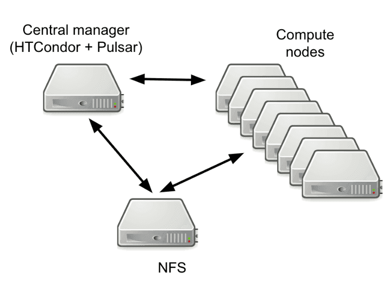

# EuroScienceGateway Work Package 3: first year achievements

The Work Package 3 of the [**EuroScienceGateway**](/projects/esg/) provides the compute infrastructure to the project and develops the software needed to maintain and further extend its architecture. Indeed, leveraging the Pulsar application, 6 National Galaxy instances will be able to provide access to remote computing resources for end-users. We present here a short summary of the WP3 first year’s achievements.

<figcaption>
  EuroScienceGateway Work Package 3 pulsar endpoints contributors.
</figcaption>

 
 

First of all we updated the components of the Open Infrastructure to the latest available software revision. The Open Infrastructure is a set of tools allowing to provide ready-to-go Pulsar nodes and Galaxy servers deployable over partners Cloud infrastructures.

Currently, each Pulsar endpoint is created using a virtual machine image, named Virtual Galaxy Compute Nodes, which provides everything needed. Containerized tools and Reference Data are shared through read only repositories based on the CERN-VM FileSystem. Finally, the deployment and the configuration of the Pulsar endpoint is managed using Terraform and Ansible. HTCondor is used as the default Resource Manager for job submission.

<figcaption>
  Pulsar endpoint architecture.
</figcaption>

 
 

The Open infrastructure update includes:
* Images updated to RockyLinux 9 ([repository](https://usegalaxy.eu/static/vgcn/))
* Pulsar app updates.
* HTCondor updated to 10.4.3 (with the new authentication mechanism between compute nodes and the Central Manager). 
* [Continuous configuration automation](https://github.com/usegalaxy-eu/pulsar-deployment)
* Documentation update
These activities resulted in the possibility to deploy new Pulsar endpoints with just a single  command, with the only requirements being access to an  OpenStack tenant and the UseGalaxy.eu RabbitMQ credentials.

Most Pulsar endpoints have been already updated to the new configuration:
* ALU-FR (DE) Pulsar deployments for testing
* CNR (IT) - IT02 and IT03
* IISAS (Slovakia) - SK01
* CNRS - GenOuest (FR) - FR01 
* CESNET (Czech Republic) - CZ01
* EGI and INFN - EGI01
* BSC (ES) - ES01
* TUBITAK ULAKBIM setup is almost completed

Moreover, the updated Open Infrastructure allows to deploy full fledged usegalaxy.eu replica servers, thus allowing to instantiate new usegalaxy services easily, but also providing a robust framework for maintaining and updating running instances. We also started documenting the whole procedure, which has been successfully used to deploy a prototype of the Italian UseGalaxy server ([temporary repository](https://usegalaxy-it.github.io/documentation/)).

Currently, 7 UseGalaxy endpoints are available: [usegalaxy.eu](https://usegalaxy.eu) (ALU-FR), [https://usegalaxy.be](https://usegalaxy.be/) (VIB), [usegalaxy.fr](https://usegalaxy.fr/) (CNRS), [usegalaxy.es](https://usegalaxy.es/) (BSC-CNS), [usegalaxy.no](https://usegalaxy.no/) (ELIXIR-NO), [usegalaxy.cz](https://usegalaxy.cz/) (CESNET) and usegalaxy.it (CNR). In this case the activities focused on the management and maintenance of the instances:
* Align to Galaxy 23.0 or later release
* Switch to Total Perspective Vortex dynamic job destination tool ([pre-print](https://arxiv.org/abs/2312.02060))
* Pulsar endpoints integration
* OS image and PostgreSQL updates.

Finally, in order to enable other workflow engines to access and leverage the a Pulsar Network, we are going to implement support for the GA4GH Task Execution Service, as a proof of concept, allowing other services to submit jobs via TES to Pulsar. The Task Execution Service (TES) API is an effort to define a standardized schema and API for describing batch execution tasks. A task defines a set of input files, a set of containers and commands to run, a set of output files, and some logging and metadata.

<figcaption>
  The TES for Pulsar architecture
</figcaption>

 
 

For this purpose the TESP (TES for Pulsar) microservice, decoupled from Pulsar, has been developed: it implements the TES standard, distributes TES tasks using the Pulsar REST API and supporting Docker containers for tools provisioning. The [current version](https://github.com/CESNET/tesp-api) provides:
* TESP implementation, usage via curl or Snakemake
* three methods for file transfer (S3, https, ftp)
* support for development version of Galaxy TES runner

TESP will be tested with WfExS, a high-level workflow execution service backend, developed within EOSC-Life as part of Demonstrator 7, which can manage workflows across different domains during 2024.

The WP3 work will, of course, continue during 2024, with the release of the documentation for both Pulsar and (Use)Galaxy endpoint deployment. We also plan to complete the Pulsar endpoints deployment and connect more UseGalaxy.`*` to the Pulsar network. Finally, we also aim to test the Open Infrastructure with commercial Cloud providers, in order to further extend the possibility for users to use Galaxy as frontend for their very own resources.

#### WP3 Repositories
* [Pulsar Deployment repository](https://github.com/usegalaxy-eu/pulsar-deployment)
* [VGCN Images repository](https://usegalaxy.eu/static/vgcn)
* [Pulsar destination availability](https://github.com/usegalaxy-eu/infrastructure-playbook/blob/master/files/galaxy/tpv/destinations.yml.j2)
* [TPV update](https://eurosciencegateway.eu/news/2023-05-08-tpv-switch)
* [TES for Pulsar](https://github.com/CESNET/tesp-api)
* [TESP Galaxy runner](https://github.com/galaxyproject/galaxy/pull/14462)
