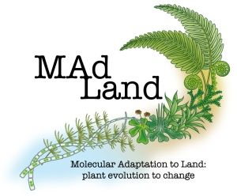

Welcome to the world of MAdLandDB – your go-to protein database for a comprehensive collection of fully sequenced plant and algal genomes. Developed and actively maintained by the [Rensing lab](https://plantco.de/), MAdLandDB stands out for its emphasis on non-seed plants and streptophyte algae. In this blog post, we'll explore the key features and recent updates of this invaluable resource.

### Introduction

MAdLandDB is a protein database comprising of a comprehensive collection of fully sequenced plant and algal genomes, with a particular emphasis on non-seed plants and streptophyte algae. This database contains over 21 million sequences, representing more than 600 diverse group of species. Its scope extends to various organisms, including fungi, animals, the SAR group, bacteria, and archaea, fostering a platform for comprehensive comparative analysis.The database's unique species abbreviation system, using a 5-letter code, simplifies identification. For instance, CHABR – <i>Chara braunii</i>, an example of how this nomenclature works. It delivers non-redundant, reliable genome sequences utilizing [BLASTp](https://usegalaxy.eu/root?tool_id=toolshed.g2.bx.psu.edu/repos/devteam/ncbi_blast_plus/ncbi_blastp_wrapper/2.14.1+galaxy1) and [Diamond](https://usegalaxy.eu/root?tool_id=toolshed.g2.bx.psu.edu/repos/bgruening/diamond/bg_diamond/2.0.15+galaxy0) search functionalities on [Galaxy](https://usegalaxy.eu/) interface for comparative and evolutionary questions in plant biology

<!-- 

 -->

 

 

### What Sets MAdLandDB Apart? 

**Non-redundancy:** One of the database's primary strengths lies in its non-redundant nature. Every sequence is carefully curated, ensuring that you access only the most reliable genomic information.

**Genome Project Origins:** MAdLandDB takes pride in sourcing its sequences predominantly from genome projects. This approach enhances the reliability of the data and provides a solid foundation for various comparative analyses.

**Comprehensive Information:** With the 5-letter code in the sequence header information along with the gene IDs simplifies the species name and also the source of gene encoding (plastome or transcriptome-based, etc). This additional information proves invaluable, especially in cases where a full genome is not yet available. Upon special request, we can also provide metadata about the sequences and their genome projects.

### MAdLandDB releases   

There have been several releases since MAdLand DB was hosted on [Galaxy](https://usegalaxy.eu/).  

| DATE  | #RELEASE |  
| ------------- | ------------- | 
| 22 December 2022 | 1st release |
| 03 Febuary 2023 | 2nd release |
| 23 August 2023| 3rd release |
| 18 January 2024 | 4th release |

Want to know more about MAdLand, please visit [MAdLand](https://madland.science/movies.php)

