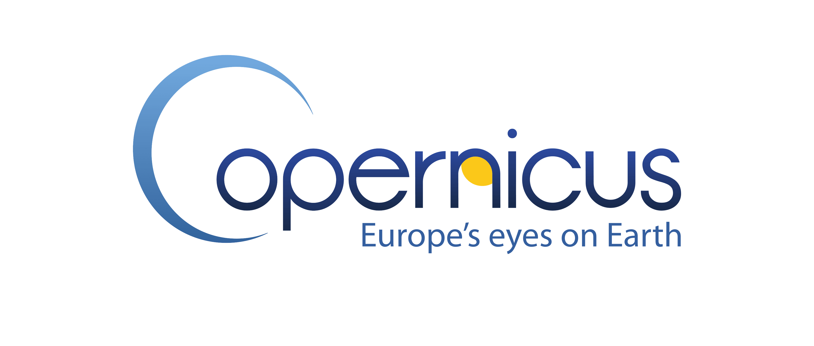

Some news on the progression of the [earth-system.usegalaxy.eu](https://earth-system.usegalaxy.eu). 

# From tools ...

## Jupyterlab ft Jupyterlab

Recently, 2 more Jupyterlab tools and their set of notebooks were added in Galaxy and more specifically in [earth-system.usegalaxy.eu](https://earth-system.usegalaxy.eu). 
What do you mean you never heard of this subdomain?? Then, I suggest you go check this blog post ["A brand new subdomain of Galaxy Europe: earth-system.usegalaxy.eu"](https://galaxyproject.org/news/2023-10-17-earth-system/)
Anyway, about the tools there is one on Copernicus Data Space Ecosystem and another and the Holoviz ecosystem.

### Copernicus Data Space Ecosystem (CDSE)

Access a wide range of Earth observation data from the Copernicus Sentinel missions and more. The Copernicus Data Space Ecosystem provides notebooks for easy discovery, visualization, and download.

The Copernicus Data Space Ecosystem provides access to Earth observation data from the Copernicus Sentinel satellites.

    - Sentinel-1
    - Sentinel-2
    - Sentinel-3
    - Sentinel-5P

More data are available including high-resolution satellite imagery from various providers and data offerings from different Copernicus services, ensuring a comprehensive and diverse dataset for your needs.

This Jupyterlab tool allows you to dive into data exploration, visualization, and analysis without the hassle of installing dependencies or downloading large data sets.
To use this tool, you need to use the .

Whether you are a seasoned data scientist, a researcher, or a student just starting your journey into earth observation, the JupyterLab service offers a user-friendly and efficient
way to harness the power of data analysis. With its seamless integration with Copernicus Data Space Ecosystem services, you can unlock valuable insights and unleash the potential of earth observation data in your work.

### Holoviz

With Python, initial exploration is typically in a Jupyter notebook, using tools like Matplotlib and Bokeh to develop static or interactive plots. These tools support a simple syntax for making certain kinds of plots,
but showing more complex relationships in data can quickly turn into a major software development exercise, making it difficult to achieve understanding during exploration. Various toolkits like Bokeh,
Dash, and ipywidgets allow building apps to control and explore these visualizations interactively rather than recoding each time, but again outside of a small range of simple functions building the
app itself becomes a major software development exercise. Plotting libraries also have limitations on how much data they can handle, especially if they require that all of the data be present in the
web browser’s limited memory space. It is thus difficult to find tools that support anything close to the entire range of cases where data needs to be visualized.

To address all the above issues, a set of open-source Python packages was developed  to streamline the entire process of working with small and large datasets. The HoloViz ecosystem includes a set of special-purpose tools designed to fill in the gaps and solve the whole problem of visualization:

    - Panel: Assembling objects from many different libraries into a layout or app, whether in a Jupyter notebook or in a standalone servable dashboard

    - hvPlot: Quickly return interactive HoloViews, GeoViews, or Panel objects from Pandas, Xarray, or other data structures

    - HoloViews: Declarative objects for instantly visualizable data, building Bokeh plots from convenient high-level specifications

    - GeoViews: Visualizable geographic data that can be mixed and matched with HoloViews objects

Everything is accessible through the 

And you know what you can even chain these two brand-new tools! How do you ask? Keep reading for the answer.

# ... to tutorials

## Land degradation

This time we are still using the Copernicus Jupyterlab to retrieve using OpenEO NDVI time-series data. Once you have your time-series you can easily visualise and analyse them through some graphs with Holoviz.
To follow an easy way to see the evolution of vegetation throughout time check out this
[tutorial: From NDVI data with OpenEO to time series visualisation with Holoviews](https://training.galaxyproject.org/training-material/topics/ecology/tutorials/ndvi_openeo/tutorial.html).

## A volcanic study

Following the domain chosen by the Fair-Ease project (if you still don't know what that is then I recommend you to check [this blog up](https://galaxyproject.org/news/2023-10-17-earth-system/)),
the tutorial was written to study some atmosphere variable over the volcano La Soufrière. In April 2021, the volcano "La Soufrière" in Guadeloupe erupted. 
The tutorial [Sentinel 5P data visualisation](https://training.galaxyproject.org/training-material/topics/climate/tutorials/sentinel5_data/tutorial.html) will walk you through the
discovery with OpenEO of Sentinel 5P Copernicus data to the visualisation of sulfur dioxide and aerosol spread out around the Antilles area from the 1st April to 30th May 2021.
For the visualisation part of those atmosphere variables, you can use the great [Panoply tool]((https://earth-system.usegalaxy.eu/root?tool_id=interactive_tool_panoply).

## Interrested?

If you are interested in these tools and/or tutorials don't hesitate to test them and give some feedbacks!

## Coming up soon!

We are still working on Earth System tools, workflows, and tutorials. This specific study is in cooperation with the [Fair-Ease](https://fairease.eu/) and [EuroScienceGateway](https://eurosciencegateway.eu/) projects
(to know more about the projects see the [blog](https://galaxyproject.org/news/2023-05-21-fair-ease-euro-science-gateway/) .
