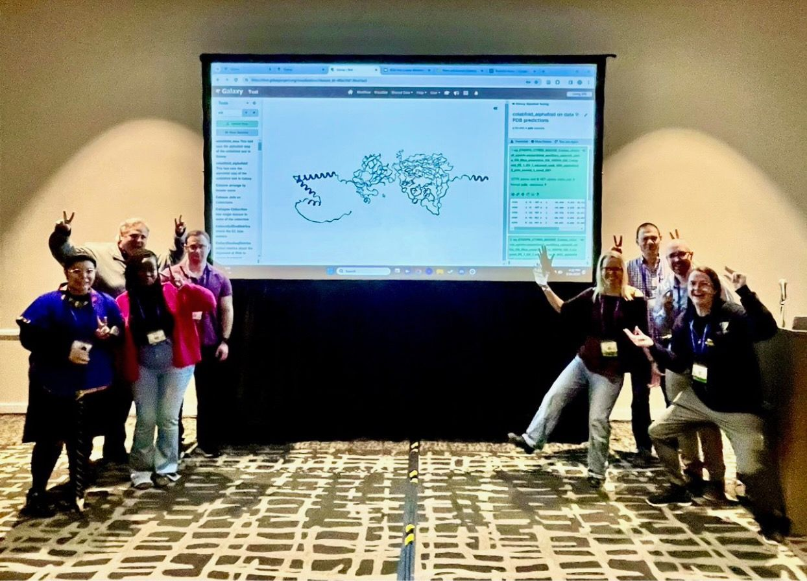
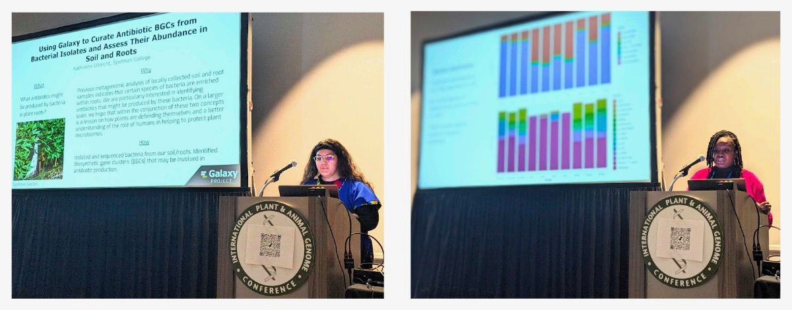
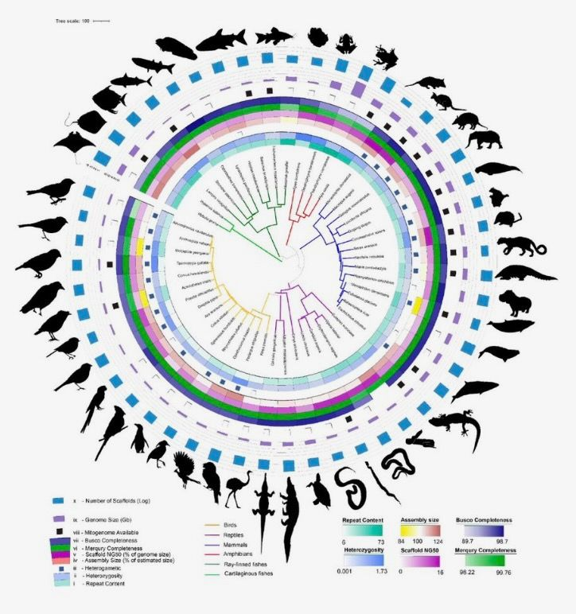
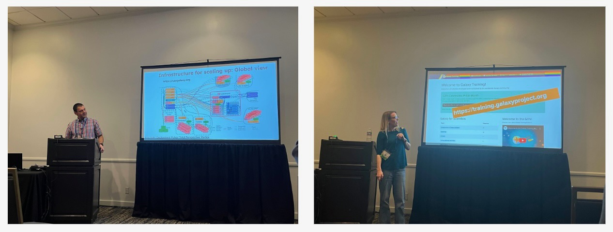

# The 31st annual International Plant & Animal Genome Conference (PAG31) Meeting Report
January 12th–17th, 2024; San Diego, CA, USA

## Overview 
The 31st annual Plant & Animal Genome Conference (PAG31) served as a valuable forum for discussions on recent developments and future plans in plant and animal genome projects. With 7 Plenary Talks, over 200 Workshops, and 100 Exhibitors, the conference offered a comprehensive platform for technical presentations, poster sessions, and workshops. It provided an excellent opportunity for the exchange of ideas and applications in this globally significant project. Notably, Galaxy participated with enthusiasm in PAG31, hosting its own workshop and being featured in several others. This active involvement underscored Galaxy's commitment to contributing meaningfully to the international discourse on plant and animal genomics (and beyond!).

## Galaxy for NGS Data Analysis: A Hands-on Workshop
Galaxy showcased its commitment to advancing life science research with a workshop titled "Galaxy for NGS Data Analysis: A Hands-on Workshop" at PAG31. Galaxy is a widely used open-source platform that empowers scientists globally and enhances research accessibility, reproducibility, and transparency. The workshop began with an introduction by Michael Schatz to the Galaxy platform, featuring insights into recent work supporting microbiome analysis for the [Genomic Data Science Community Network](https://www.gdscn.org/). Attendees engaged in a tutorial on quality control, classification, and analysis of metagenomes from short and long-read sequencing data.

A spotlight on the [Galaxy Training Network (GTN)](https://training.galaxyproject.org/) by Saskia Hiltemann emphasized its collaborative, open, and FAIR approach to scientific training materials. With over 300 tutorials authored and reviewed by a global community, the GTN serves researchers, educators, and scientific tool developers. The Introduction to Galaxy portion of the workshop by Natalie Whitaker covered key topics, including using the Galaxy interface, organizing analyses, running tools, and managing data. Participants prepared for in-depth analyses, delving into metagenomics data to identify yeast species and visualize microbiome communities.

The workshop further explored microbiome analyses, leveraging Galaxy's tools, workflows, and existing trainings led by Alex Ostrovsky. Participants had hands-on experience running their own microbiome analyses on reference data, gaining a deeper understanding of Galaxy's capabilities. The concluding segment by Tyler Collins centered on the assembly and annotation of microbial genomes, advocating a hybrid sequencing strategy for improved accuracy. The workshop emphasized the integration of long and short-read sequencing methods and highlighted the significance of predicting protein structures using ColabFold, bridging genomic sequencing data with functional proteomics analysis. Galaxy's dedication to open-source, FAIR data access, and comprehensive analyses shone through, offering participants a valuable learning experience at PAG31.

### BioDIGS
Galaxy was honored to feature the research endeavors of two promising undergraduate students from Spelman College, Nia Davis and Katherine Ulbricht, during PAG31's "Galaxy for NGS Data Analysis: A Hands-on Workshop." These students, affiliated with the [BioDIGS (BioDiversity and Informatics for Genomics Scholars) Project](https://biodigs.org/#home), presented their insightful investigations into plant microbiome interactions.

Katherine Ulbricht shared her expertise in a talk titled "Using Galaxy to Curate Antibiotic BGCs from Bacterial Isolates and Assess Their Abundance in Soil and Roots," while Nia Davis delved into "Analyzing the Pathogenic and Antibiotic Bacteria in Cucumber and Wheat Plants." Their engaging presentations provided a glimpse into the promising research conducted by emerging talents in the field.

Galaxy extends its appreciation to Katherine and Nia for joining PAG31 and showcasing their work with BioDIGS and Galaxy. This collaboration underscores Galaxy's commitment to providing a platform for diverse perspectives and fostering inclusivity in STEM, recognizing the potential of young researchers like Katherine and Nia to contribute to the future of genomics.

## Vertebrate Genome Project
The [Vertebrate Genomes Project (VGP)](https://vertebrategenomesproject.org/) took the spotlight at PAG31, offering a comprehensive series of talks that delved into the project's ambitious goal of generating phased, error-free, chromosome-level, near-complete, and annotated reference genome assemblies for all ~70,000 extant vertebrate species. Aligned with the Earth BioGenome Project (EBP), which aims to produce reference-quality genomes for all 1.8 million named species on Earth, the VGP emphasizes the crucial role these genomes will play as a valuable resource for the broader scientific community.

Galaxy played a central and instrumental role in the success of the VGP. The platform proved to be a linchpin in the VGP's mission, facilitating seamless data integration, analysis, and collaboration among researchers. The discussions during these talks underscored the importance of Galaxy in overcoming challenges related to genome-wide alignments, phylogenetic tree inference, universal gene nomenclature, and comparative genomics of specialized traits within the VGP's Phase 1 scientific studies in which a representative species from every (or nearly every) vertebrate order will be assembled and released.

The workshop not only addressed the scientific intricacies of the VGP but also focused on ongoing advancements in sequencing technology, assembly techniques, and annotation methodologies. This collaborative effort aimed to organize and discuss the work involved in each project, with the anticipated outcome benefiting all high-quality reference genome projects affiliated with the VGP and EBP.

In a significant development following PAG31, the VGP recently published a groundbreaking paper in [Nature Biotechnology](https://www.nature.com/articles/s41587-023-02100-3). The paper delves into scalable, accessible, and reproducible reference genome assembly and evaluation, with Galaxy emerging as a crucial component in the methodology. This publication marks a milestone for the VGP, solidifying its commitment to advancing genomics research and underscores Galaxy's pivotal role in enabling cutting-edge genomic studies on a global scale. 

## Teaching Genetics, Genomics, Biotechnology, and Bioinformatics
Galaxy played a prominent role in the workshop session titled "Teaching Genetics, Genomics, Biotechnology, and Bioinformatics," contributing two insightful talks by Anton Nekrutenko and Saskia Hiltemann.

Saskia Hiltemann's presentation focused on the multifaceted capabilities of Galaxy as a mature, browser-accessible workbench for scientific computing. Galaxy empowers scientists to effortlessly share, analyze, and visualize their data, requiring minimal technical expertise. With over 8,000 integrated analysis software packages and support from various national infrastructure providers, Galaxy has fostered a thriving global community that actively contributes to the project. Saskia highlighted the [Galaxy Training Network (GTN)](https://training.galaxyproject.org/), an open and collaborative initiative delivering comprehensive training materials across various scientific topics. The GTN, boasting over 375 tutorials created by more than 300 contributors, facilitates self-study and offers valuable resources for educators in both classroom and virtual settings. The talk provided insights into leveraging Galaxy, the GTN, and other training resources for effective data science teaching.

Anton Nekrutenko's presentation delved into advancements in genome sequencing and assembly, addressing the challenges of reproducibility and scalability. He introduced the latest Vertebrate Genomes Project assembly pipeline, showcasing its versatility and ability to deliver high-quality reference genomes across a diverse range of vertebrate species. The pipeline, accessible through Galaxy, incorporates PacBio HiFi long-reads and Hi-C-based haplotype phasing in a novel graph-based paradigm. Anton emphasized the importance of standardized quality control to troubleshoot assembly issues and assess biological complexities automatically. By making the pipeline freely accessible through Galaxy, researchers without local computational resources can engage in the training and assembly process, democratizing access and enhancing reproducibility. The presentation demonstrated the flexibility and reliability of the pipeline through the successful assembly of reference genomes for 51 vertebrate species spanning major taxonomic groups, including fish, amphibians, reptiles, birds, and mammals.

Galaxy's active involvement in this workshop session underscores its pivotal role in advancing education, research, and the democratization of scientific tools and knowledge.

## JEDI+
To facilitate the effort towards fostering justice, equity, diversity, and inclusion in genomics research, PAG31 dedicated a session to Justice, Equity, Diversity, Inclusion + (JEDI+). This session marked a significant expansion of the discourse, featuring talks by experts in both genomics and JEDI+, followed by a panel discussion and interactive activities. The workshop aimed to systematically address global inequalities in the genomics community, considering JEDI+ as the guiding principle throughout the genomic data lifecycle.

During the session, Carolyn Hogg delivered a noteworthy talk titled "Implementation: Genomic Resources," where she thoughtfully highlighted Galaxy. This shout-out emphasized the importance of integrating tools like Galaxy in the pursuit of justice, equity, diversity, and inclusion within genomics. The session served as a crucial step towards acknowledging and addressing systemic injustices in genomics, encouraging and establishing an environment where the field can realize its full scientific potential while embracing social responsibility and inclusivity.

VGP researcher Giulio Formenti also gave a presentation on “Genome Assembly and Curation”, in which he highlighted the ongoing challenges of large-scale genome analysis and how the VGP adopted Galaxy to support their production assemblies. He highlighted Galaxy’s core principles of accessibility, reproducibility, and transparency as keys to the success of the project. In a separate exchange, VGP researcher Adam Phillippy commented on Galaxy: “Thanks for building the engine that will take VGP across the finish line!” 

## Testimonials 

Katherine Ulbricht, Spelman College

*“I had an amazing time at PAG31! The Galaxy Team was extremely accommodating and welcoming; they made the conference feel like a natural place to be. The conference itself was also stellar, and it was honestly stunning to be casually walking amongst and conversing with pillars of the genomics community. The idea of presenting at the workshop was daunting at first, but with ample support that seemed to be freely given, I feel confident in stating that even though I stood in front of the most impressive audience I had ever faced, I felt calm, collected, and prepared. This was an absolutely brilliant experience, and I am unbelievably lucky to have been part of it!”*

Natalie Whitaker-Allen, Johns Hopkins University

*“I had the privilege of attending the Plant & Animal Genome Conference for the very first time, and my experience was truly transformative. The conference provided an invaluable platform for knowledge exchange, collaborative engagement, and following the latest developments in genomics. Galaxy's workshop, which I had the privilege of participating in and hosting, provided a unique platform for participants to delve into the intricacies of NGS data analysis. Witnessing the active engagement and enthusiasm of attendees as they navigated the Galaxy platform was truly gratifying. Galaxy's commitment to fostering inclusivity and empowering underrepresented voices in STEM resonated strongly, and being a part of this transformative environment was both inspiring and fulfilling. I am eager to contribute to future conferences and continue collaborating with Galaxy to advance genomics knowledge and accessibility.”*

## Plant & Animal Genome Conference 2025
Galaxy eagerly anticipates its participation in next year’s Plant & Animal Genome Conference (PAG32), building upon the momentum and enriching experiences gained at PAG31. As a steadfast contributor to the genomics community, Galaxy looks forward to showcasing its latest advancements, facilitating engaging workshops, and continuing its commitment to fostering inclusivity and collaboration in the field. The enthusiasm to share insights, exchange ideas, and contribute to the ever-evolving landscape of genomics research accentuates Galaxy's dedication to staying at the forefront of innovation. The forthcoming conference provides an exciting opportunity for Galaxy to strengthen existing partnerships, forge new connections, and continue to play a pivotal role in shaping the future of genomics!

