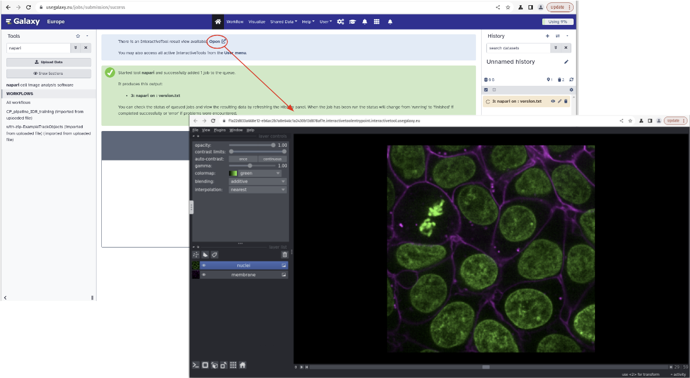

Napari is now available for the imaging community to use in Galaxy Europe!

## What is Napari? What does it do?

[Napari](https://napari.org/) is an open-source image viewer for analyzing large multi-dimensional images. It is built on top of Python, Qt, [VisPy](https://vispy.org/) and the scientific Python stack.

### Features

Napari provides a dynamic platform for visualizing and interacting with 2D, 3D, and multi-dimensional arrays on a canvas. It allows users to overlay derived data such as points, polygons, segmentations, and more. It also facilitates the annotation and editing of derived datasets using standard data structures like NumPy or Zarr arrays. Napari seamlessly integrates exploration, computation, and annotation in the field of imaging data analysis.

## How to access Napari through Galaxy Europe?

To use Napari in Galaxy, first you need to create an account in Galaxy and log in with your credentials. You can access Napari from [here](https://usegalaxy.eu/root?tool_id=interactive_tool_napari) and specify images from your history that you want to visualize using Napari, then press the _Run Tool_ button to launch a Napari instance. When the graphical user interface of Napari is ready, an  'Open' link will be displayed at the top of the Galaxy central panel (see screenshot below). 

We are still working on integrating more plugins into the Napari interactive tool in Galaxy. 

This work is supported by the [NFDI4BIOIMAGE project](https://nfdi4bioimage.de/).

