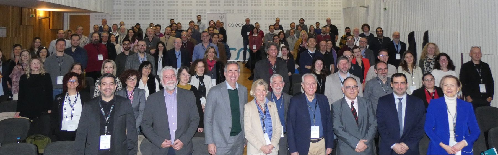
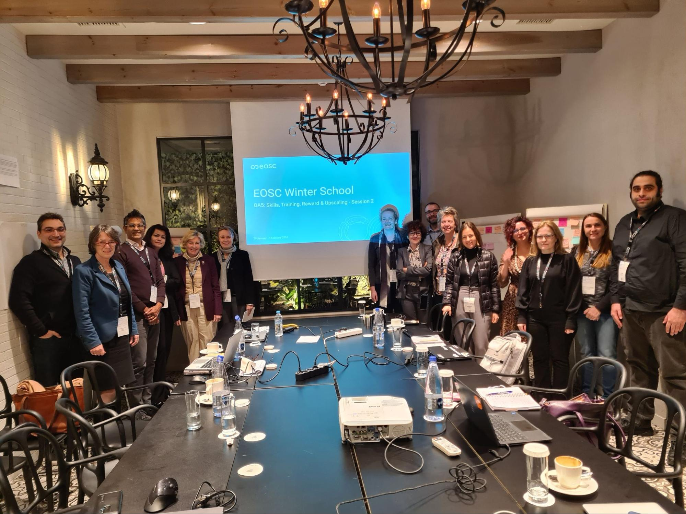

Our Horizont Europe funded EOSC project [EuroScienceGateway](https://eurosciencegateway.eu) participated in the [EOSC Winter School 2024](https://eosc.eu/eosc-focus-project/winter-school-2024/) in Thessaloniki, Greece, from 29th Jan - 01st Feb. The desire for more collaborations between all the existing [EOSC projects](https://eosc.eu/horizon-europe-projects/) was the initial idea to have a joint meeting with EOSC project members to discuss different topics the state of the art, goals, and future achievements towards the EOSC SRIAs and macro roadmap. Intense discussions over 3 days gave an in-depth technical understanding of specific opportunity areas and integrating the deliverables of [the EOSC-A Task Forces](https://eosc.eu/eosc-task-forces/) into these projects.

After a warm welcome from the European Commission and EOSC and their political statements on the importance of EOSC, 1.5 days were used for intense networking and discussions on common goals, strategies, and collaborations. Almost all Opportunity Areas (OAs) were covered by ESG members. More information about the EOSC Opportunity Areas can be found here:
- [PIDs](https://eosc.eu/oa1-pids-persistent-identifiers)
- [Metadata, Ontologies & Interoperability](https://eosc.eu/oa2-metadata-ontologies-interoperability)
- [FAIR Assessment & Alignment](https://eosc.eu/oa3-fair-assessment-alignment)
- [User & Resource Environments](https://eosc.eu/oa4-user-resource-environments)
- [Skills, Training, Rewards, Recognition, & Upscaling](https://eosc.eu/oa5-skills-training-rewards-recognition-upscaling)
- [Open Scholarly Communication](https://eosc.eu/oa6-open-scholarly-communication)

The EuroScienceGateway project with the underlying Galaxy infrastructure and Galaxy Training platform (GTN) was represented in almost all OAs and has successfully shown that the Galaxy project and the European Galaxy Server are already widely established as technical core infrastructures in many EOSC projects. Besides the Galaxy infrastructure for data analysis and as VRE, the Galaxy Training Network (GTN) was presented as a very mature training platform with more than 380 different tutorials.

One of the key conclusions of the nearly 120 participants from the EOSC Association (EOSC-A) and the 21 EOSC-related EU projects is that the Winter School resulted in such essential collaborations and outcomes, inspiring an appetite for “more hands-on, collaborative work”, that it should be repeated on an annual basis - and yes, we absolutely agree.

To put into action this “hands-on, collaborative work” directly following the EOSC winter school, a small informal hackathon was put in place. During this time multiple EOSC projects (AquaInfra, EuroScienceGateway, Fair-Ease, Raise, ...) worked together on Galaxy.
- [Interactive STAC catalog tool](https://earth-system.usegalaxy.eu/root?tool_id=interactive_tool_stac)
- [Satellite data for earth sciences](https://galaxyproject.org/news/2024-02-04-jupyterlabs/)
- Update of [Supported communities with their own subdomain](https://galaxyproject.org/eu/subdomains/) and talks on how getting more visibility for the subdomains

