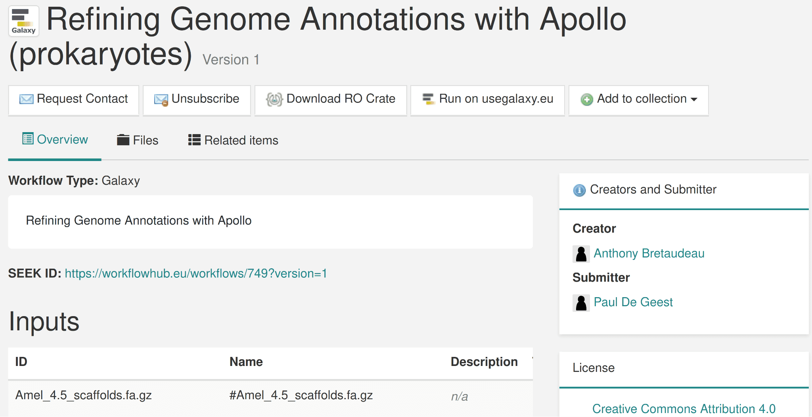

[WorkflowHub](https://workflowhub.eu/) is a registry of computational workflows, provided as a EOSC Service by ELIXIR-UK, and used by over 200 different research projects, institutions and virtual collaborations. For this milestone of EuroScienceGateway (ESG), the project has developed an onboarding guide for WorkflowHub in order to register in WorkflowHub the initial ESG workflows that have been developed and maintained by the project. These workflows cover the EuroScienceGateway use cases of astronomy, biodiversity, earth science and genomics.

## ESG onboarding guide for WorkflowHub

[EuroScienceGateway](https://eurosciencegateway.eu/) (ESG) has developed a project-specific onboarding guide for WorkflowHub \[[Soiland-Reyes 2024](https://doi.org/10.48546/workflowhub.sop.8.2)\]. The guide gives an overview of the structure used in WorkflowHub and pointers to general WorkflowHub onboarding.

The guide is managed as a living document in Google Doc, and registered as a [Standard Operating Procedure](https://doi.org/10.48546/workflowhub.sop.8.1) in WorkflowHub with versioned snapshots.

Guide content include:

1.  EuroScienceGateway workflow organisation in WorkflowHub
2.  Registering EuroScienceGateway workflows in WorkflowHub
3.  Linking your workflow GitHub repository with WorkflowHub
4.  Keeping workflows up-to-date
5.  Linking workflows with other workflows
6.  Publishing workflows
7.  Adding new teams and collections

As part of the EuroScienceGateway project is about maturing the WorkflowHub EOSC service, similar project-specific guides have now been developed for the Biodiversity Genomics Europe ([BGE](https://biodiversitygenomics.eu/)) project, Beyond COVID-19 ([BY-COVID](https://by-covid.eu/)), BioDiversity Digital Twin ([BioDT](https://biodt.eu/)). As these projects are larger and combine existing collaboration networks and e-Infrastructures, their organisation in WorkflowHub can be more complex than ESG, assisted by their respective onboarding guides.

## Registering ESG workflows in WorkflowHub

Within the WorkflowHub, a [EuroScienceGateway team](https://workflowhub.eu/projects/166) groups the contributors, organisations and workflows developed by the ESG project. Each contributor can register for a separate account, and their workflows can be given shared attribution.

  
**Figure 1**: The WorkflowHub team <https://workflowhub.eu/projects/166> shows registered people, organisations, standard operating procedures, workflows and collections.

Workflows are registered as [Workflow RO-Crates](https://w3id.org/workflowhub/workflow-ro-crate/), capturing the workflow definition and its metadata as a [FAIR Digital Object](https://doi.org/10.3897/rio.8.e93937). [RO-Crate](https://www.researchobject.org/ro-crate/) is a general-purpose FAIR packaging mechanism for data, metadata and software.

  
**Figure 2**: Workflow [https://workflowhub.eu/workflows/749?version=1](https://workflowhub.eu/workflows/749?version=1) with options for **Download RO-Crate** and **Run on usegalaxy.eu**

Galaxy workflows registered this way can be launched from WorkflowHub (Figure 2) [directly onto the usegalaxy.eu](/news/2023-11-13-run-in-galaxy-button-workflowhub) instance. This feature is also used by the GTN as part of a snippet (Figure 3) that [enables such launching of workflows](https://training.galaxyproject.org/training-material/news/2023/12/12/tutorial-run-wfh-ds.html) from a particular tutorial.

  
**Figure 3**: Galaxy Training Network [guide for embedding WorkflowHub](https://training.galaxyproject.org/training-material/topics/contributing/tutorials/create-new-tutorial-content/tutorial.html#workflows) execution snippets in tutorials.

In addition, an [ESG Workflow Collection](https://workflowhub.eu/collections/13) has been created - the purpose of this is to also aggregate pre-existing and third-party workflows which have been helped or further developed by ESG, such as in the Galaxy Training Network ([GTN](https://training.galaxyproject.org/)) and Intergalactic Workflow Commission ([IWC](https://github.com/galaxyproject/iwc)), both which are community-led initiatives with participants outside ESG.

### Registered EuroScienceGateway workflows

As of 2024-02-28, the [WorkflowHub ESG collection](https://workflowhub.eu/collections/13) contains the workflows:

 * [Gravitational Wave source Cone Search](https://workflowhub.eu/workflows/415) (CWL)  by [Volodymyr Savchenko](https://workflowhub.eu/people/168)
 * [Example Multi-Wavelength Light-Curve Analysis](https://workflowhub.eu/workflows/766) (Galaxy) by [Volodymyr Savchenko](https://workflowhub.eu/people/168)
 * [Refining Genome Annotations with Apollo (prokaryotes)](https://workflowhub.eu/workflows/749) (Galaxy) by [Anthony Bretaudeau](https://workflowhub.eu/people/241)
 * [Visualizing NDVI time-series data with HoloViz](https://workflowhub.eu/workflows/759) (Galaxy) by Marie Jossé
 * [Calculating and visualizing OBIS marine biodiversity indicators](https://workflowhub.eu/workflows/758) (Galaxy)      Marie Josse
 * [Finding the Muon Stopping Site using PyMuonSuite](https://workflowhub.eu/workflows/757) (Galaxy) by [Leandro Liborio](https://orcid.org/0000-0003-2777-5167), Muon Spectroscopy Computational Project
 * [Sentinel 5P volcanic data visualization](https://workflowhub.eu/workflows/756) (Galaxy) by Marie Jossé
 * [Functional protein annotation using EggNOG-mapper and InterProScan](https://workflowhub.eu/workflows/755) (Galaxy) by [Anthony Bretaudeau](https://orcid.org/0000-0003-0914-2470)
 * [Genome annotation with Funannotate](https://workflowhub.eu/workflows/754) (Galaxy) by [Anthony Bretaudeau](https://orcid.org/0000-0003-0914-2470)
 * [Masking repeats with RepeatMasker](https://workflowhub.eu/workflows/753) (Galaxy) by [Anthony Bretaudeau](https://orcid.org/0000-0003-0914-2470)

These workflows span the [ESG use cases](/projects/esg/news/?tag=esg-wp5), including from astronomy, biodiversity, earth science and genomics. Further workflows will be registered during the second phase of the project.

Additional [Galaxy Training Network](https://training.galaxyproject.org/) (GTN) workflows are being considered for WorkflowHub registration, however as some of these workflows are building blocks meant to be completed according to a particular tutorial, these will be better suited for a separate collection, as they may not be directly suitable for scientific use.

In contrast, the Intergalactic Workflow Commission ([IWC](https://github.com/galaxyproject/iwc)) has developed mature, production-grade workflows for Galaxy. The separate [IWC team](https://workflowhub.eu/projects/33#workflows) in WorkflowHub has registered 47 workflows as of 2024-02-28. These are automatically registered by the WorkflowHub Bot, which scans the [IWC GitHub repositories](https://github.com/iwc-workflows/) and registers the workflows according to their RO-Crate metadata. As many of these also have defined tests, WorkflowHub is able to show their test status via the [LifeMonitor](https://lifemonitor.eu/) service, picked up from the [test definition](https://www.lifemonitor.eu/lm_test_monitoring) in their RO-Crate (Figure 4).

  
**Figure 4:** Workflow [https://workflowhub.eu/workflows/615?version=2](https://workflowhub.eu/workflows/615?version=2) indicates **Tests Passing** and links to the [LifeMonitor test results](https://app.lifemonitor.eu/workflow;uuid=37f29ed0-543f-013c-9190-005056ab8eb2).

## Cite As

Stian Soiland-Reyes, Björn Grüning, Paul De Geest (2024):\
**EuroScienceGateway MS3: Initial EuroScienceGateway workflows registered**.\
*Zenodo* (Milestone)\
<https://doi.org/10.5281/zenodo.1072892>
