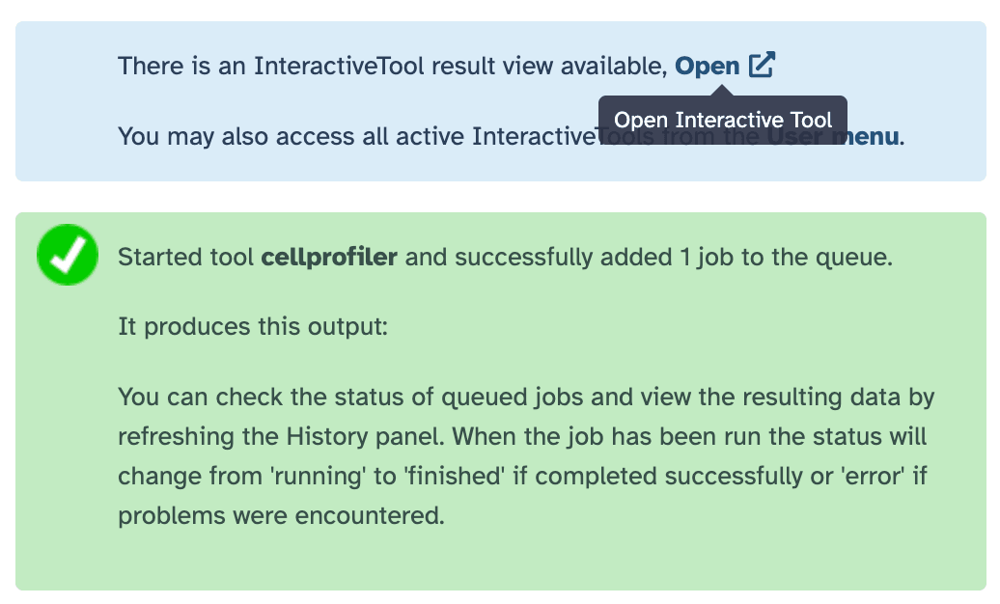

CellProfiler versions 3.1.9 and 4 have been available in Galaxy as tools for a while now. Additionally, you can customize your automated workflows by accessing individual modules from CellProfiler 3.1.9. To closely replicate your local environment, Cell Profiler is now also available as an interactive tool.

## What is CellProfiler? 

[CellProfiler](https://cellprofiler.org/) is an open-source software for measuring and analyzing cell images. 

## What can I do with CellProfiler in Galaxy? 
Two CellProfiler tutorials for fully-automated workflows are available already to perform [segmentation](
https://training.galaxyproject.org/training-material/topics/imaging/tutorials/tutorial-CP/tutorial.html) and [tracking](https://training.galaxyproject.org/training-material/news/2021/03/18/tutorial_imaging_cell_profiler.html).
You can (1) assemble your workflows using individual modules of CellProfiler available as Galaxy tools or (2) craft your workflows using CellProfiler and upload your cppipe file to be run in Galaxy. Up to you!

### What’s new then?

The novelty is that, besides the two options mentioned above, you can use CellProfiler in your browser interactively, i.e. you can plug and play the modules in the CellProfiler interface in the browser. Once you’re ready, you run it like in your local workstation but with the power of an HPC or cloud environment on the backend. 

### How does it work?

To use this new interactive tool, first create an account in Galaxy and log in with your credentials. Then, you can find find in the Tools panel “**Run CellProfiler** interactive tool” or go to [this link](https://usegalaxy.eu/?tool_id=interactive_tool_cellprofiler&version=latest). In the central panel of Galaxy, you’ll find a _Run Tool_ button to launch the CellProfiler instance. When the graphical user interface of Napari is ready, an 'Open' link will be displayed at the top of the Galaxy central panel (see screenshot below). 

And with that, you’re ready to go. Enjoy performing your favourite image analysis in Galaxy!

–

This work is supported by the [NFDI4BIOIMAGE project](https://nfdi4bioimage.de/).

