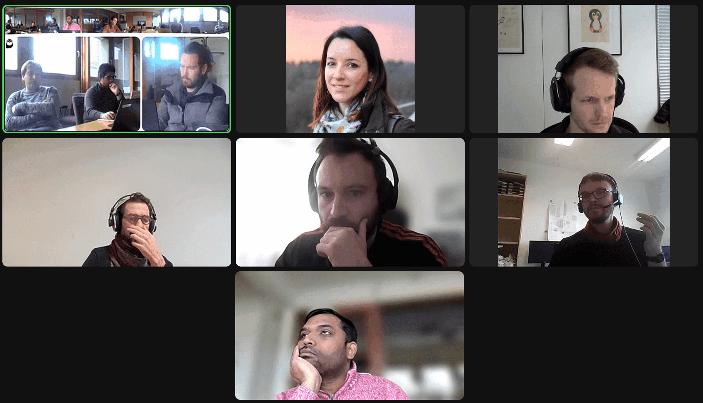
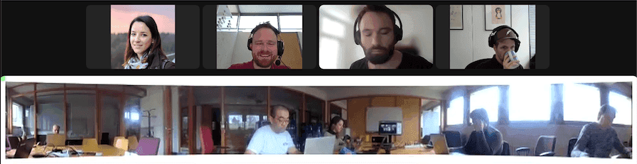

The *"Image Analysis in Galaxy"* hackathon was held from February 26th to March 1st, 2024, at the University of Freiburg (Germany). Co-organized by Euro-BioImaging and NFDI4BIOIMAGE, the event aimed to enhance image analysis capabilities and workflows within the Galaxy platform.

Participants worked on various aspects of imaging analysis, including data management, visualizations, migrating existing workflows into Galaxy and creating novel Galaxy tools, among others. The hackathon took place in a hybrid format, allowing for remote participation.

# Tools

## Interactive tools

[Napari](https://galaxyproject.org/news/2024-02-26-napari-available/) and [CellProfiler](https://galaxyproject.org/news/2024-03-01-cellprofiler-available/) have now been integrated into Galaxy as interactive tools. This means that you can now use both applications in the same way as you’d do in your local workstation but with the computational capabilities of high-performance or cloud computing resources in the backend.

**How do they work?** 

To use these new interactive tools, you need first to create an account in Galaxy and log in with your credentials. Then, you can find in the Tools panel of the left side, either “**Run Napari**“ interactive tool or “**Run CellProfiler**” interactive tool. Once you click on the one of your choice, you’ll find a **Run Tool** button to launch the CellProfiler or Napari instances in the central panel of Galaxy. When the graphical user interface is ready, an  'Open' link will be displayed at the top of the Galaxy central panel. 

## Cellpose headless

[Cellpose](https://www.cellpose.org/) is now available as a Galaxy tool. Cellpose is a deep learning-based segmentation tool widely used in the image analysis field. The integration of Cellpose into Galaxy harnesses the HPC resources, enabling users to perform segmentation tasks on a wide range of images with enhanced computing power. 

**How does it work?**

You can go to the tool panel and type “cellpose” in the search box. You can upload input images to Galaxy history using the ‘Upload Data’ button. To run the Cellpose tool, select input images, pre-trained model type and channel to segment via its user interface. The output will be available in your Galaxy history upon completion of the tool’s execution.

## AI-powered image analysis: Notebooks & Tool

This project aimed to curate a list of advanced AI models from the [BioImage Model Zoo](https://bioimage.io/#/), make them available via Galaxy as remote files and develop a general-purpose tool in Galaxy to make inferences on test images. 

**How do they work?**

A curated list of AI models has been made available in Galaxy, accessible in the Galaxy's file uploader at "ML models/bioimaging-models".

Models can be accessed for advanced Galaxy users in a Jupyter Notebook using the "get" method. Once the model is accessible in a notebook, it can make inferences on a test image. One example of such a notebook is bioimage-boundary-model-galaxy-IT, which takes one of the curated models and analyses a test image. 

A Galaxy tool is also being developed to take one of the curated models and test images directly for analysis. The project currently supports Pytorch-based AI models. Moving forward, support for TensorFlow models will be added. A [pull request](https://github.com/bgruening/galaxytools/pull/1391) of the initial work toward building the general-purpose tool has been added to showcase the project's progress and collect feedback from the imaging community to improve it.

## Visualization of TIFF

It is now possible to visualize TIFF and OME-TIFF files in Galaxy. Previously, manual conversion to other formats such as PNG or JPEG was required before visualization for certain web browsers. The conversion step can now be omitted within all web browsers.

**How does it work?**

You can now find a new visualization “Tiff Viewer” that will display basic regular TIFF images ([PR](https://github.com/galaxyproject/galaxy/pull/17553)). 

Once you upload a TIFF file to your history, you can click the visualization icon in your expanded dataset and select this new visualization.

Alternatively, you can display the TIFF file using the Avivator external application which provides more advanced functionality like zooming, etc. ([PR](https://github.com/galaxyproject/galaxy/pull/17554)).

## Visualization of zarr-based images

Work is ongoing towards the visualization of zarr-based images. For that, first Galaxy needs to have a proper *zarr* data type definition, including required metadata. Once this is possible and the Vizarr npm package is updated, Vizarr will be integrated as a Galaxy visualization plugin.

## Tool quality standards

For the first time, we have implemented capabilities for the automatic testing of Galaxy tools and workflows specifically tailored for the testing of image-oriented tools. The new capabilities permit automatic testing using *(i)* statements about the image metadata, *(ii)* the image content, as well as *(iii)* direct comparison to ground truth images, and will contribute to the overall quality of tools and workflows in our community. Existing tools were improved, including major bug fixes.

# Workflows

## IWC workflow

The segmentation of cell nuclei in microscopy images is a central task in many biological studies. When using fluorescent markers, cell nuclei often appear as bright image regions compared to the image background, which permits effective segmentation of the nuclei using automatic intensity thresholding methods (e.g., Otsu 1979). 

**How does it work?**

A **workflow based on Otsu thresholding for segmentation and counting of nuclei** using fluorescence microscopy images has been created, submitted to IWC, and is now available on [WorkflowHub](https://workflowhub.eu/workflows/771).

## Workflow translation from KNIME to Galaxy

The main goal of the project was to investigate the translation of KNIME workflows for image analysis into Galaxy workflows. The main tested workflow was a high content screening analysis workflow obtained from the KNIME Hub. Furthermore, we work on the detection of subcellular structures workflow described in a recent publication. Translation focused on the first main steps of pre-processing, segmentation and feature extraction. 

**How does it work?**

As the main outcome, it was confirmed that the main nodes for image processing are present on the Galaxy EU server and several steps of the workflow can be translated from KNIME to Galaxy with similar outcomes. We discovered some tools that are present in KNIME and can still be integrated into Galaxy. In particular, processes on binary images present also in imageJ (i.e. outline, fill holes, erode, dilate, voronoi-otsu-labeling, subtract background) can be added or implemented. An overview on the results plus the workflow converted to Galaxy [was published in Zenodo](10.5281/zenodo.10793700).

A comprehensive list of tools was prepared and given for implementation (see [issue](https://github.com/BMCV/galaxy-image-analysis/issues/105#issuecomment-1983395507)).
Furthermore, a small workflow for testing different threshold values and checking outcomes would be soon developed to speed up the workflow development. 
As a future task, a translation table from KNIME to Galaxy can be established to easily guide the user through the workflow conversion. Since most of the KNIME tools are ImageJ-based, a tool for running imageJ macros in Galaxy might also be developed to efficiently operate a complete translation between the two platforms. 

## Workflow translation from Nextflow to Galaxy

In this project, we aim to translate a small Nextflow image analysis workflow into a Galaxy workflow. The workflow quantifies the closing of a wound area over time in brightfield microscopy images of a cell monolayer. The main step of the workflow measures the fraction of the lesion that is free of cells for each time point. The resulting output is a CSV table of cell-free percentages as a function of time. 

**How does it work?**

We have translated the main step of this workflow into a Galaxy tool, which can be accessed via the tool panel on the left, or through [this link](https://usegalaxy.eu/root?tool_id=toolshed.g2.bx.psu.edu/repos/bgruening/woundhealing_scratch_assay/woundhealing_scratch_assay/1.6.1+galaxy0). 
The workflow is [available in the WorkflowHub](https://www.google.com/url?q=https://workflowhub.eu/workflows/782&sa=D&source=docs&ust=1709730450657431&usg=AOvVaw1HY9NTHYFQZvVK-wH2oPMd) as well.

The input of the main step in the workflow is a collection of TIFF images. As a next step, we aim to build a data download tool to automatically acquire input images from cloud storage such as S3.

# Next steps

After this successful week with plenty of outcomes, we are looking forward to similar gatherings in which we can continue the collaboration! 

Further updates will be discussed at the FAIR Image Data Workflows Expert Group, we’re meeting every **3rd Wednesday of the month at 4 pm CE(S)T**. Join us!

