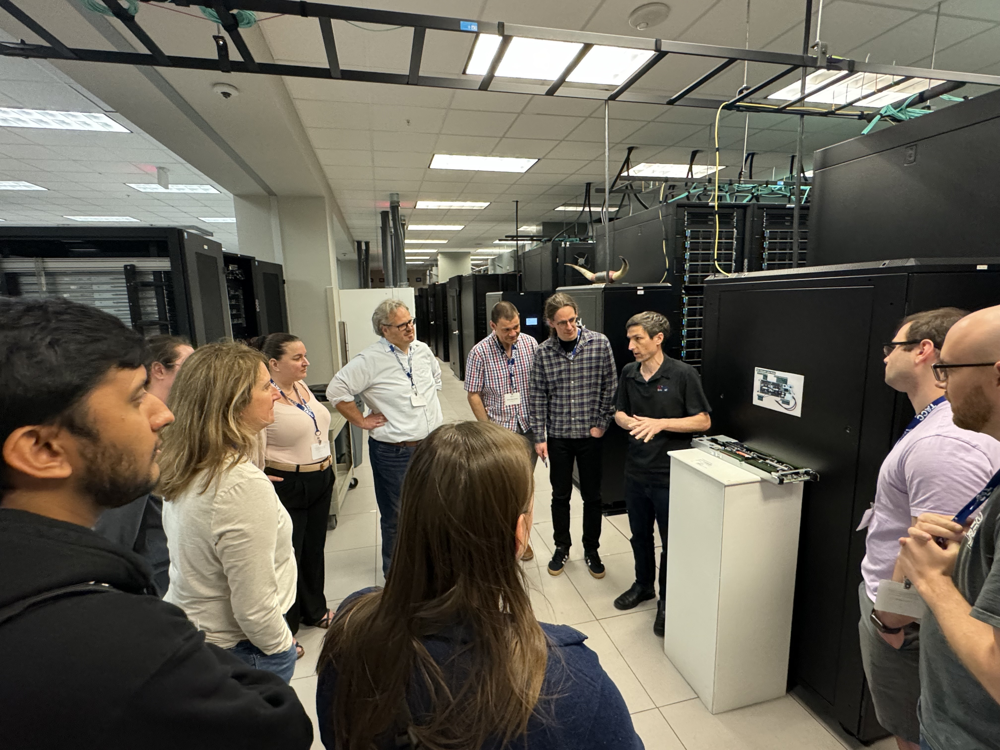
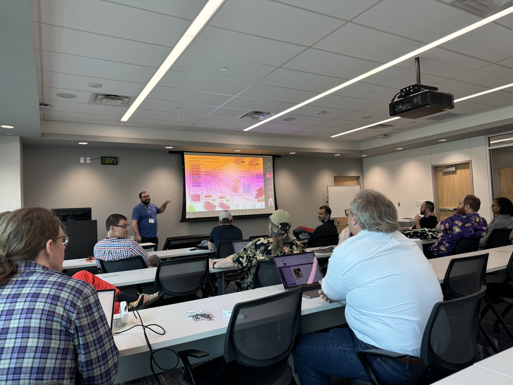
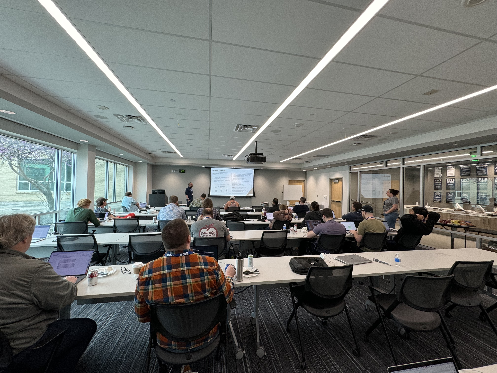
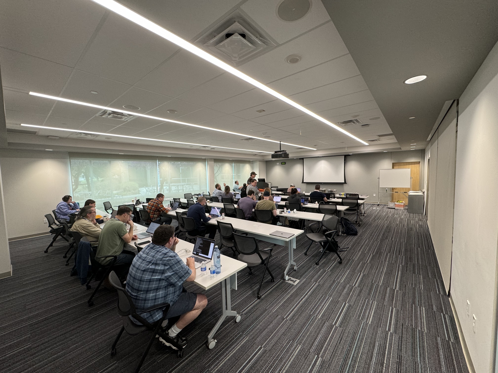
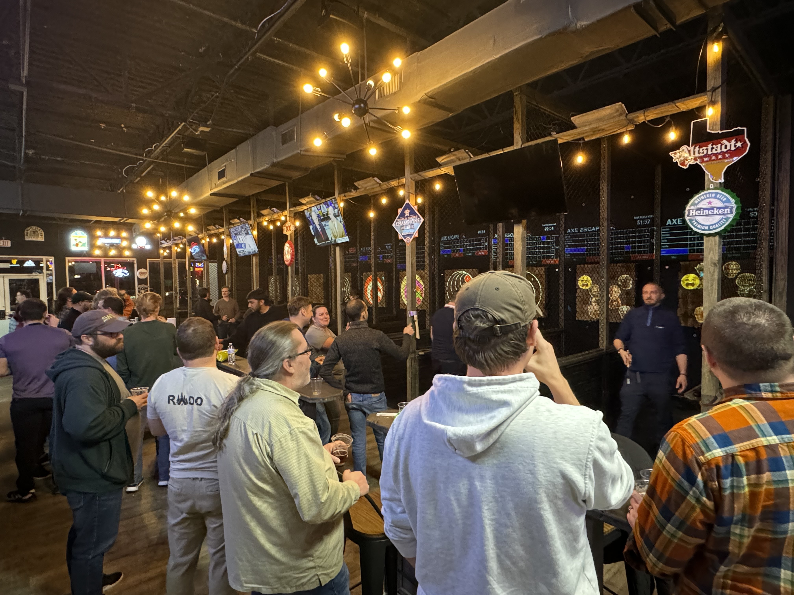
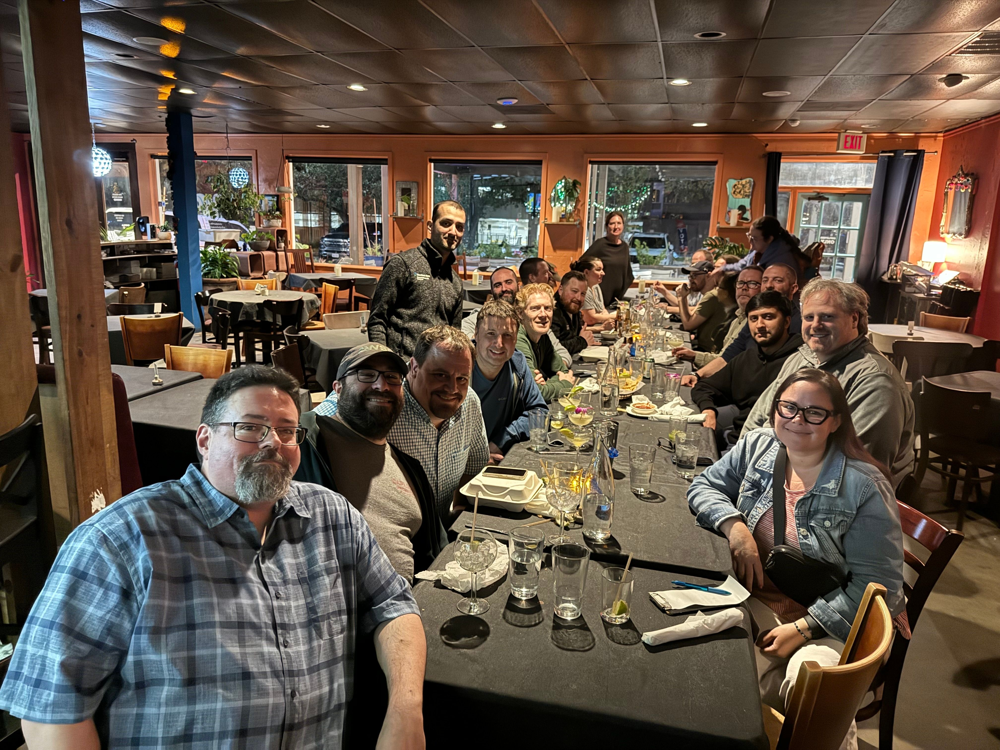

# Galaxy Team Meeting in Austin, Texas: February 27th-29th, 2024

The Galaxy team recently convened in Austin, Texas, for an impactful and memorable team meeting. From a tour of the Texas Advanced Computing Center (TACC) to engaging discussions and a hackathon, the meeting was packed with activities aimed at enhancing collaboration and innovation within the team.

## Tour of TACC
The Galaxy team kicked off our team meeting with a tour of TACC. Galaxy has used TACC to support our advanced computing resources for over 10 years, and we were thrilled to be able to tour the facilities and meet some of the team. Galaxy is extremely grateful for the support we have received from TACC over the years. Our strong relationship with TACC has been instrumental in advancing the Galaxy platform, and we look forward to continuing our collaboration in the future. Thank you, TACC, for your continued support and partnership!

## Engaging Discussions and Presentations
The meeting featured a series of engaging lightning talks by Galaxy developers, highlighting their recent work on the platform and outlining their goals for the near future. These talks not only showcased the diverse expertise within the team but also sparked lively discussions and brainstorming sessions. Additionally, group discussions were held to discuss Galaxy's roadmap, outreach efforts, the upcoming Galaxy Community Conference in Brno, Czech Republic, and updates from various working groups.
 

## Hackathon
A highlight of the meeting was the hackathon, where Galaxy developers collaborated in small groups to work on active projects aimed at enhancing the platform. The hackathon provided an invaluable opportunity for developers to work face-to-face, brainstorm ideas, and tackle challenges together, leading to innovative solutions and new insights.

## Networking and Team Building
After days filled with productive discussions and collaboration, the Galaxy team unwound with a fun and unique team-building activity: axe throwing! This exciting experience brought team members together for a night of laughter and camaraderie, strengthening bonds and fostering a sense of unity within the team.

## Looking Ahead
The Galaxy team meeting in Austin was a resounding success, thanks to the dedication and enthusiasm of its members. As the team returns to their respective locations, they carry with them new ideas, insights, and collaborations that will drive the continued growth and success of the Galaxy platform.

Stay tuned for more updates and developments from the Galaxy team as they continue to push the boundaries of scientific research and data analysis.

