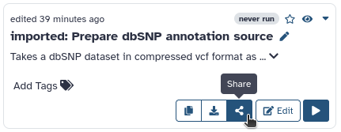
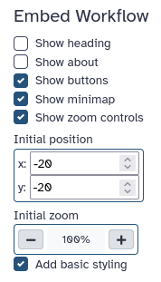
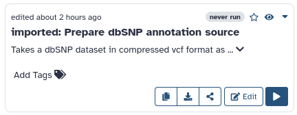
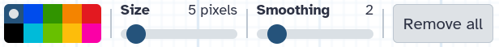
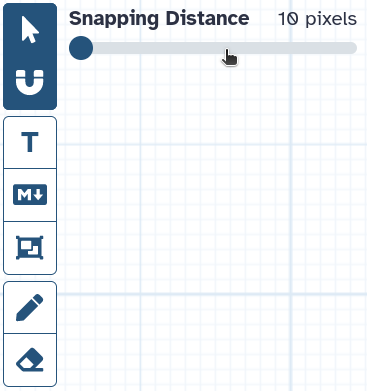
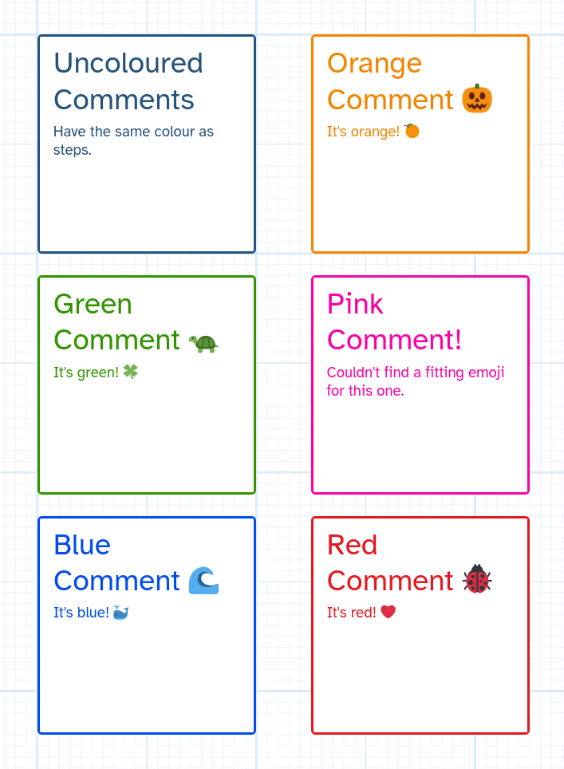
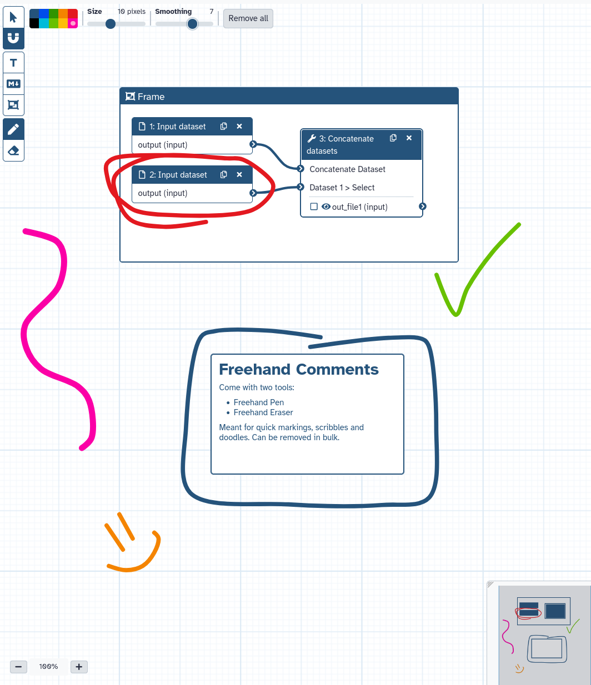

In the past few updates to Galaxy, many exiting changes and additions have arrived to workflows.

In this article, we'd like to shine a spotlight on three of them, which we are particularly excited about!

## 🤯 Is that a Workflow on the Community Hub?

It sure is!

And it's also the first feature we'd like to show you: **Workflow Embeds**

<iframe title="Galaxy Workflow Embed" style="width: 100%; height: 700px; border: none;" src="https://usegalaxy.eu/published/workflow?id=a80f9b926ba43892&embed=true&buttons=true&about=false&heading=true&minimap=true&zoom_controls=true&initialX=-20&initialY=-20&zoom=0.5"></iframe>

This is the workflow editor, hosted on usegalaxy.eu, embedded inside the community hub (this site!).
You can drag it around, zoom in and out, view the workflow on usegalaxy.eu, or download it directly here, all fully interactive.

This does not just work on the community hub, it works on any website. Galaxy workflows are now fully embedable, like a YouTube video embed.

Powering this embed is the workflow editor in a read-only mode.

## 🤔 How do I make my own Embeds?

Embeds can easily be created from the workflow publishing page.
Go to the list of your workflows, and click "Share".

_notice how this list looks a bit different than it used to? Hold that thought_

Now make sure "Make workflow accessible" is turned on, and scroll down to the all new "Embed Workflow" section.

### ✅ Embed Options

There's a bunch of options to customize the embed. The defaults are fine for most cases, but here's a brief explanation of what these all do:

-   Show Heading: display a heading, showing either the workflows name, or "Workflow Preview" depending on if the about section is visible.
-   Show About: show or hide the about section. If the about section is active, shows the workflows name there, instead of in the heading.
-   Show Buttons: display the "Download" and "View in Galaxy" buttons.
-   Show Minimap: whether to show the minimap (bottom-right) inside the embedded workflow editor.
-   Show Zoom Controls: whether to show the zoom controls (bottom-left) inside the embedded workflow editor.
-   Initial Position: the x, y position shown before the user has dragged the canvas.
-   Initial Zoom: the zoom level shown, before the user zoomed in or out.
-   Add Basic Styling: adds a width, height, and removes the border of the embed. This is required for most websites, unless they have their own styling for the embed, or you want to use your own, custom, styling.

### 📈 Embed all the Workflows!

Workflow embeds are a powerful way to share and advertise your workflows.
Now that you know what an embed is and how it works, we'd love to see your interactive workflow previews out in the wild!

## 💌 Workflow Cards

The workflow list has a all new look.

Instead of a table, you will find that you now have a choice of two views: a list view, and a grid view.

In both workflows are represented by responsive workflow cards, which have all the options as before, in a all new layout.
The workflow list will remember your preferred view, so you do not have to switch it every time you access your list of workflows.

_narrow workflow card. mostly visible in grid view_

_wide workflow card. mostly visible in list view_

The cards themselves being responsive has the added benefit that when viewing the workflow list in list view on a narrow screen, it will display a narrow card, and similarly when viewing your workflows in grid view on a very wide screen, it will display the wide workflow card.

## 💬 Workflow Comments

Workflow comments are a new set of features that enable you to visually to explain and structure your Workflows right inside the Workflow editor.
Have a look at this example of a commented workflow (courtesy of [Helena](https://github.com/hexylena)):

_tip: to learn how make high res workflow screenshots, have a look at [this GTN tutorial](https://training.galaxyproject.org/training-material/topics/galaxy-interface/tutorials/workflow-posters/tutorial.html)_

Comments are saved on your Workflow, so they can be shared with other Workflow contributors, help guide workflow users, or just help you keep track of your work and sort your thoughts, while developing a workflow. They can also help you with teaching, live demos, and providing feedback on a workflow, all directly inside the Workflow editor.

### 🛠️ Editor Tool Bar

To quickly place workflow comments a set of "editor tools" have been added to a brand new UI element in the workflow editor: the Editor Toolbar.

This new feature allows you to select tools other than the mouse pointer to edit and decorate your Workflow. In this update, the new features present in the Toolbar mostly center around the new Workflow Comments (with exception of the cursor and magnet-snapping), but additional general editor tools may be implemented in the future.

### 🧲 Snapping

Our first new editor tool can be used on Steps as well as Comments. The snapping editor tool is a toggle, and when turned on, you will notice a new option appear right next to the Toolbar.

Whenever this option is shown while using an editor tool (such as the cursor), snapping is active. The slider can be used to adjust the strength of the snap. Using snapping makes it super easy to align your Steps and Comments to the Workflow gird!

### 🔤 Text Comments

The first type of Comment in the Editor Toolbar is a simple Text Comment.
Text Comments are just free floating text, which can be styled. It's main uses include section headings and short comments.

To place a Text comment, select the Text Comment Tool, then drag a box which determines where your new Comment will be placed. Finally begin typing, to change the Text in the comment.

<iframe width="560" height="315" src="https://www.youtube.com/embed/ndPeBov5O0s" title="Galaxy 23.2 - Workflow Comments - Placing Text Comments" frameborder="0" allow="accelerometer; autoplay; clipboard-write; encrypted-media; gyroscope; picture-in-picture; web-share" allowfullscreen></iframe>

In the menu that pops up when a Comment is selected, it can be Styled in multiple ways, making the whole text italic, bold, coloured, or larger / smaller.

### 📝 Markdown Comments

Markdown Comments also display text, but as rendered markdown. Editing the text will display the raw text, and selecting anything else will show the Comment in a rendered state. They also come with a border and background, and scroll if they overflow.

The main use for Markdown Comments is leaving longer, rich-text, explanations or notes.

Most of the styling for this type of Comment is done with markdown itself, but just like all other Comments they can be assigned a colour, coloring the Comments border and contents.

### 🔲 Frame Comments

Frame Comments are a bit different from the two types of Comments we just looked at. They can only display a short bit of text at the top, and otherwise consist of a faintly coloured box. They are used to visually group parts of your workflow together, Steps and Comments alike.

Placing Frame Comments is easy. Just select the frame comment tool, and drag around the Steps / Comments you want grouped in a frame. Don't worry about the exact placement too much, as you can use the "fit to content" button, to automatically resize the frame to fit your content with a comfortable margin.

<iframe width="560" height="315" src="https://www.youtube.com/embed/lAOvpGRxTk4" title="Galaxy 23.2 - Workflow Comments -  Placing Frame Comments" frameborder="0" allow="accelerometer; autoplay; clipboard-write; encrypted-media; gyroscope; picture-in-picture; web-share" allowfullscreen></iframe>

Frame Comments also offer a convenience feature, which can help you in quickly re-arranging your Workflows. When a Frame Comment is moved, all it's contents stick to it, and are moved along with it.

The grouping hierarchy of frame comments is saved on the workflow, so using Text- / Markdown Comments together with Frame Comments, can make it easier for other software to understand your Comments, if they implement support for Workflow Comments.

⚠️ A word of caution: When importing your Workflows to Software other than the newest Galaxy version, Comments can be lost.
Your Workflows will still function perfectly fine, since Workflow Comments are optional and the rest of your Workflow remains backwards compatible when using them.

### 🖍 Freehand Comments

Finally, there are Freehand Comments. These come with not one, but two new Editor Tools: the Freehand Pen, and the Freehand Eraser.

Freehand Comments are drawings directly on your Workflow. The Freehand Pen has configurable smoothing, so these Comments are fairly easy to draw with a mouse. They are perfect for showing what you are referring to in live demos, leaving quick marks when reviewing or debugging a Workflow, drawing arrows to show what your Markdown Comment is referring to, etc. Also doodles.

Removing Freehand Comments is just as easy as drawing them. Either use the Freehand Eraser, or press the "Remove all" button in the Editor Tool Bar which appears when either the Pen or the Eraser is selected

### 🗺️ Minimap

It is also worth mentioning that all these Comments, and their colours, are rendered to the Minimap, in the lower right hand corner of the Workflow Editor, as can be seen in several examples above. This can make the Minimap much more useful in quicky getting your bearings on where you are in the Workflow, especially when making use of Frame Comments.

## 🌍 More Embeds

Check out these embedded workflows from the Galaxy community.

<iframe title="Galaxy Workflow Embed" style="width: 100%; height: 700px; border: none;" src="https://usegalaxy.eu/published/workflow?id=a705370bc2c13d5c&embed=true&buttons=true&about=false&heading=true&minimap=true&zoom_controls=true&initialX=-20&initialY=-20&zoom=0.5"></iframe>

<iframe title="Galaxy Workflow Embed" style="width: 100%; height: 700px; border: none;" src="https://usegalaxy.eu/published/workflow?id=6e0330de5d80e619&embed=true&buttons=true&about=false&heading=true&minimap=true&zoom_controls=true&initialX=-20&initialY=-20&zoom=0.5"></iframe>

<iframe title="Galaxy Workflow Embed" style="width: 100%; height: 700px; border: none;" src="https://usegalaxy.eu/published/workflow?id=585c21b7b1d864fc&embed=true&buttons=true&about=false&heading=true&minimap=true&zoom_controls=true&initialX=-20&initialY=-20&zoom=0.5"></iframe>

## 💭 Final Thoughts

We hope you these features a useful addition to your Workflow workflow, no matter how you may work with them. We're also excited for the possibilities the new Editor Tool Bar, Workflow Cards, Comments, and embeds offer for the future of Galaxy Workflows

As always, please let us know if you have any feedback about these feature.

Thanks for reading!
