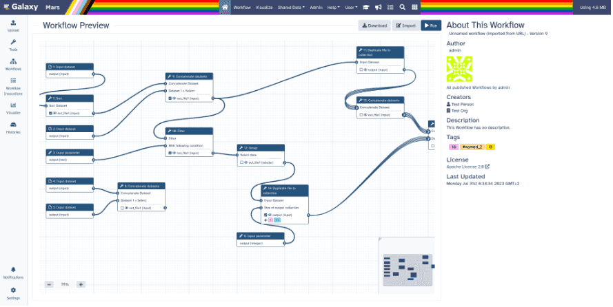

Hello, Galaxy Community!

Greetings, Galaxy enthusiasts! We're thrilled to bring you the latest edition of the Galaxy Newsletter, packed with exciting updates and insights from the Galaxy community. In this issue, we'll delve into the highlights of the upcoming GCC2024, explore the Galaxy Mentoring Network, and unveil the newest features of the Galaxy 23.2 Release.

Our Special Interest Group Spotlight shines on Single Cell, showcasing the collaborative efforts and innovative tools driving advancements in this field. We'll also celebrate Galaxy's impact in three scientific papers in our Galaxy Success Stories segment.

In other news, we bid adieu to Twitter as Galaxy departs the platform, and we'll recap some major events and engagements that have kept Galaxy at the forefront of bioinformatics. Plus, we'll give you a sneak peek at upcoming events that you won't want to miss. And don't forget to check out our [new Hub landing design](https://galaxyproject.org/).

Join us as we journey through the latest news and developments in the Galaxy universe!

# Coming up: GCC2024

We're thrilled to announce that plans for the [2024 Galaxy Community Conference (GCC2024)](https://galaxyproject.org/events/gcc2024/) are well underway, and we can't wait to welcome you in Brno, Czech Republic, from June 24th to 29th, 2024.

GCC2024 promises to be an exceptional gathering of researchers, developers, practitioners, and enthusiasts from around the globe, all united by our passion for Galaxy and the advancement of open science. Whether you're a seasoned Galaxy user or just getting started, GCC2024 offers something for everyone.

## What to Expect:

- __Engaging Sessions:__ We’ll have a diverse range of sessions covering cutting-edge research, innovative tools and workflows, and best practices in data analysis with Galaxy.
- __Inspiring Keynotes:__ Be inspired by keynote speakers who are at the forefront of their fields, sharing their insights and vision for the future of Galaxy and open science.
- __Interactive Workshops:__ Enhance your skills and knowledge through [hands-on workshops and training sessions](https://galaxyproject.org/events/gcc2024/training/) led by experts in the field.
- __Networking Opportunities:__ Connect with fellow Galaxy users, developers, and contributors from around the world, forging new collaborations and sharing experiences.
- __Social Events:__ Unwind and have fun at our networking and social events, where you can relax, mingle, and enjoy the company of your peers in a casual setting.

## Registration and Abstract Submission Now Open:
General registration is now open for GCC2024. Join us for this exciting event to connect with fellow community members and contribute to the vibrant Galaxy community. [Register now](https://auth.oxfordabstracts.com/?redirect=https%3A%2F%2Fregister.oxfordabstracts.com%2Fevent%2F5248%3Fpreview%3Dtrue) to reserve your place and join us for what promises to be an unforgettable event.

A friendly reminder that the __deadline for submitting abstracts for talks is April 15, 2024__. Share your research, insights, and experiences with the community by presenting a talk at GCC2024; submit your abstract, [here](https://galaxyproject.org/events/gcc2024/abstracts/)!

## Stay Updated on GCC2024:
Stay in the loop with all the latest news and announcements about GCC2024 by joining our [dedicated mailing list](https://gaggle.email/join/gcc2024-announce@gaggle.email). Be the first to know about keynote speakers, workshop and training schedules, social events, and more. Don't miss out on important updates – sign up today and ensure you're well-prepared for an enriching experience at GCC2024!

We look forward to welcoming you to Brno for GCC2024 and celebrating the vibrant Galaxy Community together!

# Join the Galaxy Mentoring Network

Are you passionate about open science and eager to connect with like-minded individuals? The [Galaxy Mentoring Network (GMN)](https://galaxy-mentor-network.netlify.app/) is calling for applications from both mentors and mentees interested in joining our vibrant community.

## About GMN: 
The GMN facilitates connections between experienced members of the global Galaxy community and those seeking guidance in STEM fields. Our mission is to support the integration of new members, whether they're users, developers, students, or professionals, by fostering meaningful dialogue, sharing experiences, and setting achievable goals over a two-month mentorship period.

__Who Should Apply:__
- __Mentors:__ Experienced researchers, educators, or industry professionals in the Galaxy community eager to share their knowledge and support the development of others.
- __Mentees:__ Students, early-career professionals, or anyone seeking guidance in developing projects related to the Galaxy framework or community.

__Benefits of Participation:__
- __Networking Opportunities:__ Connect with diverse individuals across various disciplines.
- __Professional Development:__ Gain valuable insights and guidance to advance your career goals.
- __Personal Growth:__ Enhance leadership skills and confidence while expanding your network.
- __Community Engagement:__ Contribute to a supportive community committed to open science, collaboration, and education.

## How to Apply: 
[Visit our website](https://galaxy-mentor-network.netlify.app/) to apply for the GMN. Applications are open to all backgrounds and experience levels. Please note that we review applications every three months, and we appreciate your patience as we match mentors and mentees effectively.

__Contact Information:__ For inquiries or more information, please email galaxy.mentorship@gmail.com. 

Join us in shaping the future of Galaxy mentorship and fostering collaboration within the scientific community. Together, we can make a difference in the lives of aspiring open science enthusiasts!

# Galaxy 23.2 Release

We're excited to announce the release of Galaxy 23.2, packed with new features and enhancements designed to streamline your Galaxy experience. Here's a glimpse into what Galaxy 23.2 has to offer:

1. __Workflow Comments:__ Collaborate with ease using our new Workflow Comments feature in the Galaxy Workflow Editor. With intuitive visual tools, including text comments, markdown explanations, and freehand drawing, users can now enhance communication, structure, and organization within workflows.

3. __Enhanced Published Workflow Sharing:__ Sharing and navigating workflows has never been smoother with the revamped Published Workflow Sharing page. Featuring a more informative layout, a read-only mode, an embedded interactive editor view, and improved responsiveness, users can effortlessly share and collaborate on workflows.

5. __Seamless InvenioRDM Integration:__ Galaxy now integrates seamlessly with InvenioRDM, allowing users to import files directly from InvenioRDM repositories into Galaxy and publish Galaxy records, including Histories and datasets, to InvenioRDM. This integration streamlines data import and export processes, empowering users with greater flexibility and efficiency.

Upgrade to Galaxy 23.2 today and experience these exciting new features firsthand. For more information and detailed instructions, check out our [user release notes](https://docs.galaxyproject.org/en/master/releases/23.2_announce_user.html).

# Special Interest Group Spotlight: Single Cell

The Galaxy Single Cell Community has had a stellar year, advancing tools and workflows while fostering global collaboration. Expanding beyond scRNA-seq, the community now offers tools for single-cell ATAC-seq and CITE-Seq analysis. Updates include a revamped UI for RNA STARSolo, new tools for scATAC-seq data preprocessing, and enhanced functionalities for Seurat. Community building efforts have led to the unification of single-cell subdomains and the launch of the Single Cell Community of Practice hub. Collaboration has also extended internationally, with projects spanning three continents. Training initiatives have been revamped, including the introduction of the Case Study Reloaded tutorial for parallel trajectory analysis. The community remains committed to efficiency, consolidating instances and preventing duplication to streamline workflows.

Join the community for another exciting year with the Galaxy Single Cell Community as they continue to push boundaries and explore the cosmos of single-cell analysis! __For more information on the Single Cell Special Interest Group, please contact [Wendi Bacon](https://training.galaxyproject.org/training-material/hall-of-fame/nomadscientist/)__.

# Galaxy Success Stories

__Scalable, accessible and reproducible reference genome assembly and evaluation in Galaxy (Larivière et al., Nature Biotechnology, 2024)__

The Earth BioGenome Project aims to sequence genomes of all ~1.8 million eukaryotic species over the next decade, requiring a significant increase in genome production pace. To achieve this, researchers combined the expertise of the Vertebrate Genomes Project (VGP) and the European Reference Genome Atlas (ERGA) to develop an automated assembly pipeline within the Galaxy ecosystem. This pipeline uses PacBio HiFi reads and long-distance information from Hi-C maps and/or optical maps to generate nearly complete assemblies, with extensive quality control functions. Validation using vertebrate datasets has shown improvements in haplotype resolution, particularly for large, repeat-rich genomes. Future work will focus on improving efficiency, incorporating ultra-long-read data, and automating the curation process. The workflows and instructions are [available on the Galaxy website](https://galaxyproject.org/projects/vgp/workflows/), and new genome assemblies are being submitted to the [NCBI under the Vertebrate Genome Project BioProject](https://www.ncbi.nlm.nih.gov/bioproject/489243).

  __[Read the full paper!](https://www.nature.com/articles/s41587-023-02100-3)__

__Anthropogenic contamination sources drive differences in antimicrobial-resistant Escherichia coli in three urban lakes (Wight et al., Applied and Environmental Microbiology, 2024)__

Antimicrobial resistance (AMR) is a growing concern, even in environmental reservoirs, highlighting the need for thorough monitoring. A study isolated antimicrobial-resistant Escherichia coli from urban waterbodies over 15 months, examining their susceptibilities, population structures, and genetic resistance determinants. Despite close proximity, E. coli populations in each site showed distinct antimicrobial resistance patterns, with many belonging to globally concerning sequence types. Widespread resistance was observed to key antimicrobials like amoxicillin, cefotaxime, and ciprofloxacin, but susceptibility to last-line drugs was maintained. Acquired resistance genes and chromosomal mutations were identified as key mechanisms. Whole-genome analysis revealed a diverse population with various resistance and virulence genes, including those on the chromosome (e.g., blaCTX-M). Environmental persistence, likely facilitated by wild birds, and transfer of genetic elements were identified as significant contributors to resistance patterns. The researchers used the European Galaxy server (usegalaxy.eu) for bioinformatic analyses, including extracting and aligning single nucleotide polymorphisms from core genes.

  __[Read the full paper!](https://journals.asm.org/doi/10.1128/aem.01809-23)__

__Genomic variation in pepper vein yellows viruses in Australia, including a new putative variant, PeVYV-10 (Filardo et al., Archives of Virology, 2024)__

Following its initial identification in Australia in 2016, pepper vein yellows virus (PeVYV) has been sporadically found in various hosts and locations. Genomic comparisons of 14 PeVYV-like isolates suggested the presence of potential new variants. High-throughput sequencing of six PeVYV-positive plants revealed eight PeVYV-like sequences, including isolates closely related to known PeVYV variants and others showing significant genetic divergence, tentatively named PeVYV-10. This study also marks the first report of a PeVYV-like virus infecting garlic. The researchers utilized Galaxy Australia for quality trimming, adaptor and primer sequence removal, and de novo assembly of paired reads, followed by further analysis of contigs and BLAST results in Geneious 10.

  __[Read the full paper!](https://link.springer.com/article/10.1007/s00705-023-05943-y)__

We would like to direct your attention to our running list of publications that cite Galaxy on [Zotero](https://www.zotero.org/groups/1732893/galaxy) and [Google Scholar](https://scholar.google.com/citations?user=3tSiRGoAAAAJ&hl=en&authuser=1)! __Galaxy tries to keep up with all publications from our users, but if you have a paper you would like to see highlighted either in a Galaxy Newsletter or on social media, [please use this form](https://docs.google.com/forms/d/e/1FAIpQLSemRJuFm_C8NASuCeWuWtlcYVp6BVd9NRslQdcXzDQe36II9g/viewform?usp=sf_link) to let us know!__ We would love to see all the fantastic work you have been doing with Galaxy, as this not only helps us know what our users are accomplishing but also helps guide us in developing new features! 

# Galaxy is Leaving Twitter

__Galaxy will be leaving Twitter/X effective March 31st, 2024.__ We believe this decision is necessary as the platform no longer supports our commitment to fostering constructive scientific discourse. Recent changes have made it challenging to maintain the level of discussion we strive for.

We value the support and engagement from our community on Twitter/X and assure you this decision was made after careful consideration. Although we bid farewell to Twitter/X, you can still stay connected with us through our other communication channels, such as [BlueSky](https://bsky.app/profile/galaxyproject.bsky.social), [Mastodon](https://mstdn.science/@galaxyproject), and [LinkedIn](https://www.linkedin.com/company/galaxy-project). We will continue to cross-post all social media contributions there. Additionally, you can stay updated by visiting the [Galaxy Hub](https://galaxyproject.org/), and we encourage you to stay connected with the [Galaxy Training Network](https://training.galaxyproject.org/), which is active on [BlueSky](https://bsky.app/profile/galaxytraining.bsky.social) and [Mastodon](https://mstdn.science/@gtn).

Thank you for your ongoing support. We look forward to continuing our journey with you and maintaining the strong sense of community that defines Galaxy.

# Major Events and Engagements

## PAG31 Meeting Report

Exciting news! Our latest meeting report unpacks the highlights from the recent International Plant & Animal Genome Conference (PAG31). Get ready to delve into engaging workshops, thought-provoking discussions on justice, equity, diversity, and inclusion (JEDI+), and the impactful contributions of our community members. 

Explore the [full report here](https://galaxyproject.org/news/2024-02-09-pa-g31-meeting-report/), and join us in celebrating Galaxy's ongoing journey in shaping the future of genomics.

## Advances in Genome Biology and Technology

In February, Galaxy had a major presence at AGBT in Orlando Florida. This included being featured during a keynote presentation by Michael Schatz on [BioDIGS: BioDiversity and Informatics for Genomics Scholars](https://biodigs.org/). This is an exciting new initiative to perform a distributed soil metagenomics project throughout the United States working hand-in-hand with dozens of institutions especially community colleges, historically Black colleges and Universities, tribal colleges and universities, and Hispanic-serving institutions. Galaxy was featured as a supporting platform for the project, especially to empower students and researchers who had limited prior experience or who lacked large scale computing infrastructure for the research. Stay tuned for more updates on this project later this year!

# Upcoming Events

| DATE  | EVENT |  VENUE or LOCATION |
| ------------- | ------------- | ------------- |
| 21 March 2024| [Small Scale Galaxy Admins Meeting](https://galaxyproject.org/events/2024-03-small-scale/)  | Online, Global  |
| 7-11 May 2024 | [CSHL Biology of Genomes](https://meetings.cshl.edu/meetings.aspx?meet=GENOME&year=24)| Cold Spring Harbor, NY |
| 17–21 June 2024 and 22–26 July 2024 | Workshop on High-Throughput Data Analysis with Galaxy: [June](https://galaxyproject.org/events/2024-06-17-galaxy-workshop-freiburg-june/), [July](https://galaxyproject.org/events/2024-07-22-galaxy-workshop-freiburg/)  | University of Freiburg, Germany  |
| 24–29 June 2024| [2024 Galaxy Community Conference](https://galaxyproject.org/events/gcc2024/)  | Brno, Czech Republic |
| 13–16 November 2024 | [CSHL Biological Data Science](https://meetings.cshl.edu/meetings.aspx?meet=data&year=24) | Cold Spring Harbor, NY |

*Thank you for being a part of Galaxy!*

__Get more timely info by following us on [Mastodon](https://mastodon.social/@galaxyproject@mstdn.science), [Bluesky](https://bsky.app/profile/galaxyproject.bsky.social), and [LinkedIn](https://www.linkedin.com/company/galaxy-project)!__ 

