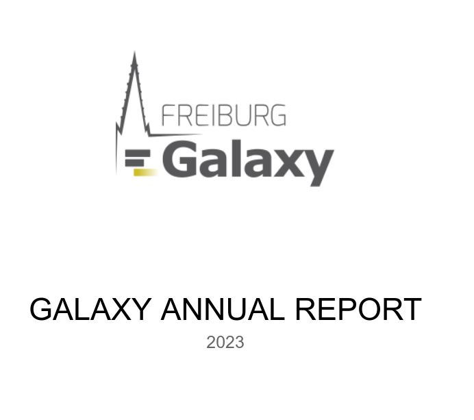

**Galaxy Annual Report 2023 published**

2023 was another amazing year for the **Freiburg Galaxy Team**. Read about our activities and achievements on new tools, workflows, features,
training and communities in our [Galaxy Annual Report](https://usegalaxy.eu/static/share/reports/2023/Galaxy_AnnualReport_2023.pdf).

We - the Freiburg Galaxy Team - want to thank all partners and contributors for making this project a big success and our 85.000 users for using [Galaxy Europe](https://usegalaxy.eu).
