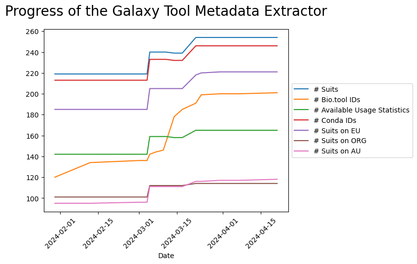

Galaxy offers almost 10,000 different tools. To solve the visibility of tools across this ecosystem, a pipeline ([Galaxy Tool Metadata Extractor](https://github.com/galaxyproject/galaxy_tool_metadata_extractor)) was developed at the [ELIXIR BioHackathon Europe 2023](https://2023.biohackathon-europe.org) that collects Galaxy wrappers from a list of GitHub repositories and automatically extracts their metadata (including Conda version, bio.tools identifier, BIII identifier, and EDAM ontology, tool availability on public servers, usage statistics on the [Europen Galaxy Server](https://usegalaxy.eu)). The pipeline can filter its inputs to only include tools that are relevant to a specific research community. 

While developing this pipeline, we realized many tools miss proper annotations. Parallel to the pipeline development, annotation guidelines were established to solve this issue. An effort was started to update 50+ Galaxy tools, link them to their respective bio.tools entries, and collectively peer-review the results. However, that was far from enough to properly annotate all Galaxy tools and other types of Galaxy resources like training material and workflows.

[microGalaxy](/community/sig/microbial/) is a community of practice within the Galaxy community that focuses on resources related to microbial research. Using Galaxy Tool Metadata Extractor, the microGalaxy community obtained a list of 260+ Galaxy tools related to microbial data analysis. Within this list, only half of them were linked to bio.tools entries, and many others had vague or very generic EDAM annotations in their bio.tools entries. The microGalaxy community decided to continue the work of improving the connection between Galaxy tools and bio.tools and improving the bio.tools entries. 

In addition to the tools, the microGalaxy community offers also other resources (30+ tutorials, 30+ workflows) that are also not properly annotated using ontologies like EDAM. Annotating all mentioned resources would improve their findability but also allow for aggregation and display of resources covering similar topics. 

To facilitate this work and work on a proof-of-concept for other communities, the microGalaxy community organized an [online hackathon in March 2024](/events/2024-03-11-hackathon-galaxy-resources-annotation/) to improve the annotation of Galaxy resources and expand Galaxy Tool Metadata Extractor to other resources like tutorials and workflows. This blogpost and the [associated preprint](https://osf.io/preprints/biohackrxiv/s7tru) hightlight the outcomes for this hackathon.

# Methods

## Initial objectives

The initial objectives of this hackathon were to improve the annotation of the Galaxy resources (tools, training, workflows) for microbial data analysis by:

* Linking [microbial Galaxy tools](https://galaxyproject.github.io/galaxy_tool_metadata_extractor/microgalaxy/) to [bio.tools](http://bio.tools) to obtain [EDAM ontology](https://edamontology.org/page) annotation
* Improving bio.tools annotations
* Annotating [existing microbial-related tutorials](https://training.galaxyproject.org/training-material/search2?query=microgalaxy) with EDAM terms
* Reflecting on the addition of EDAM terms to workflows
* Reflecting on missing terms in the EDAM ontology for microbial data analyses
* Brainstorming on a way to connect tool annotations to improve training and workflow annotations

## Organization

The hackathon was held online from March 11th to 15th 2024. It was free of cost. A Zoom room was open the whole week from 9am to 5pm CET. The [microGalaxy Matrix chat](https://matrix.to/#/#galaxyproject_microGalaxy:gitter.im) was also used for communication. 
Two daily stand-ups were done (one at 9:30 am CET and one at 4:00 pm CET) to accommodate different time zones. Additionally two brainstorming meetings on crucial subjects were planned. 

The hackathon was widely advertised by creating an event on the [Galaxy Hub website](https://galaxyproject.org/events/2024-03-11-hackathon-galaxy-resources-annotation/), the [IFB catalog](https://catalogue.france-bioinformatique.fr/event/604/) and [de.NBI website](https://www.denbi.de/training-courses-2024/1705-hackathon-improving-the-annotation-of-galaxy-resources-for-microbial-data-analysis-and-beyond), by sharing the information on different mailing lists and several community channels (Slacks or Matrix), and by spreading on social media.

## Coordination

The work during the week was coordinated using a [single Google document](https://docs.google.com/document/d/1B125dSKhB6AevnyShSi_zXIXUQd49tvNYfWHuyqmArY/edit?usp=sharing) that contained all information related to this hackathon (schedule, template for advertisement, pre-registration, etc). In this document, we also created a "How to contribute" section with step-by-step information on the different possible ways to contribute, in particular using the tutorial.

In order to track the work and avoid work duplication, a ["tracking" spreadsheet](https://docs.google.com/spreadsheets/d/1EQMLJFKIt3ucSyt1aPAUQgGDfgbPFtKNTf7PhSe8pYQ/edit?usp=sharing) was created before the event. In this spreadsheet, several sheets were created and pre-filled: (i) "Galaxy Tools not linked to bio.tools id" with their metadata to track the bio.tools entry creation and the linking between bio.tools and the Galaxy tool, (ii) "Galaxy Tools linked to bio.tools id" to track bio.tools EDAM annotation updates, (iii) "Microbial-related Galaxy Tools" to review the curated list of microbial-related tools, (iv) "Microbial-related Tutorials" to track the EDAM topics identification and tutorial update. A last sheet was added to get an overview of the progress in the different sheets. 

This sheet along with the "How to contribute" section was introduced on the first day and to any newcomer during the week.

The daily stand-up meetings were really useful for the coordination. In the 9:30 am CET meetings, participants from the APAC time zone shared their achievements for the day and participants from the EMEA time zone shared their objectives for the day. In the 4:00 pm CET meetings, participants from the EMEA time zone shared their achievements for the day.

# Outcomes

## Participants

During the week, 15+ people from all over the world joined the effort, either just to discuss and learn about our efforts or more actively. It was a great opportunity to connect with members of other communities like QIIME2 or NFDI4Microbiota.

The most active contributors (10 persons) were from Australia, Germany, France, and Norway.

## Annotation of the microbial-related resources

Improving the annotation of the Galaxy resources for microbial data analysis was the main objective of this hackathon. The outcomes are far beyond what we expected.

### Linking Galaxy Tools to bio.tools entries

Before this hackathon, 98 Galaxy tools (of the 200 microbial-related tools) were not linked to bio.tools, either because no bio.tools entry exists or because it was not provided in the Galaxy tool itself.

During the hackathon, **41** tools have been added to bio.tools. 

Most of the Galaxy tools have been linked to their corresponding bio.tools entries with the actual status being: 

| Status | Galaxy tools |
|---|---|
| Pull Request merged | 33 |
| Pull Request created, but not merged | 53 |
| Tools left | 12 |

The tools left are complicated cases where tools are deprecated or duplicated.

For the other tools, we encountered several issues during the hackathon that delayed the merging of the Pull Request. First, a lot of tools were not following current [best practices for Galaxy Tool development](https://galaxy-iuc-standards.readthedocs.io/en/latest/) so the linting of the continuous integration was failing. Once that was solved, tests were also failing for a bunch of tools. Fixing linting and test errors slowed down the process of the tool annotation but improved the quality of Galaxy tools. Secondly, Galaxy tool sources are stored in GitHub repositories where none of the current contributors have maintainer rights. 

### Review of bio.tools entries

For the Galaxy tools already linked to bio.tools, we started to review the EDAM annotations in the corresponding bio.tools entries.

| Status | bio.tools entries |
|---|---|
| Reviewed | 25 |
| Ongoing review | 14 |
| To review | 103 |

Over 140+ Galaxy tools linked to bio.tools entries, we managed to review 25 bio.tools entries. 14 are currently ongoing, especially because we are waiting to have edit access to the bio.tools entries.

For most of the tools already or under review, their EDAM annotations have to be updated because they are too large or missing some functionalities. We then need to continue the work started here to be able to use these annotations for offering a comprehensive list of tools given EDAM Topics and Operations.

### Microbial-related Galaxy Tools

Galaxy Tool Metadata Extractor extracted 400+ that might be of interest for microbial data analysis. We did our first curation during the BioHackathon in November 2023. During this hackathon, some fresh pair of eyes started to review the curated list. 

| Status | Microbial-related Galaxy tool |
|---|---|
| To keep | 180 |
| To exclude | 145 |
| To review | 420 |

We will need to continue this work but we might use information from workflows and tutorials to automatically identify the essential tools to keep in this list.

### Microbial-related Tutorials

On the Galaxy Training Network (GTN) Materials [@citesAsAuthority:batut_community-driven_2018, @citesAsAuthority:Hiltemann_2023], the microGalaxy community offers 30+ tutorials. These tutorials were not annotated with EDAM Topic or Operation. 

During the hackathon, 33 tutorials were matched with EDAM topics, that were added using Pull Requests to [GTN GitHub repository](https://github.com/galaxyproject/training-material/). A similar effort is ongoing to annotate the topics offered on the GTN website with corresponding EDAM Topics.

For EDAM Operation in tutorials, another approach will be implemented. Each tutorial comes with a list of tools. This list will be compared to the information extracted by Galaxy Tool Metadata Extractor and EDAM Operations of the tools will be added to the EDAM Operation of the tutorials.

## Improvements to Galaxy Tool Metadata Extractor

Feedback from the annotation process was used to improve the Galaxy Tool Metadata Extractor.

### Improvement of the bio.tools id extraction

No bio.tools IDs were extracted when there was unnecessary white space in the Galaxy tool XML. It was fixed in Galaxy Tool Metadata Extractor code ([Pull request #1](https://github.com/galaxyproject/galaxy_tool_metadata_extractor/pull/69), [Pull request #2](https://github.com/galaxyproject/galaxy_tool_metadata_extractor/pull/70)). In the Galaxy code itself, two new tool linting rules have been added: [one to check the validity of bio.tools annotation is Galaxy tools](https://github.com/galaxyproject/galaxy/pull/17655) and one [to check for leading and trailing spaces
in the text of leaf elements in Galaxy tool XML files](https://github.com/galaxyproject/galaxy/pull/17656). These caused problems in the metadata extractor.

Some tool suites like SPAdes include multiple bio.tools references to individual tools. To track those cases [all bio.tools references for a tool are collected and stored in an additional column](https://github.com/galaxyproject/galaxy_tool_metadata_extractor/pull/72).

### New GitHub repository sources

To extract tool suites, the Galaxy Tool Metadata Extractor uses the GitHub repositories which are processed by the [planemo monitor](https://github.com/galaxyproject/planemo-monitor). So tools stored in other repositories were not extracted and available in the tool tables. A [configuration option](https://github.com/galaxyproject/galaxy_tool_metadata_extractor/pull/71) was added that allows to add additional repositories, such as the [QIIME2 repository](https://github.com/qiime2/galaxy-tools) [@citesAsAuthority:bolyen2019reproducible].

### Availability on all public servers

Initially, tools within a suite were checked if they were installed on the largest Galaxy servers (usegalaxy.eu, usegalaxy.org, usegalaxy.org.au). The ratio of installed tools on these servers was given in the suite row with one column per server.

The approach was slightly modified. The tools within a suite are now checked if installed on the list of [all public servers](https://galaxyproject.org/use/). If at least one of them is installed, the server is listed in the new column `All Server Availability`. 

For each [UseGalaxy](https://galaxyproject.org/usegalaxy/) server, a column is added with the number of tools within the suite that is installed on the corresponding server.

### Usage statistics

Usage statistics of the tools on UseGalaxy Europe are extracted to obtain the overall tool usage as well as how many users executed the tool in the last two years. However, for some tools, these usage statistics could not be extracted. 

This is due to incorrect matching between the name of the wrapper suite and the name of the tool on the server. [It has been fixed by matching the name of the individual tool IDs included in the suite with the tool ID on the server](https://github.com/galaxyproject/galaxy_tool_metadata_extractor/pull/78). This allowed us to extract the tool usage statistics for all tools that are indeed installed on UseGalaxy Europe.

### Tracking of tool extraction

To track the progress in the number of extracted tools and their annotation, a script was developed to collect the tables generated by Galaxy Tool Metadata Extractor from every GitHub commit, including the automatic commits that are created by the bot every week to update the results with the newest tools as well as any commit that was used to improve the code.

The script generates a plot that shows the evolution of time of the number of Galaxy suites, Galaxy suites linked to bio.tools entries, Galaxy suites with usage statistics, Galaxy suites with associated conda package, and the number of the tools installed on the UseGalaxy servers.

### Landing page and interactive table update

The [landing page and interactive table](https://github.com/supernord/galaxy_tool_extractor/tree/supernord-landing-page) are also being updated to make use of the [ELIXIR Toolkit Theme](https://github.com/ELIXIR-Belgium/elixir-toolkit-theme). That will give a nicer table and page while being sure that the table can still be embedded into other webpages.

## Reflexion on EDAM terms for microbiome

In the latest version of EDAM, new topics have been added, including Multiomics (topic_4021) and metabarcoding (topic_4038). But there are still some missing terms to represent what certain tools or training are doing and for what they are useful.

During the hackathon, we had a dedicated meeting to reflect on the EDAM terms for microbiome research. We suggested that some operations could become topics: Genome annotation, Genome assembly (if merged with the Sequence assembly topic), Multilocus sequence typing / Molecular typing / Genotyping.

We also reflected on a new Microbiome or Biome (or maybe both) topic that could encompass several subtopics: Metagenomics, Metabarcoding, Metatranscriptomics, Metaproteomics, etc.

Regarding assembly, "Sequence assembly" exists as a topic and an operation, and "Genome assembly" is an operation. But there are no concepts  to represent Metagenomics assembly. It could be added as a new operation or topic.

Finally, we discussed binning. There is a "Read binning" operation mentioning contigs in its description. It could be renamed to "Binning" only to avoid confusion and include two suboperations: taxonomic binning and composition binning.

## More microbial related work

During the hackathon, contributions went also beyond resource annotation and Galaxy Tool Metadata Extractor.

### DADA2

[A workflow for DADA2](https://github.com/galaxyproject/iwc/pull/14) [@citesAsAuthority:callahan2016dada2] has been finalized for [IWC](https://github.com/galaxyproject/iwc), a GitHub repository with Galaxy Workflows maintained by the Intergalactic Workflow Commission, and is now listed in two workflows registries: [Dockstore](https://dockstore.org/organizations/iwc)[@citesAsAuthority:yuen_dockstore_2021] and [WorkflowHub](https://workflowhub.eu/workflows/790)[@citesAsAuthority:noauthor_implementing_nodate].

A [discussion with the DADA2 community](https://github.com/benjjneb/dada2/issues/1911) has been initialized in how the [existing DADA2 tutorial for R](https://benjjneb.github.io/dada2/tutorial.html) may be reused as a tutorial in the Galaxy Training material.

### BIOM

A [tool](https://github.com/galaxyproject/tools-iuc/pull/5865) has been added to allow the import of BIOM files into phyloseq objects and [a bug in the BIOM format tools has been fixed](https://github.com/galaxyproject/tools-iuc/pull/5875).

### QIIME2

A [Galaxy metadata setting problem (for an unrelated datatype)](https://github.com/galaxyproject/galaxy/pull/17674) has been fixed which made it impossible to upload QIIME2 reference data to Galaxy. 

[QIIME2 workflows](https://github.com/galaxyproject/iwc/pull/354) are being added to IWC so they can be listed on [WorkflowHub](https://workflowhub.eu/) and [Dockstore](https://dockstore.org/).

A [new QIIME2 tutorial has been linked in the Galaxy Training Network](https://github.com/galaxyproject/training-material/pull/4804). 
The training materials have also been discussed with the QIIME2 developers. 
As soon as more QIIME2 tutorials are available for Galaxy, more links will be created in the GTN. 

Other points were discussed: how reference data can be integrated into the QIIME2 Galaxy tools, how data parameters can be better annotated in the QIIME2 Galaxy tools, and possibilities for parallelization in upcoming QIIME2 releases. 

For the improvement of the datatype usage, a script has been developed that extracts the hierarchy of the Galaxy datatypes and their EDAM data and format annotations which may help the QIIME2 developers to develop the mapping.

### Restructuring of the Microbiome Training Topic 

The Microbiome Topic that stored all microbiome-related resources of the Galaxy Training Network has been [restructured](https://github.com/galaxyproject/training-material/pull/4814). A better structure was obtained by adding subtopics: Metabarcoding, Metagenomics, and Metatranscriptomics. 

# Conclusion and outlook

The hackathon was successful with outcomes beyond the initial expectations. This was only possible as a community effort.

Using the work done during this hackathon, we can aggregate microbial-related Galaxy tool suites using their EDAM Topics and Operation and give more visibility to the available tools for different analyses. This can be done analogously for training resources and hopefully later for workflows. The Galaxy Tool Metadata extractor could then go beyond Galaxy tools and generate metadata for communities as a series of tables with curated and annotated Galaxy resources (tools, training, and workflows). These tables could be used in the community pages to give more visibility to the amazing work they are doing and help users find the resources they need.

# Acknowledgements

The Institut Français de Bioinformatique (IFB) is funded by the Programme d'Investissements d'Avenir (PIA), grant Agence Nationale de la Recherche, number ANR-11-INBS-0013.
