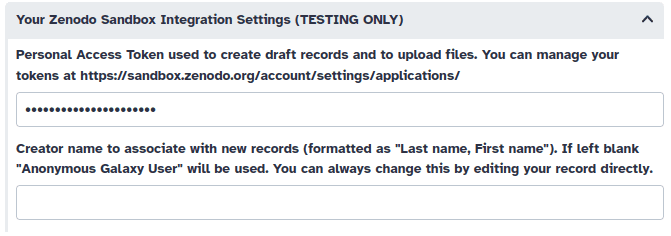
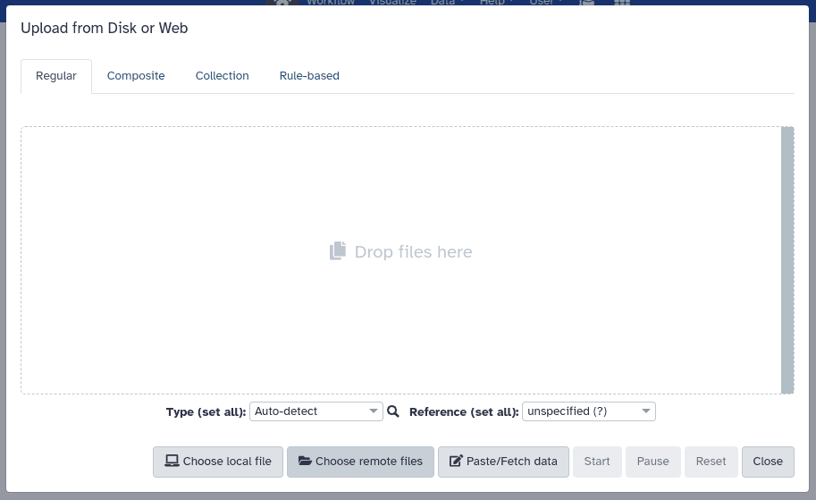

We're excited to announce a recent integration that aims to enhance research data management in Galaxy. Any InvenioRDM-compatible repository can now be connected to Galaxy, offering a streamlined experience in managing and analyzing your research data. With this integration, you can now export research results directly from Galaxy to your institution's InvenioRDM repository or Zenodo, and import files from these repositories into Galaxy for reproducible analysis workflows.

## What is InvenioRDM?

[InvenioRDM](https://inveniosoftware.org/products/rdm/) is a research data management platform designed to help organizations effectively manage, publish, and showcase their research data. It provides an infrastructure for storing, sharing, and preserving research outputs, making it a valuable tool for researchers and institutions.

## What about Zenodo?

[Zenodo](https://zenodo.org/) is an open repository for all scholarship, enabling researchers from all disciplines to share and preserve their research outputs, regardless of size or format. Free to upload and free to access, Zenodo makes scientific outputs of all kinds citable, shareable and discoverable for the long term.

It's worth noting that Zenodo [recently migrated to InvenioRDM as its underlying technical platform](https://blog.zenodo.org/2023/10/13/2023-10-13-zenodo-rdm/). This move not only makes this integration fully compatible with Zenodo but also signals a commitment to enhanced features and scalability, further bolstering the integration's potential benefits for researchers.

## How does it work?

Your Galaxy administrator needs to configure the InvenioRDM plugin to connect to a compatible InvenioRDM repository, like Zenodo or your institution's InvenioRDM instance. Once the plugin is configured, users can import files from InvenioRDM repositories into Galaxy or export files from Galaxy to InvenioRDM records.

## Getting started

For testing purposes, you can use the [Zenodo sandbox instance](https://sandbox.zenodo.org/) to explore the functionality of the plugin.

### Setting up your PAT (Personal Access Token)

To be able to upload files and browse protected records, you need to create an account and set up your PAT (Personal Access Token) in this case, in the [Zenodo sandbox instance](https://sandbox.zenodo.org/). To create a new token, go to your `user settings` and select the `Applications` tab. Then, click on `New token` and give it a name and the necessary permissions.

Once you have created the token, you can copy and paste it into your Galaxy user preferences, under `Manage Information`, and optionally, provide a _creator name_ to be used when creating new records.

### Importing records and files into Galaxy

From the Upload tool, you can select `Choose remote files` and then search for the Zenodo sandbox instance. Remember that this will only appear if the InvenioRDM plugin is configured to connect to the Zenodo sandbox in your Galaxy instance.

Once you have selected the Zenodo sandbox instance, you can browse public records and import them into your Galaxy history. You can choose to import the full record or individual files in the same way you would import files from any other remote source. However, please note that there are some **known limitations**. At the time of writing, only the top 100 records are retrievable for search or import. But fear not! We are actively working on addressing this limitation and improving the user experience.

### Exporting your Galaxy history

From the history menu, you can select `Export History to File` and then choose `to RDM repository`. You will be prompted to select the InvenioRDM repository you want to export your history to. Once you have selected the repository, you can decide whether to create a new record or upload the history to an existing draft record.

You can always edit the record metadata directly from the Zenodo sandbox web interface. Once you are satisfied with the record, you can publish it, generating a DOI that others can use to cite your research. Of course, in the case of the sandbox instance, the DOI is not minted and your data is not stored permanently. But the experience is the same as with the production instance.

## Conclusion

We are excited about the potential benefits this integration can bring to the research community and look forward to your feedback and suggestions.

Stay tuned for more updates and enhancements as we have plenty of features and quality-of-life improvements planned to boost your research data management workflows!
