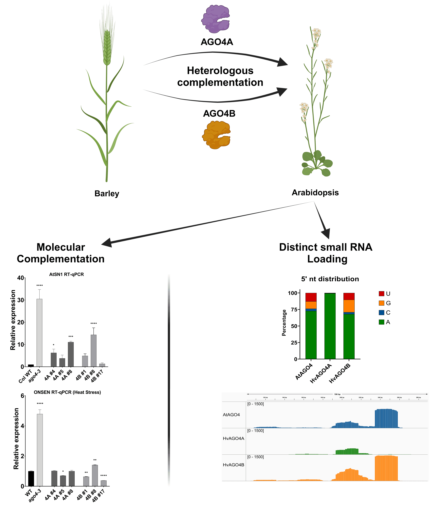

With this article we like to share Fabio's experience with usegalaxy.eu and its use for his research.

 

>I'm Fabio Miloro, PhD student at [Hungarian University of Agriculture and Life Sciences (MATE)](https://genetics.uni-mate.hu/home). Our research delves into the fascinating world of RNA-directed DNA methylation (RdDM) in barley, a crucial process for maintaining genome integrity, regulating transposable elements (TEs) and controlling gene expression, especially in large genomes like barley (~5 Gb).
>To gain insights into the function of Argonaute 4 (AGO4) proteins, key players in RdDM, we performed heterologous complementation in _Arabidopsis thaliana_. This analysis is based on small RNA (sRNA) sequencing data derived from immunoprecipitation of AGO4 proteins, which we processed using the Galaxy platform. The Galaxy platform allows us to efficiently analyze sRNA sequencing data by providing an easy-to-use environment for critical steps such as quality control, mapping to the reference genome, and categorizing sRNAs using dedicated pipelines such as [sRNAPipe](https://mobilednajournal.biomedcentral.com/articles/10.1186/s13100-018-0130-7). Finally, we could publish our results in [Plant Cell Reports](https://link.springer.com/article/10.1007/s00299-024-03177-z):
>
>Miloro _et al._ - Barley AGO4 proteins show overlapping functionality with distinct small RNA-binding properties in heterologous complementation; Plant Cell Rep. 2024 Mar 13;43(4):96. [doi: 10.1007/s00299-024-03177-z](https://doi.org/10.1007/s00299-024-03177-z) [PMID: 38480545](https://pubmed.ncbi.nlm.nih.gov/38480545/)
>
>In particular, Galaxy's ability to analyze multiple libraries simultaneously within a single pipeline streamlines the process, enabling faster and more efficient data analysis. This robust workflow allows us to identify AGO4-bound small RNAs and elucidate their role in barley RdDM.
