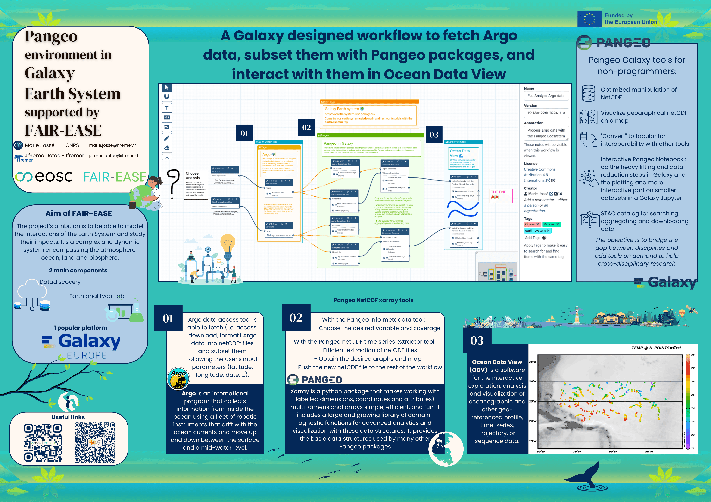

The European Geosciences Union (EGU) was held at the Austria Center Vienna (ACV) and online, from the 14–19th April 2024.
The assembly was open to the scientists of all nations. During this conference the EOSC project [FAIR-EASE](https://fairease.eu/) presented
a [Galaxy climate featuring earth system workflow](https://usegalaxy.eu/u/marie.josse/w/full-analyse-argo-data) available on Galaxy Europe and explained
in a [tutorial](https://training.galaxyproject.org/training-material/topics/climate/tutorials/argo_pangeo/tutorial.html).

# The posters
Two posters side by side were presented:

# The follow-up
During this really fruitful conference, we were able to get in touch with multiple scientists interested in getting their hands on Galaxy. We are currently reaching out again with them to bring new earth system, climate, and environment users and use-cases!
