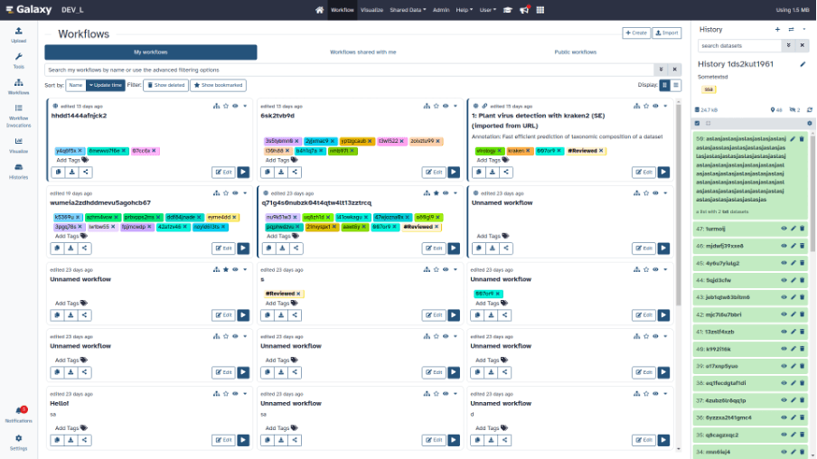
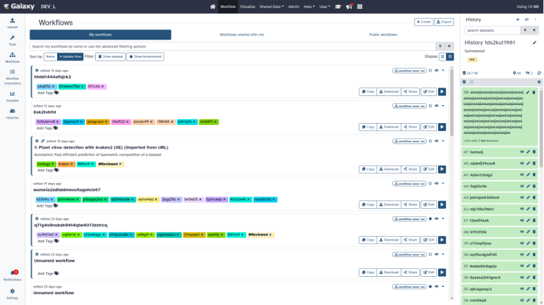
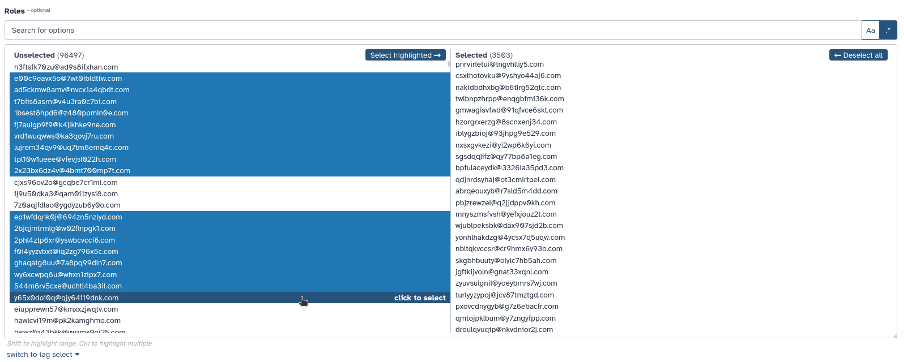
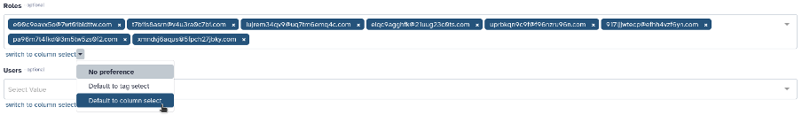

# 2024 Galaxy Release (v 24.0)

The Galaxy Committers team is pleased to announce the Galaxy 24.0 release!

## Highlights

### New Workflow List and Card View

As part of our ongoing efforts to enhance user experience, we are proud to announce several new improvements to the workflow user interface, including workflow list view, workflow card view, and workflow quick view. These improvements also include new tabs for “My workflows” (owned by the user), “Shared with me” (shared by other users), and “Published workflows” (publicly accessible workflows).

<iframe width="560" height="315" src="https://www.youtube.com/embed/YKTiTIBCi1E?si=4g9HhQMENWFeTf92" title="Galaxy 24.0 - Workflow Cards" frameborder="0" allow="accelerometer; autoplay; clipboard-write; encrypted-media; gyroscope; picture-in-picture; web-share" referrerpolicy="strict-origin-when-cross-origin" allowfullscreen></iframe>

My workflows: card view

My workflows: list view

### New select component for selecting a large amount of options

This new component addresses the need of selecting a very large number of options at once. The component features a list based layout which can be filtered using plain-text or a regular expression. Options can be added individually, in bulk via the filter value, or by first highlighting a range.

The component is fully keyboard accessible. All methods of selection and highlighting work via keyboard. The options are not selectable individually with tab, but can be scrolled through using the arrow-keys. The hover hint adapts when a keyboard is used.

The size of the table can be increased to allow for seeing more options at once.The options in the list are limited to 1000 for performance reasons, but this can be temporarily increased in steps of 500, when reaching the end of a list.

The component can be chosen when multiple options are available; a local preference for which component to choose can be set. If no preference is set, the component will be used if there are more than 15 options selected, or more than 500 options are available.

### Multiple item drag and drop and keyboard navigation

This new feature allows users to select multiple history items and drag and drop them into other histories or even tool forms! Users can also navigate their history using the arrow keys; multiple history items can be selected with the <kbd>Shift + ArrowUp/ArrowDown</kbd> key combination.

Drag and drop:

<iframe width="560" height="315" src="https://www.youtube.com/embed/CL6AJkSmkf4?si=tg2twKCfcf_fi2ef" title="Galaxy 24.0 - Multiselect / Drag and Drop Enhancements" frameborder="0" allow="accelerometer; autoplay; clipboard-write; encrypted-media; gyroscope; picture-in-picture; web-share" referrerpolicy="strict-origin-when-cross-origin" allowfullscreen></iframe>

Keyboard navigation and selection:

<iframe width="560" height="315" src="https://www.youtube.com/embed/tzTxmPzl6qU?si=3cqhDhcuo12yeeAh" title="Galaxy 24.0 - Keyboard Selection" frameborder="0" allow="accelerometer; autoplay; clipboard-write; encrypted-media; gyroscope; picture-in-picture; web-share" referrerpolicy="strict-origin-when-cross-origin" allowfullscreen></iframe>

### Resource grids have been consolidated into tab views

Your histories, visualisations, and pages are now consolidated into an easier to use interface. Switch between your results and published results easily.

<iframe width="560" height="315" src="https://www.youtube.com/embed/mkwLAYdncRs?si=FgeZnCEaqSUdSYJK" title="Galaxy 24.0 - Resource Grids" frameborder="0" allow="accelerometer; autoplay; clipboard-write; encrypted-media; gyroscope; picture-in-picture; web-share" referrerpolicy="strict-origin-when-cross-origin" allowfullscreen></iframe>

### Move datasets between storage locations

Relocate a dataset to a different storage location with ease using this new UI feature! The example below uses an instance with four storage locations defined, but only three of them declaring the same “device” ID (set by the administrator). Clicking on the dataset information and scrolling to storage details has a “Relocate” option if the dataset is “safe” to relocate and there are valid targets to relocate it to. The UI utilizes the same visual language used for describing attributes of the storage and exposing admin provided details. This example also shows what the buttons look like for storage locations with and without quota enabled.

<iframe width="560" height="315" src="https://www.youtube.com/embed/uas3zdg-Ea0?si=Adu8y1vkJm51wnc7" title="Galaxy 24.0 - Relocating Data" frameborder="0" allow="accelerometer; autoplay; clipboard-write; encrypted-media; gyroscope; picture-in-picture; web-share" referrerpolicy="strict-origin-when-cross-origin" allowfullscreen></iframe>

## Miscellaneous Improvements

The 23.2 release includes many other improvements to user experience. Following are a few examples:

### Visualizations

* Fix for fits_image_viewer visualization plugin
* Replaces Trackster Grids with Data Dialog, Removes Phyloviz, Circster and Sweepster
* Add basic TIFF Image visualization
* Enhance Avivator display app to support regular Tiffs
* Remove legacy phyloviz, circster and sweepster artifacts

### Datatypes

* Make columns types an empty list for empty tabular data
* Python 3.8 as minimum
* Add support for (fast5.tar).xz binary compressed files
* Fix for converter tests
* Correct dbkey for minerva display app
* Add a3m datatype
* Add binary datatypes for intermediate output of fastk tools
* Enable warn_unreachable mypy option
* Fix type annotation of code using XML tree
* Update to black 2024 stable style
* Allow using tool data bundles as inputs to reference data select parameters
* Faster FASTA and FASTQ metadata setting
* Feature SBOL datatypes
* Better display of estimated line numbers and add number of columns for tabular
* Add magres datatype
* Add npy datatype

### Builtin Tool Updates

* Qiskit in galaxy
* Hide wig_to_bigWig tool
* Update to black 2024 stable style
* Update RStudio GxIT to use the reworked 23.1 image

## Release Notes

Please see the [full release notes](https://docs.galaxyproject.org/en/master/releases/24.0_announce_user.html) for all the details!

*Thank you for using Galaxy!*

[The Galaxy Team](https://galaxyproject.org/galaxy-team/)

