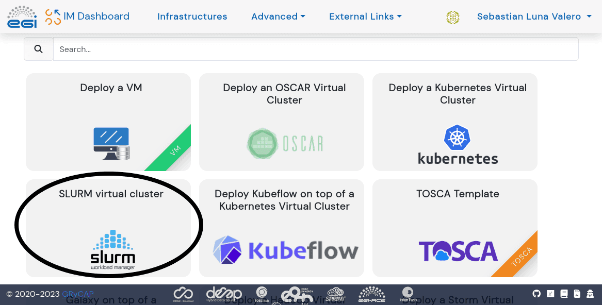

The [EuroScienceGateway Project](../../projects/esg/) is streamlining the way that users Bring their Own Compute (BYOC) to Galaxy. A [previous post](../2023-10-31-esg-byoc-im/) explained how to deploy [HTCondor](https://htcondor.org/) and [Pulsar](https://pulsar.readthedocs.io/) in the [EGI Federated Cloud](https://www.egi.eu/service/cloud-compute/) using [Infrastructure Manager](https://www.egi.eu/service/infrastructure-manager/) (IM). In this new post we will present how to deploy [Slurm](https://slurm.schedmd.com/) and [ARC](https://www.nordugrid.org/arc/arc7/) instead. The *Advanced Resource Connector (ARC)* middleware, developed by the [NorduGrid Collaboration](http://www.nordugrid.org/), is an open source software solution enabling e-Science computing infrastructures with emphasis on processing of large data volumes. ARC is being used to enable national and international e-infrastructures since its first release in 2002.

## What is ARC?

ARC was developed as one of several technologies to enable use of distributed compute and storage capabilities required by the experiments at the [Large Hadron Collider](https://home.cern/science/accelerators/large-hadron-collider) (LHC). ARC is installed as an edge service to a computational resource, being a traditional HPC, a dedicated cluster, or a cloud-provisioned resource. The ARC-Compute-Element (ARC-CE) acts as a bridge between the user-requests and the local batch system. To the end-user all complexity of handling different types of compute cluster setups, like OS type, batch system type, software availability, or worrying about moving data in and out of the cluster is abstracted away and handled by ARC. ARC was developed especially for shared HPC systems, where the data is not assumed to be local, and where there might not be outbound connectivity on the compute node. Therefore ARC takes care of all data staging on the edge server: input data is downloaded before the job is handed off to the local batch system, output data is staged out once the job is done and has returned back to the ARC server. In this way valuable compute time is not wasted on data transfers, no additional external software needs to be installed, and no outbound connectivity is needed on the compute nodes. Moreover: ARC caches its inputdata, avoiding repeated downloads, thus saving data centre bandwidth.

## Pre-requisites

Before starting, these are the pre-requisites to repeat the steps below yourself:

1. Create an [EGI Check-in Account](https://docs.egi.eu/users/aai/check-in/signup/) if you don't have one already.

1. Have access to a [Virtual Organisation](https://docs.egi.eu/users/aai/check-in/joining-virtual-organisation/) (VO) with enough resources to deploy a virtual cluster of virtual machines with Slurm. In this example the VO we are using is [vo.usegalaxy.eu](https://appdb.egi.eu/store/vo/vo.usegalaxy.eu).

## How to deploy ARC with IM?

This is the overview of the steps to deploy ARC in the [EGI Federated Cloud](https://www.egi.eu/service/cloud-compute/) using [Infrastructure Manager](https://www.egi.eu/service/infrastructure-manager/) (IM).

1. Use EGI Check-in to access https://im.egi.eu/ and configure credentials in IM.

1. Select Slurm and ARC in Infrastructure Manager.

1. Configure Slurm and ARC with Infrastructure Manager.

1. Connect to the virtual cluster and run a test job with ARC.

Once the EGI Check-in account has been created and the membership to a Virtual Organization has been approved, the user needs to [configure the credentials in Infrastructure Manager](https://docs.egi.eu/users/compute/orchestration/im/dashboard/#cloud-credentials) (see below).


Out of all the deployment options available in Infrastructure Manager the user needs to click on Slurm first (see below), and *Add* ARC later. Although ARC supports other [job schedulers](https://en.wikipedia.org/wiki/Job_scheduler), our focus for this activity has been on Slurm only. Therefore, at the moment, the only way to deploy a ARC endpoints with Infrastructure Manager is with Slurm but this can be expanded in the future.



After *adding* ARC in Infrastructure Manager, the user should click on **Configure** (see below) to move on with the deployment.


Before clicking **Submit** to start the deployment (see below), the user needs to fill out information about:

* Number of CPUs, RAM for the front-end node of the Slurm cluster

* Number of CPUs, RAM for each worker node of the Slurm cluster

* Version of Slurm to install

* Timezone for ARC

* Cloud Provider and Virtual Machine Image


All going well the deployment completes as shown below. Infrastructure Manager shows: 1) the name of the deployment, 2) a unique ID for it, 3) the cloud where the deployment happened (with additional information about the specific site and VO, in the case of the EGI Federated Cloud), 4) status of the deployment, 5) information about the number of Virtual Machines deployed, and 6) the Actions menu.


Clicking on the *Outputs* button (see image above) in Infrastructure Manager provides the following information: username for SSH, public SSH key and public IP address to connect via SSH. For more information about possible actions, please refer to the [documentation](https://docs.egi.eu/users/compute/orchestration/im/dashboard/#list-of-actions).

## Testing

Once the deployment has completed, use the credentials and public IP address to *ssh* into the virtual cluster.

For a quick test, to make sure everything is working as expected, run the following commands:

```bash
# Go to folder with testing scripts
cd /home/cloudadm/testing/

# Generate a test proxy for the user
arcproxy

# Submit a test job
bash submit-cmd.sh
```

Monitor progress with:

```bash
# Get list of jobs submitted via ARC
arcctl job list --long

# Check progress of a specific job
arcctl job log <jobid>

# Also with Slurm
squeue
```

This is all work in progress and we would welcome your feedback to improve it!
