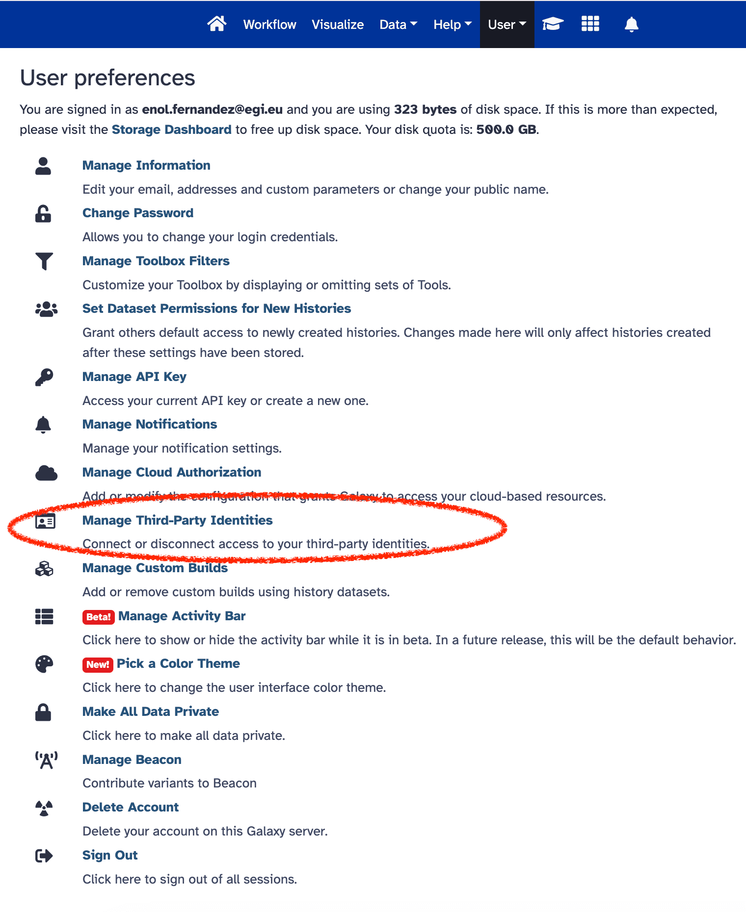

EGI Check-in is a Identity and Access Management service that, with its systems
and processes, allows you to assign a single digital identity to each entity,
authenticate them when they log in, authorize them to access specified resources
and monitor and manage these identities throughout their life cycle. After the
[release of the EGI Check-in plugin for python-social-auth](../2023-11-08-esg-psa/),
the [EuroScienceGateway Project](../../projects/esg/) has added a new login
option for users so they can use their existing EGI Check-in accounts to access
the European Galaxy Server, thus facilitating the access to the services to the
broad community of EGI users without any extra steps.

If you already have a valid Check-in account,
[login to UseGalaxy.eu](https://usegalaxy.eu/login/start) now and start using
the service. If you don't have one yet, register at least one of your identities
in a new EGI Check-in account
[from here](https://docs.egi.eu/users/aai/check-in/signup/) and use it to login
to UseGalaxy.eu!

If you already have a Galaxy account and would like to connect it to your EGI
account, you can go to the users preferences and click on **Manage Third-Party
Identities** to link both accounts.

From there you can select the identity provider and after a successful login
your accounts will be linked

