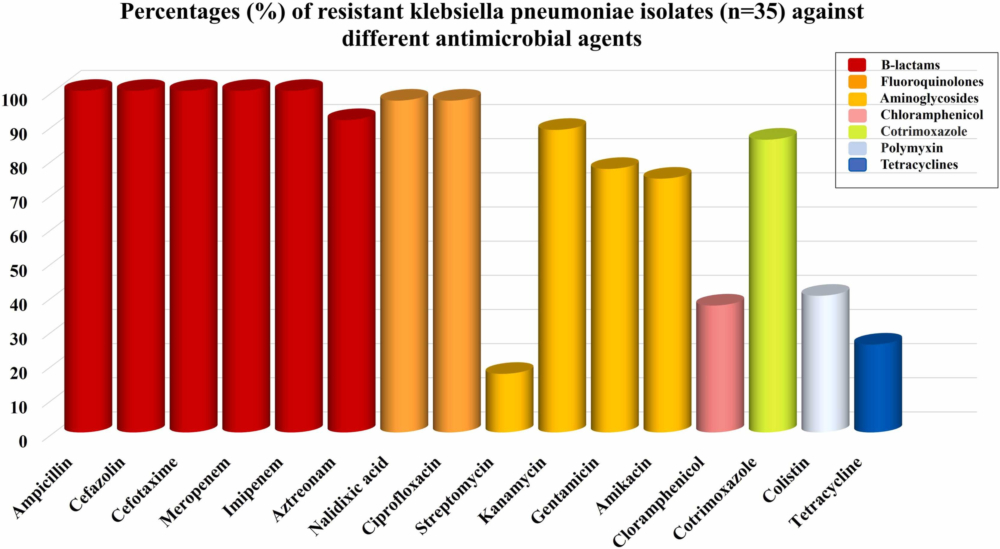

# Galaxy in Research: Investigating Food Safety Threats

We're excited to highlight a recent publication that sheds light on an alarming public health concern: the emergence of carbapenem and colistin-resistant hypervirulent Klebsiella pneumoniae (CRKP) in the Egyptian food chain. Published by Rana Fahmi Sabala and colleagues, this study underscores the urgent need for vigilance in food safety practices.

## Research Overview

The study, conducted in Egypt, aimed to investigate the prevalence and characteristics of CRKP in various food samples collected from local markets. A total of 311 samples, including minced meat, chicken meat, diced meat, and mutton, were screened for CRKP. Remarkably, CRKP was isolated from 11% of the samples, with 45.71% of them showing resistance to colistin, a last-resort antibiotic for treating CRKP-mediated infections.

## Key Findings

In addition to carbapenem and colistin resistance, the CRKP isolates exhibited resistance to multiple antimicrobials, highlighting the challenge of treating these infections. Furthermore, most of the CRKP isolates belonged to phylogroup Kp1 and were identified as potentially hypervirulent, posing a significant threat to public health.

Antimicrobial resistance in 35 CRKP strains from diced meat, minced meat, chicken, and mutton samples in Egypt. (Sabala et al., 2024)

## Galaxy's Role

To analyze the short reads obtained from the sequencing data, the researchers utilized SPAdes, a genome assembly tool available on the [European Galaxy Server](https://usegalaxy.eu/). The Galaxy platform enabled the researchers to perform efficient and accurate assembly of the genomic data, facilitating their investigation into the epidemiology and characteristics of CRKP in food samples.

## Significance of the Study

This study has significant implications for food safety and public health in Egypt and beyond. By identifying the presence of CRKP in food samples and elucidating their resistance profiles and virulence characteristics, the researchers have highlighted the need for enhanced surveillance and control measures to prevent the spread of these dangerous pathogens.

## Acknowledgment

Galaxy would like to acknowledge Rana Fahmi Sabala, Akira Fukuda, Chie Nakajima, Yasuhiko Suzuki, Masaru Usui, and Mohamed Elhadidy for their valuable contribution to this research and would like to sincerely thank the researchers for choosing Galaxy as one of their analysis platforms.

*Stay tuned for more updates on Galaxy-enabled research and scientific discovery.*

--- <be> 

Rana Fahmi Sabala, Fukuda, A., Nakajima, C., Suzuki, Y., Usui, M., & Elhadidy, M. (2024). Carbapenem and colistin-resistant hypervirulent Klebsiella pneumoniae: An emerging threat transcending the Egyptian food chain. Journal of Infection and Public Health, 17(6), 1037–1046. https://doi.org/10.1016/j.jiph.2024.04.010
