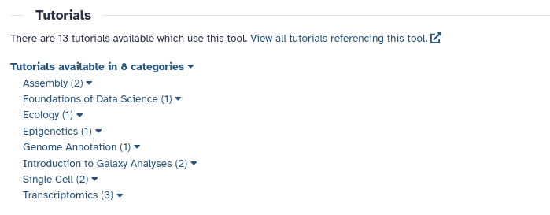

The [Galaxy Training Network](https://training.galaxyproject.org/) has many guides, practical examples, and help for certain tools throughout it's many tutorials.
Often times when using a tool, such information can be very useful, but hard to discover.

The GTN Tool-Form integration helps with this, by connecting to the Galaxy Training Network, and displaying all tutorials which make use of the tool you are currently using, directly inside to Tool Form!
This way it is easy to discover practical examples and guides for Tools, general and domain-specific.
The list of tutorials referencing a specific tool can either be viewed on the GTN, or browsed from within the Tool Form.

Check out this example from the [EU Galaxy Server](https://usegalaxy.eu/) for the [Concatenate Datasets tool](https://usegalaxy.eu/?tool_id=cat1):

If this section does not appear on your Galaxy server, there may be no tutorials available for the tool you are currently using, or this feature may not be enabled.

The GTN integration does not have to use the official GTN.
Set-up correctly, it can also point to an internal help-site or wiki.
