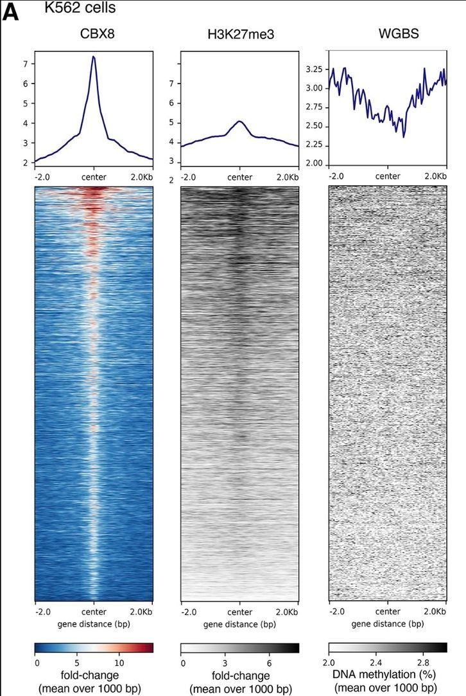

# Galaxy in Research: Decoding Chromatin Interactions with asteRIa

In a recent study, Mara Stadler, Saulius Lukauskas, Till Bartke, and Christian L Müller have introduced a new computational workflow called asteRIa. Their research, titled "asteRIa enables robust interaction modeling between chromatin modifications and epigenetic readers," offers a detailed understanding of how chromatin modifications cooperate to recruit proteins, a process crucial for regulating gene expression.

## Research Overview 

Chromatin modifications play a vital role in controlling DNA transcription, replication, and repair. These modifications recruit epigenetic 'reader' proteins that mediate various downstream events. Despite their importance, the cooperative effects of multiple chromatin modifications in recruiting such proteins have remained largely unexplored. This study integrates nucleosome affinity purification data with high-throughput quantitative proteomics and hierarchical interaction modeling to estimate the combinatorial effects of chromatin modifications on protein recruitment.

## Key Findings

The asteRIa workflow combines hierarchical interaction modeling, stability-based model selection, and replicate consistency checks to provide a stable estimation of robust interactions among chromatin modifications. The researchers identified several epigenetic reader candidates responding to specific interactions between chromatin modifications. Notably, the polycomb protein CBX8 results were independently validated using genome-wide ChIP-Seq and bisulfite sequencing datasets.

A heat map was created using deeptools on Galaxy, showing score distributions across CBX8 IDR-thresholded peaks in K562 cells. (Stadler et al., 2024)

## Galaxy's Role

The researchers leveraged Galaxy for crucial steps in their analysis. They used the 'bins' mode within deeptools on the Galaxy web platform to calculate averages of WGBS data and fold-change values to a reference genome within consecutive genome bins of 1000 base pairs. This analysis was performed across four cell types: A549 (human lung carcinoma epithelial cells), K562 (human myelogenous leukemia cells), H1 cells (human embryonic stem cells), and mES cells (mouse embryonic stem cells). By using Galaxy, the researchers ensured the exclusion of blacklisted regions during their calculations, enabling a comprehensive genome-wide analysis of H3K27me3 and methylated DNA in CBX8 peak regions.

## Significance of the Study

This study provides the first quantitative framework for identifying the cooperative effects of chromatin modifications on protein binding. By understanding these interactions, researchers can gain deeper insights into the regulation of gene expression and the role of epigenetic modifications in various biological processes and diseases.

## Acknowledgment

Galaxy extends our gratitude to Mara Stadler, Saulius Lukauskas, Till Bartke, and Christian L Müller for their remarkable work and for choosing to use Galaxy in their research. Their study highlights the versatility and effectiveness of Galaxy in facilitating cutting-edge genomic analyses.

*Stay tuned for more updates on Galaxy-enabled research and scientific discovery.*

--- <be> 

Mara Stadler, Saulius Lukauskas, Till Bartke, Christian L Müller, asteRIa enables robust interaction modeling between chromatin modifications and epigenetic readers, Nucleic Acids Research, 2024;, gkae361, https://doi.org/10.1093/nar/gkae361 
