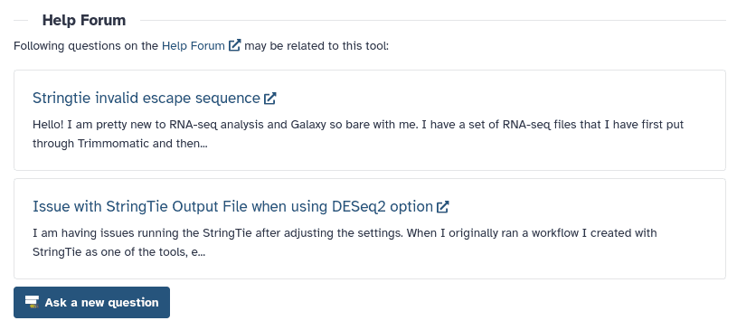

Galaxy's Community Help Forum contains a trove of valuable information when it comes to using, understanding and trouble shooting complex tools.
To make this information more discoverable, the Help Forum is now integrated within Galaxy's Tool Form.

When this feature is enabled on your Galaxy server, a new section will appear at the bottom of every tool Form.

This example is from the ["StringTie" tool on the EU Galaxy Server](https://usegalaxy.eu/?tool_id=stringtie).

The questions displayed in the Tool Form are all answered and curated, so if you're having a similar issue to the questions you find here, you can be sure to find a helpful answer as well.

## Curating The Help Forum Section

In order to ensure this section is the most resourceful it can be, the questions which appear here need to be hand-curated.
For a Help Forum post to show in the "Help Forum" tool form section, three criteria need to be met:

-   The post must have a "tool-help" tag
-   The post must have a tag corresponding to the (short) tool id
-   The post must have an accepted answer

When a new question is posted via the "Ask a new question" button, the "tool-help" and tool id tags are pre-filled, so the question must only be answered for it to appear here.

If a question is no longer helpful, removing the "tool-help" tag, or tool id tag will hide the post again.

Some posts are relevant to more than one tool. In such cases multiple tool id tags can be added to a post, and it will appear on all relevant tool-forms.

## For Admins

Just like the GTN integration, the Help Forum integration does not need to link to the official Help Forum. It can connect to any forum using [Discourse](https://www.discourse.org/), or any other forum software with a discourse-compatible API.
