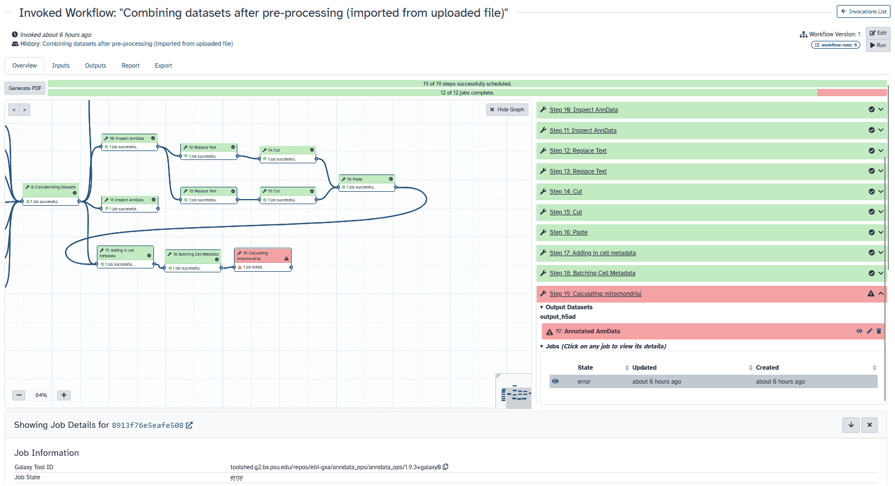
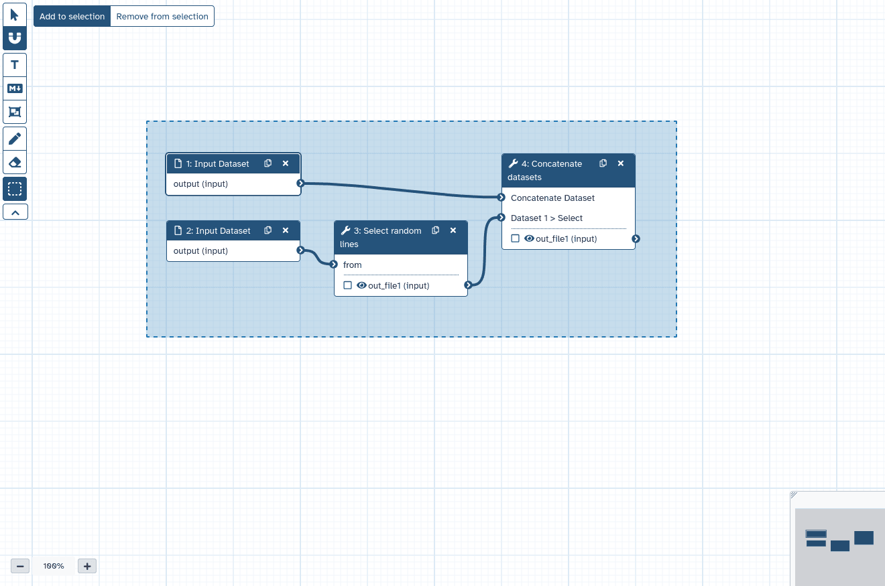
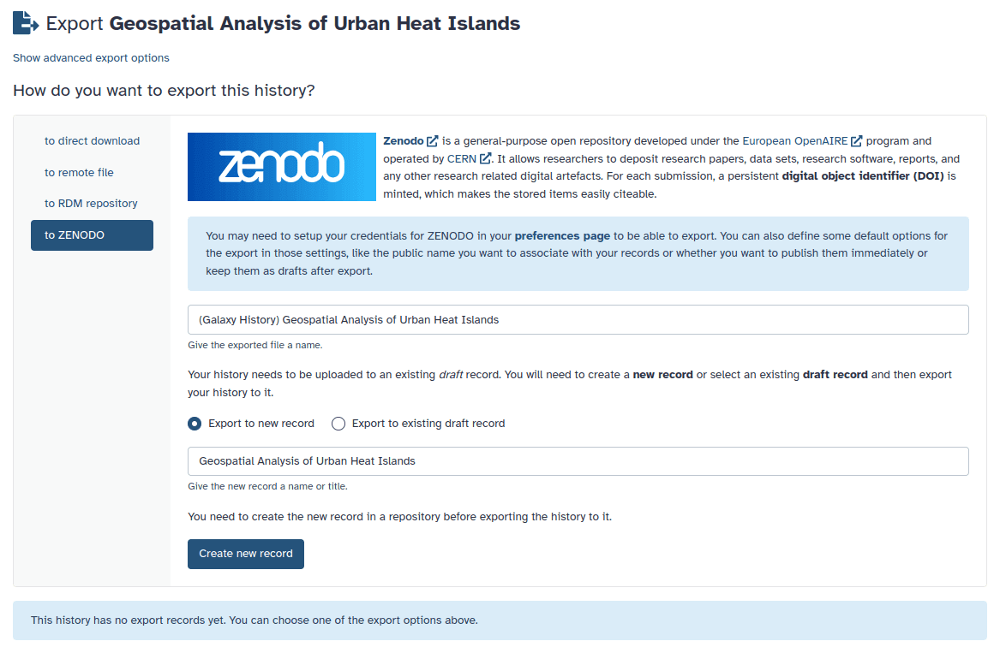
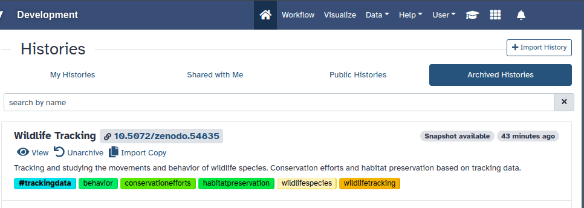

# 24.1 Galaxy Release (June 2024)

The Galaxy Committers team is pleased to announce the Galaxy 24.1 release!

## Highlights

### Visualizing workflow runs with an invocation graph view
A graph view has been added to the workflow invocation summary. This feature uses the original workflow structure to display job states for each step on the workflow editor canvas. You can click on a step to expand and see detailed information about that invocation step.

### Workflow editor undo/redo
Undo/redo functionality has been added to the workflow editor, enhancing the user experience and workflow management. Here's how it works:

- Action Class Instances: The system uses a store to manage undo and redo stacks of action class instances. These instances encapsulate bi-directional state changes.
- Granular Undo-Redo: All user actions in the workflow editor are now managed by these action classes, allowing for granular undo and redo of workflow modifications.
- Continuous State-Changes: For continuous state changes (like moving a node or typing text), changes are stored every second or when another change occurs.

This system provides users with more control over their workflow editing process, allowing them to undo and redo changes in a detailed and efficient manner.

### Select multiple items in workflow editor
New selection features in the Workflow Editor have been introduced to improve workflow management:

- Shift-Select: You can now shift-select multiple steps or comments, allowing for easier grouping and manipulation of workflow elements.
- Box Selection Editor Tool: This tool enables you to add or remove items from the selection by dragging a box around them. This feature is useful for quickly selecting multiple items.
- Group Actions: Selected items can be moved together, deleted, and duplicated, streamlining workflow editing tasks.
- Default Selection for Imported and Duplicated Items: Items imported from other workflows and newly duplicated items are now selected by default. This makes it easier to reposition them within the workflow.

These enhancements simplify the process of selecting and managing multiple elements in the Workflow Editor, improving the overall editing experience.

### All-vs-all collection analysis patterns
Galaxy now matches corresponding datasets when multiple collections are used to map over a tool, akin to a dot product pattern. This feature can be adapted for all-vs-all mapping by first creating two new input collections containing the Cartesian product (in math terms) or Cross Join (in SQL terms) of the inputs. These collections align every combination of elements between the first and second lists, enhancing flexibility in dataset mapping.

### Pagination support added to files source plugins
To improve the navigation of remote file sources potentially containing vast numbers of files, server-side pagination support has been added to file source plugins. Plugins can now support server-side pagination, searching and sorting, which is indicated by corresponding serializable properties and is implemented on a per-plugin basis. See PyFilesystem2-based and Invenio-based plugins for details on implementation.

### Zenodo integration
A new Zenodo file source plugin based on Invenio has been added, making integration more straightforward. This update also introduces new schemes (invenio:// and zenodo://) for Invenio and Zenodo file sources, respectively, aligning them with their intended conventions. Existing exports using the gxfiles:// scheme will continue to work as expected.

### Document Object Identifiers displayed in archived histories
Histories that have been archived and preserved in an external repository like Zenodo will now display their Document Object Identifier (DOI). This change enhances the clarity and accessibility of archived histories.

### Activity bar is now enabled by default
The activity bar is now enabled by default, enhancing the user experience by providing quick access to essential features and improving workflow navigation.

## Visualizations
* Check various preconditions in FeatureLocationIndexDataProvider
* Add pinia to manually mounted vue components
* Update parcel-built visualizations to use parcel v2
* Fix visualizations compatible dataset filtering
* Fix pca 3d rendering of tabular files and visualization error handling in general

## Datatypes
* Tighten axt sniffer
* Don't set dataset peek for errored jobs
* Better display of estimated line numbers and add number of columns for tabular
* Add colabfold tar file datatype
* Set minimal metadata also for empty bed datasets
* Code cleanups from ruff and pyupgrade
* Npz sniffing: do not read the whole file
* Never fail dataset serialization if display_peek fails
* Enable ``warn_unused_ignores`` mypy option
* Add support for additional media types
* Enable flake8-implicit-str-concat ruff rules
* Chore: remove repetitive words
* Add Net datatype

## Builtin Tool Updates
* Raise exception when extracting dataset from collection without datasets
* Backport Qiskit Jupyter Notebook update to 24.1
* Fix null inputs in database operation tools
* Code cleanups from ruff and pyupgrade
* Rename JupyTool to something more searchable (i.e. JupyterLab which includes the substring Jupyter)
* Enable ``warn_unused_ignores`` mypy option
* Enable flake8-implicit-str-concat ruff rules

## Release Notes
Please see the [full release notes](https://docs.galaxyproject.org/en/master/releases/24.1_announce_user.html) for all the details!

*Thank you for using Galaxy!*

[The Galaxy Team](https://galaxyproject.org/galaxy-team/)

